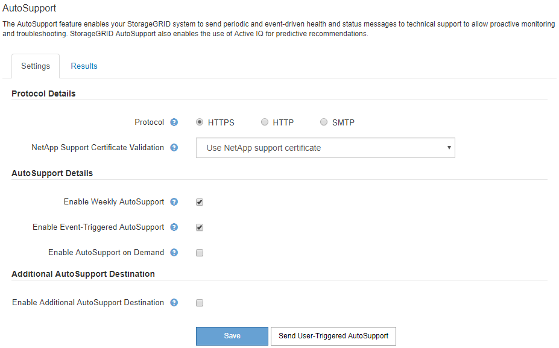

= Configurazione di AutoSupport
:allow-uri-read: 
:icons: font
:imagesdir: ../media/

[role="lead"]
La funzione AutoSupport consente al sistema StorageGRID di inviare messaggi di stato e di stato al supporto tecnico. L'utilizzo di AutoSupport può accelerare notevolmente la determinazione e la risoluzione dei problemi. Il supporto tecnico può anche monitorare le esigenze di storage del sistema e aiutare a determinare se è necessario aggiungere nuovi nodi o siti. In alternativa, è possibile configurare i messaggi AutoSupport in modo che vengano inviati a una destinazione aggiuntiva.

== Informazioni incluse nei messaggi AutoSupport

I messaggi AutoSupport includono informazioni quali:

* Versione del software StorageGRID
* Versione del sistema operativo
* Informazioni sugli attributi a livello di sistema e di posizione
* Avvisi e allarmi recenti (sistema legacy)
* Stato corrente di tutte le attività della griglia, inclusi i dati storici
* Informazioni sugli eventi elencate nella pagina *nodi* *_nodo griglia_* *Eventi*
* Utilizzo del database Admin Node
* Numero di oggetti persi o mancanti
* Impostazioni di configurazione della griglia
* Entità NMS
* Policy ILM attiva
* File delle specifiche della griglia con provisioning
* Metriche diagnostiche

È possibile attivare la funzione AutoSupport e le singole opzioni AutoSupport quando si installa StorageGRID per la prima volta oppure attivarle in un secondo momento. Se AutoSupport non è attivato, viene visualizzato un messaggio sul dashboard di gestione della griglia. Il messaggio include un collegamento alla pagina di configurazione di AutoSupport.

image::../media/autosupport_disabled_message.png[AutoSupport Disabled Msg]

È possibile selezionare il simbolo "`x`"  per chiudere il messaggio. Il messaggio non viene visualizzato fino a quando la cache del browser non viene cancellata, anche se AutoSupport rimane disattivato.

== Utilizzando Active IQ

Active IQ è un consulente digitale basato sul cloud che sfrutta l'analisi predittiva e la saggezza della community della base installata di NetApp. Le valutazioni continue dei rischi, gli avvisi predittivi, le indicazioni prescrittive e le azioni automatizzate consentono di prevenire i problemi prima che si verifichino, migliorando lo stato di salute del sistema e la disponibilità del sistema.

Se si desidera utilizzare le dashboard e le funzionalità di Active IQ sul sito del supporto, è necessario attivare AutoSupport.

https://docs.netapp.com/us-en/active-iq/index.html["Documentazione di Active IQ Digital Advisor"]

== Accesso alle impostazioni AutoSupport

Si configura AutoSupport utilizzando Gestione griglia (*supporto* *Strumenti* *AutoSupport*). La pagina *AutoSupport* contiene due schede: *Impostazioni* e *risultati*.

== Protocolli per l'invio di messaggi AutoSupport

È possibile scegliere uno dei tre protocolli per l'invio dei messaggi AutoSupport:

* HTTPS
* HTTP
* SMTP

Se si inviano messaggi AutoSupport utilizzando HTTPS o HTTP, è possibile configurare un server proxy non trasparente tra i nodi di amministrazione e il supporto tecnico.

Se si utilizza SMTP come protocollo per i messaggi AutoSupport, è necessario configurare un server di posta SMTP.

== Opzioni AutoSupport

È possibile utilizzare qualsiasi combinazione delle seguenti opzioni per inviare messaggi AutoSupport al supporto tecnico:

* *Settimanale*: Invia automaticamente i messaggi AutoSupport una volta alla settimana. Impostazione predefinita: Enabled (attivato).
* *Evento attivato*: Invia automaticamente i messaggi AutoSupport ogni ora o quando si verificano eventi di sistema significativi. Impostazione predefinita: Enabled (attivato).
* *Su richiesta*: Consente al supporto tecnico di richiedere che il sistema StorageGRID invii automaticamente messaggi AutoSupport, utile quando si verifica un problema (richiede il protocollo di trasmissione HTTPS AutoSupport). Impostazione predefinita: Disattivata.
* *Attivato dall'utente*: Consente di inviare manualmente i messaggi AutoSupport in qualsiasi momento.

.Informazioni correlate
https://mysupport.netapp.com/site/global/dashboard["Supporto NetApp"^]
