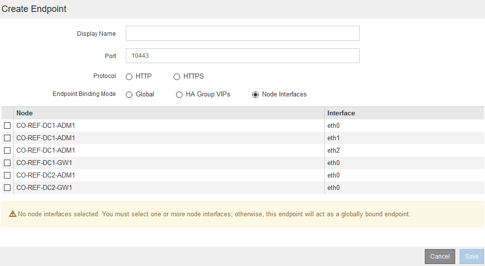

= Configurazione degli endpoint del bilanciamento del carico
:allow-uri-read: 
:icons: font
:imagesdir: ../media/

[role="lead"]
È possibile creare, modificare e rimuovere endpoint del bilanciamento del carico.

== Creazione di endpoint per il bilanciamento del carico

Ogni endpoint del bilanciamento del carico specifica una porta, un protocollo di rete (HTTP o HTTPS) e un tipo di servizio (S3 o Swift). Se si crea un endpoint HTTPS, è necessario caricare o generare un certificato server.

.Di cosa hai bisogno
* È necessario disporre dell'autorizzazione di accesso root.
* È necessario accedere a Grid Manager utilizzando un browser supportato.
* Se in precedenza sono state rimappate le porte che si intende utilizzare per il servizio Load Balancer, è necessario rimuovere i rimap.
+

IMPORTANT: Se sono state rimappate delle porte, non è possibile utilizzare le stesse porte per configurare gli endpoint del bilanciamento del carico. È possibile creare endpoint utilizzando porte rimappate, ma tali endpoint verranno rimappati alle porte e al servizio CLB originali, non al servizio Load Balancer. Seguire le istruzioni riportate nelle istruzioni di ripristino e manutenzione per rimuovere i rimapper delle porte.

+

NOTE: Il servizio CLB è obsoleto.

.Fasi
. Selezionare *Configuration* > *Network Settings* > *Load Balancer Endpoints*.
+
Viene visualizzata la pagina endpoint del bilanciamento del carico.

+
image::../media/load_balancer_endpoints.png[endpoint del bilanciamento del carico]

. Selezionare *Aggiungi endpoint*.
+
Viene visualizzata la finestra di dialogo Create Endpoint (Crea endpoint).

+
image::../media/load_balancer_endpoint_create_http.png[Creare un endpoint LB]

. Inserire un nome da visualizzare per l'endpoint, che verrà visualizzato nell'elenco della pagina endpoint del bilanciamento del carico.
. Inserire un numero di porta o lasciare il numero di porta pre-compilato così com'è.
+
Se si immette il numero di porta 80 o 443, l'endpoint viene configurato solo sui nodi gateway, poiché queste porte sono riservate sui nodi Admin.

+

NOTE: Le porte utilizzate da altri servizi di rete non sono consentite. Per un elenco delle porte utilizzate per le comunicazioni interne ed esterne, consultare le linee guida per il collegamento in rete.

. Selezionare *HTTP* o *HTTPS* per specificare il protocollo di rete per questo endpoint.
. Selezionare una modalità di binding degli endpoint.
+
** *Globale* (impostazione predefinita): L'endpoint è accessibile su tutti i nodi Gateway e Admin sul numero di porta specificato.
+
image::../media/load_balancer_endpoint_global_binding_mode.png[Endpoint Global Binding Mode]

** *Ha Group VIP*: L'endpoint è accessibile solo attraverso gli indirizzi IP virtuali definiti per i gruppi ha selezionati. Gli endpoint definiti in questa modalità possono riutilizzare lo stesso numero di porta, purché i gruppi ha definiti da tali endpoint non si sovrappongano tra loro.
+
Selezionare i gruppi ha con gli indirizzi IP virtuali in cui si desidera visualizzare l'endpoint.

+
image::../media/load_balancer_endpoint_ha_group_vips_binding_mode.png[Endpoint ha Group VIPs Binding Mode]

** *Node Interfaces*: L'endpoint è accessibile solo sui nodi designati e sulle interfacce di rete. Gli endpoint definiti in questa modalità possono riutilizzare lo stesso numero di porta purché tali interfacce non si sovrappongano l'una all'altra.
+
Selezionare le interfacce del nodo in cui si desidera visualizzare l'endpoint.

+

. Selezionare *Salva*.
+
Viene visualizzata la finestra di dialogo Edit Endpoint (Modifica endpoint).

. Selezionare *S3* o *Swift* per specificare il tipo di traffico che verrà utilizzato dall'endpoint.
+
image::../media/load_balancer_endpoint_client_options.png[Client di bilanciamento del carico]

. Se si seleziona *HTTP*, selezionare *Save* (Salva).
+
Viene creato l'endpoint non protetto. La tabella nella pagina degli endpoint del bilanciamento del carico elenca il nome visualizzato, il numero di porta, il protocollo e l'ID dell'endpoint dell'endpoint.

. Se si seleziona *HTTPS* e si desidera caricare un certificato, selezionare *carica certificato*.
+
image::../media/load_balancer_endpoint_upload_cert.png[Carica certificato]

+
.. Cercare il certificato del server e la chiave privata del certificato.
+
Per consentire ai client S3 di connettersi utilizzando un nome di dominio dell'endpoint S3 API, utilizzare un certificato con più domini o caratteri jolly che corrisponda a tutti i nomi di dominio che il client potrebbe utilizzare per connettersi alla griglia. Ad esempio, il certificato del server potrebbe utilizzare il nome di dominio `*._example_.com`.

+
link:configuring-s3-api-endpoint-domain-names.html["Configurazione dei nomi di dominio degli endpoint S3 API"]

.. Se si desidera, cercare un bundle CA.
.. Selezionare *Salva*.
+
Vengono visualizzati i dati del certificato con codifica PEM per l'endpoint.

. Se si seleziona *HTTPS* e si desidera generare un certificato, selezionare *generate Certificate* (genera certificato).
+
image::../media/load_balancer_endpoint_generate_cert.png[Genera certificato]

+
.. Immettere un nome di dominio o un indirizzo IP.
+
È possibile utilizzare i caratteri jolly per rappresentare i nomi di dominio completi di tutti i nodi Admin e Gateway che eseguono il servizio Load Balancer. Ad esempio, `*.sgws.foo.com` utilizza il carattere jolly * per rappresentare `gn1.sgws.foo.com` e. `gn2.sgws.foo.com`.

+
link:configuring-s3-api-endpoint-domain-names.html["Configurazione dei nomi di dominio degli endpoint S3 API"]

.. Selezionare image:../media/icon_plus_sign_black_on_white.gif["Segno più"] Per aggiungere altri nomi di dominio o indirizzi IP.
+
Se si utilizzano gruppi ad alta disponibilità (ha), aggiungere i nomi di dominio e gli indirizzi IP degli IP virtuali ha.

.. Se si desidera, immettere un oggetto X.509, noto anche come nome distinto (DN), per identificare chi possiede il certificato.
.. Se si desidera, selezionare il numero di giorni in cui il certificato è valido. L'impostazione predefinita è 730 giorni.
.. Selezionare *generate*.
+
Vengono visualizzati i metadati del certificato e i dati del certificato con codifica PEM per l'endpoint.

. Fare clic su *Save* (Salva).
+
Viene creato l'endpoint. La tabella nella pagina degli endpoint del bilanciamento del carico elenca il nome visualizzato, il numero di porta, il protocollo e l'ID dell'endpoint dell'endpoint.

.Informazioni correlate
link:../maintain/index.html["Mantieni  Ripristina"]

link:../network/index.html["Linee guida per la rete"]

link:managing-high-availability-groups.html["Gestione di gruppi ad alta disponibilità"]

link:managing-untrusted-client-networks.html["Gestione di reti client non attendibili"]

== Modifica degli endpoint del bilanciamento del carico

Per un endpoint non protetto (HTTP), è possibile modificare il tipo di servizio dell'endpoint tra S3 e Swift. Per un endpoint protetto (HTTPS), è possibile modificare il tipo di servizio dell'endpoint e visualizzare o modificare il certificato di protezione.

.Di cosa hai bisogno
* È necessario disporre dell'autorizzazione di accesso root.
* È necessario accedere a Grid Manager utilizzando un browser supportato.

.Fasi
. Selezionare *Configuration* > *Network Settings* > *Load Balancer Endpoints*.
+
Viene visualizzata la pagina endpoint del bilanciamento del carico. Gli endpoint esistenti sono elencati nella tabella.

+
Gli endpoint con certificati che scadranno a breve sono identificati nella tabella.

+
image::../media/load_balancer_endpoint_edit_or_remove.png[Modifica punto finale]

. Selezionare l'endpoint che si desidera modificare.
. Fare clic su *Edit endpoint* (Modifica endpoint).
+
Viene visualizzata la finestra di dialogo Edit Endpoint (Modifica endpoint).

+
Per un endpoint non protetto (HTTP), viene visualizzata solo la sezione Configurazione servizio endpoint della finestra di dialogo. Per un endpoint protetto (HTTPS), vengono visualizzate le sezioni Endpoint Service Configuration (Configurazione servizio endpoint) e Certificates (certificati) della finestra di dialogo, come illustrato nell'esempio seguente.

+
image::../media/load_balancer_endpoint_edit.png[Modifica l'endpoint del bilanciamento del carico]

. Apportare le modifiche desiderate all'endpoint.
+
Per un endpoint non protetto (HTTP), è possibile:

+
** Modificare il tipo di servizio dell'endpoint tra S3 e Swift.
** Modificare la modalità di associazione dell'endpoint. Per un endpoint protetto (HTTPS), è possibile:
** Modificare il tipo di servizio dell'endpoint tra S3 e Swift.
** Modificare la modalità di associazione dell'endpoint.
** Visualizzare il certificato di protezione.
** Caricare o generare un nuovo certificato di sicurezza quando il certificato corrente è scaduto o sta per scadere.
+
Selezionare una scheda per visualizzare informazioni dettagliate sul certificato del server StorageGRID predefinito o su un certificato firmato dalla CA caricato.

+

NOTE: Per modificare il protocollo per un endpoint esistente, ad esempio da HTTP a HTTPS, è necessario creare un nuovo endpoint. Seguire le istruzioni per la creazione degli endpoint del bilanciamento del carico e selezionare il protocollo desiderato.

. Fare clic su *Save* (Salva).

.Informazioni correlate
<<Creazione di endpoint per il bilanciamento del carico>>

== Rimozione degli endpoint del bilanciamento del carico

Se non hai più bisogno di un endpoint di bilanciamento del carico, puoi rimuoverlo.

.Di cosa hai bisogno
* È necessario disporre dell'autorizzazione di accesso root.
* È necessario accedere a Grid Manager utilizzando un browser supportato.

.Fasi
. Selezionare *Configuration* > *Network Settings* > *Load Balancer Endpoints*.
+
Viene visualizzata la pagina endpoint del bilanciamento del carico. Gli endpoint esistenti sono elencati nella tabella.

+
image::../media/load_balancer_endpoint_edit_or_remove.png[Modifica punto finale]

. Selezionare il pulsante di opzione a sinistra dell'endpoint che si desidera rimuovere.
. Fare clic su *Rimuovi endpoint*.
+
Viene visualizzata una finestra di dialogo di conferma.

+
image::../media/load_balancer_endpoint_confirm_removal.png[Confermare la rimozione degli endpoint]

. Fare clic su *OK*.
+
L'endpoint viene rimosso.

