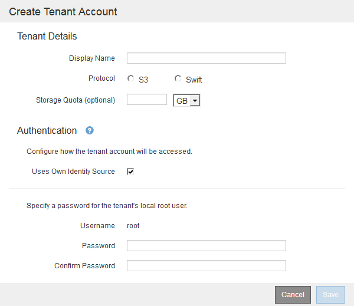

= Creazione di un account tenant
:allow-uri-read: 
:icons: font
:imagesdir: ../media/

[role="lead"]
È necessario creare almeno un account tenant per controllare l'accesso allo storage nel sistema StorageGRID.

.Di cosa hai bisogno
* È necessario accedere a Grid Manager utilizzando un browser supportato.
* È necessario disporre di autorizzazioni di accesso specifiche.

.Fasi
. Selezionare *tenant*.
+
Viene visualizzata la pagina account tenant che elenca gli account tenant esistenti.

+
image::../media/tenant_accounts_page_blank.png[Pagina account tenant - vuota]

. Selezionare *Crea*.
+
Viene visualizzata la pagina Create tenant account (Crea account tenant). I campi inclusi nella pagina dipendono dall'attivazione o meno di SSO (Single Sign-on) per il sistema StorageGRID.

+
** Se non viene utilizzato SSO, la pagina Create tenant account (Crea account tenant) è simile a questa.
+

** Se SSO è attivato, la pagina Create tenant account (Crea account tenant) è simile a questa.
+
image::../media/create_tenant_account_sso.gif[Crea account tenant SSO abilitato]

.Informazioni correlate
link:using-identity-federation.html["Utilizzo della federazione delle identità"]

link:configuring-sso.html["Configurazione del single sign-on"]
