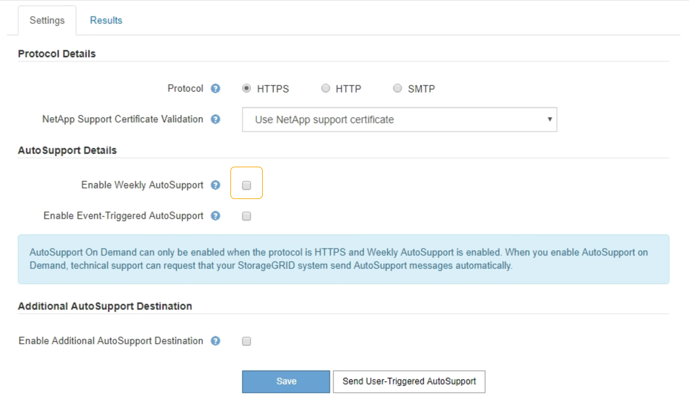

= Disattivazione dei messaggi AutoSupport settimanali
:allow-uri-read: 
:icons: font
:imagesdir: ../media/

[role="lead"]
Per impostazione predefinita, il sistema StorageGRID è configurato per inviare un messaggio AutoSupport al supporto NetApp una volta alla settimana.

.Di cosa hai bisogno
* È necessario accedere a Grid Manager utilizzando un browser supportato.
* È necessario disporre dell'autorizzazione Root Access o Other Grid Configuration.

.A proposito di questa attività
Per determinare quando viene inviato il messaggio AutoSupport settimanale, consultare la sezione *prossima ora pianificata* in *AutoSupport settimanale* nella pagina *AutoSupport* *risultati*. image:../media/autosupport_weekly_next_scheduled_time.png["Orario pianificato successivo AutoSupport settimanale"]

È possibile disattivare l'invio automatico di un messaggio AutoSupport in qualsiasi momento.

.Fasi
. Selezionare *supporto* *Strumenti* *AutoSupport*.
+
Viene visualizzata la pagina AutoSupport (Impostazioni) con la scheda *Settings* (Impostazioni) selezionata.

. Deselezionare la casella di controllo *attiva AutoSupport settimanale*.
+

. Selezionare *Salva*.

