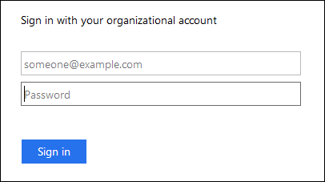

= Come funziona il single sign-on
:allow-uri-read: 
:icons: font
:imagesdir: ../media/

[role="lead"]
Prima di attivare SSO (Single Sign-on), esaminare in che modo i processi di accesso e disconnessione di StorageGRID vengono influenzati quando SSO è attivato.

== Accesso quando SSO è attivato

Quando SSO è attivato e si accede a StorageGRID, si viene reindirizzati alla pagina SSO dell'organizzazione per convalidare le credenziali.

.Fasi
. Immettere il nome di dominio completo o l'indirizzo IP di qualsiasi nodo di amministrazione StorageGRID in un browser Web.
+
Viene visualizzata la pagina di accesso a StorageGRID.

+
** Se si accede per la prima volta all'URL del browser, viene richiesto di inserire un ID account:
+
image::../media/sso_sign_in_first_time.gif[Accesso con SSO abilitato per il primo accesso]

** Se in precedenza hai effettuato l'accesso a Grid Manager o al Tenant Manager, ti verrà richiesto di selezionare un account recente o di inserire un ID account:
+
image::../media/sign_in_sso.gif[Pagina di accesso a StorageGRID se SSO è attivato]

+

NOTE: La pagina di accesso a StorageGRID non viene visualizzata quando si inserisce l'URL completo di un account tenant (ovvero un nome di dominio completo o un indirizzo IP seguito da) `/?accountId=_20-digit-account-id_`). Al contrario, si viene immediatamente reindirizzati alla pagina di accesso SSO dell'organizzazione, dove è possibile <<signin_sso,Accedi con le tue credenziali SSO>>.

. Indicare se si desidera accedere a Grid Manager o al tenant Manager:
+
** Per accedere a Grid Manager, lasciare vuoto il campo**account ID**, inserire *0* come ID account o selezionare *Grid Manager* se compare nell'elenco degli account recenti.
** Per accedere al tenant Manager, inserire l'ID account tenant di 20 cifre o selezionare un tenant in base al nome, se visualizzato nell'elenco degli account recenti.

. Fare clic su *Accedi*
+
StorageGRID reindirizza l'utente alla pagina di accesso SSO della propria organizzazione. Ad esempio:

+

. [[signin_sso]]Accedi con le tue credenziali SSO.
+
Se le credenziali SSO sono corrette:

+
.. Il provider di identità (IdP) fornisce una risposta di autenticazione a StorageGRID.
.. StorageGRID convalida la risposta di autenticazione.
.. Se la risposta è valida e l'utente appartiene a un gruppo federated con un'autorizzazione di accesso adeguata, l'utente ha effettuato l'accesso a Grid Manager o al tenant Manager, a seconda dell'account selezionato.

. Se si dispone di autorizzazioni adeguate, è possibile accedere ad altri nodi di amministrazione o a Grid Manager o Tenant Manager.
+
Non è necessario immettere nuovamente le credenziali SSO.

== Disconnessione quando SSO è attivato

Quando SSO è abilitato per StorageGRID, ciò che accade quando si effettua la disconnessione dipende da ciò che si effettua l'accesso e da dove si effettua la disconnessione.

.Fasi
. Individuare il collegamento *Disconnetti* nell'angolo in alto a destra dell'interfaccia utente.
. Fare clic su *Disconnetti*.
+
Viene visualizzata la pagina di accesso a StorageGRID. Il menu a discesa *Recent Accounts* (account recenti) viene aggiornato per includere *Grid Manager* o il nome del tenant, in modo da poter accedere a queste interfacce utente più rapidamente in futuro.

+
[cols="1a,1a,1a"]
|===
| Se hai effettuato l'accesso a... | E ti disconnetterai da... | Sei disconnesso da... 

 a| 
Grid Manager su uno o più nodi di amministrazione
 a| 
Grid Manager su qualsiasi nodo di amministrazione
 a| 
Grid Manager su tutti i nodi di amministrazione

 a| 
Tenant Manager su uno o più nodi di amministrazione
 a| 
Tenant Manager su qualsiasi nodo di amministrazione
 a| 
Tenant Manager su tutti i nodi di amministrazione

 a| 
Sia Grid Manager che tenant Manager
 a| 
Grid Manager
 a| 
Solo Grid Manager. Per disconnettersi da SSO, devi anche disconnetterti da Tenant Manager.

 a| 
Manager tenant
 a| 
Solo il tenant manager. Per disconnettersi da SSO, è inoltre necessario disconnettersi da Grid Manager.

|===

NOTE: La tabella riassume ciò che accade quando si effettua la disconnessione se si utilizza una singola sessione del browser. Se hai effettuato l'accesso a StorageGRID in più sessioni del browser, devi disconnetterti separatamente da tutte le sessioni del browser.
