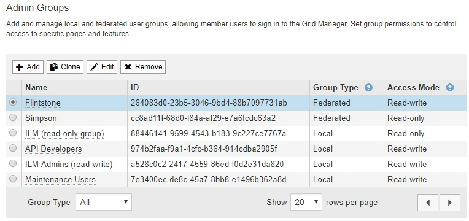

= Gestione dei gruppi di amministratori
:allow-uri-read: 
:icons: font
:imagesdir: ../media/

[role="lead"]
È possibile creare gruppi di amministratori per gestire le autorizzazioni di sicurezza per uno o più utenti amministratori. Gli utenti devono appartenere a un gruppo per poter accedere al sistema StorageGRID.

== Creazione di gruppi di amministratori

I gruppi di amministratori consentono di determinare quali utenti possono accedere a quali funzionalità e operazioni in Grid Manager e nell'API Grid Management.

.Di cosa hai bisogno
* È necessario accedere a Grid Manager utilizzando un browser supportato.
* È necessario disporre di autorizzazioni di accesso specifiche.
* Se si intende importare un gruppo federated, è necessario che la federazione delle identità sia configurata e che il gruppo federated esista già nell'origine delle identità configurata.

.Fasi
. Selezionare *Configuration* *Access Control* *Admin Groups*.
+
Viene visualizzata la pagina Admin Groups (gruppi di amministratori) che elenca i gruppi di amministratori esistenti.

+

. Selezionare *Aggiungi*.
+
Viene visualizzata la finestra di dialogo Add Group (Aggiungi gruppo).

+
image::../media/add_group.png[Aggiungi gruppo]

. Per tipo di gruppo, selezionare *locale* se si desidera creare un gruppo che verrà utilizzato solo all'interno di StorageGRID oppure selezionare *Federato* se si desidera importare un gruppo dall'origine dell'identità.
. Se si seleziona *locale*, immettere un nome visualizzato per il gruppo. Il nome visualizzato è il nome visualizzato in Grid Manager. Ad esempio, "`Maintenance Users`" o "`ILM Administrators.`"
. Immettere un nome univoco per il gruppo.
+
** *Locale*: Immettere il nome univoco desiderato. Ad esempio, "`ILM Administrators.`"
** *Federated*: Immettere il nome del gruppo esattamente come appare nell'origine dell'identità configurata.

. Per *Access Mode*, selezionare se gli utenti del gruppo possono modificare le impostazioni ed eseguire operazioni in Grid Manager e nell'API Grid Management o se possono visualizzare solo impostazioni e funzionalità.
+
** *Read-write* (valore predefinito): Gli utenti possono modificare le impostazioni ed eseguire le operazioni consentite dalle autorizzazioni di gestione.
** *Sola lettura*: Gli utenti possono visualizzare solo le impostazioni e le funzionalità. Non possono apportare modifiche o eseguire operazioni nell'API Grid Manager o Grid Management. Gli utenti locali di sola lettura possono modificare le proprie password.
+

NOTE: Se un utente appartiene a più gruppi e un gruppo è impostato su *sola lettura*, l'utente avrà accesso in sola lettura a tutte le impostazioni e funzionalità selezionate.

. Selezionare una o più autorizzazioni di gestione.
+
È necessario assegnare almeno un'autorizzazione a ciascun gruppo; in caso contrario, gli utenti appartenenti al gruppo non potranno accedere a StorageGRID.

. Selezionare *Salva*.
+
Viene creato il nuovo gruppo. Se si tratta di un gruppo locale, è ora possibile aggiungere uno o più utenti. Se si tratta di un gruppo federated, l'origine identità gestisce gli utenti appartenenti al gruppo.

.Informazioni correlate
link:managing-local-users.html["Gestione degli utenti locali"]

== Autorizzazioni del gruppo di amministrazione

Quando si creano gruppi di utenti admin, si selezionano una o più autorizzazioni per controllare l'accesso a funzionalità specifiche di Grid Manager. È quindi possibile assegnare ciascun utente a uno o più di questi gruppi di amministratori per determinare quali attività possono essere eseguite dall'utente.

È necessario assegnare almeno un'autorizzazione a ciascun gruppo; in caso contrario, gli utenti appartenenti a tale gruppo non potranno accedere a Grid Manager.

Per impostazione predefinita, qualsiasi utente appartenente a un gruppo che dispone di almeno un'autorizzazione può eseguire le seguenti attività:

* Accedi a Grid Manager
* Visualizza la dashboard
* Visualizzare le pagine dei nodi
* Monitorare la topologia della griglia
* Visualizzare gli avvisi correnti e risolti
* Visualizzazione degli allarmi correnti e storici (sistema legacy)
* Modifica della propria password (solo utenti locali)
* Visualizzare alcune informazioni nelle pagine Configurazione e manutenzione

Le sezioni seguenti descrivono le autorizzazioni che è possibile assegnare durante la creazione o la modifica di un gruppo amministrativo. Qualsiasi funzionalità non esplicitamente menzionata richiede l'autorizzazione Root Access.

=== Accesso root

Questa autorizzazione consente di accedere a tutte le funzioni di amministrazione della griglia.

=== Gestire gli avvisi

Questa autorizzazione consente di accedere alle opzioni per la gestione degli avvisi. Gli utenti devono disporre di questa autorizzazione per gestire silenzi, notifiche di avviso e regole di avviso.

=== Riconoscere gli allarmi (sistema legacy)

Questa autorizzazione consente di riconoscere e rispondere agli allarmi (sistema legacy). Tutti gli utenti che hanno effettuato l'accesso possono visualizzare gli allarmi correnti e storici.

Se si desidera che un utente monitori la topologia della griglia e riconosca solo gli allarmi, è necessario assegnare questa autorizzazione.

=== Configurazione della pagina Grid Topology (topologia griglia)

Questa autorizzazione consente di accedere alle seguenti opzioni di menu:

* Schede di configurazione disponibili nelle pagine di *supporto* *Strumenti* *topologia griglia*.
* Collegamento *Reset event count* (Ripristina conteggi eventi) nella scheda *Nodes* *Events* (nodi).

=== Altra configurazione della griglia

Questa autorizzazione consente di accedere a ulteriori opzioni di configurazione della griglia.

IMPORTANT: Per visualizzare queste opzioni aggiuntive, gli utenti devono disporre anche dell'autorizzazione Grid Topology Page Configuration.

* *Allarmi* (sistema legacy):
+
** Allarmi globali
** Configurazione e-mail legacy

* *ILM*:
+
** Pool di storage
** Storage Grades (gradi di storage)

* *Configurazione* *Impostazioni di rete*
+
** Costo del collegamento

* *Configurazione* *Impostazioni di sistema*:
+
** Opzioni di visualizzazione
** Opzioni griglia
** Opzioni di storage

* *Configurazione* *monitoraggio*:
+
** Eventi

* *Supporto*:
+
** AutoSupport

=== Account tenant

Questa autorizzazione consente di accedere alla pagina *tenant* *tenant account*.

NOTE: La versione 1 dell'API Grid Management (obsoleta) utilizza questa autorizzazione per gestire i criteri di gruppo tenant, reimpostare le password di amministrazione di Swift e gestire le chiavi di accesso S3 dell'utente root.

=== Modificare la password principale del tenant

Questa autorizzazione consente di accedere all'opzione *Change Root Password* (Modifica password root) nella pagina Tenant Accounts (account tenant), consentendo di controllare chi può modificare la password per l'utente root locale del tenant. Gli utenti che non dispongono di questa autorizzazione non possono visualizzare l'opzione *Change Root Password* (Modifica password root).

NOTE: Prima di poter assegnare questa autorizzazione, è necessario assegnare al gruppo l'autorizzazione account tenant.

=== Manutenzione

Questa autorizzazione consente di accedere alle seguenti opzioni di menu:

* *Configurazione* *Impostazioni di sistema*:
+
** Nomi di dominio*
** Certificati server*

* *Configurazione* *monitoraggio*:
+
** Audit*

* *Configurazione* *controllo accessi*:
+
** Password di rete

* *Manutenzione* *attività di manutenzione*
+
** Decommissionare
** Espansione
** Recovery (recupero)

* *Manutenzione* *rete*:
+
** Server DNS*
** Rete di rete*
** Server NTP*

* *Manutenzione* *sistema*:
+
** Licenza*
** Pacchetto di ripristino
** Aggiornamento software

* *Supporto* *Strumenti*:
+
** Registri

* Gli utenti che non dispongono dell'autorizzazione di manutenzione possono visualizzare, ma non modificare, le pagine contrassegnate da un asterisco.

=== Query metriche

Questa autorizzazione consente di accedere alla pagina *Support* *Tools* *Metrics*. Questa autorizzazione consente inoltre di accedere alle query metriche Prometheus personalizzate utilizzando la sezione *metriche* dell'API Grid Management.

=== ILM

Questa autorizzazione consente di accedere alle seguenti opzioni del menu *ILM*:

* *Erasure coding*
* *Regole*
* *Politiche*
* *Regioni*

NOTE: L'accesso alle opzioni di menu *ILM* *Storage Pools* e *ILM* *Storage Grades* è controllato dalle altre autorizzazioni Grid Configuration (Configurazione griglia) e Grid Topology Page Configuration (Configurazione pagina topologia griglia).

=== Object Metadata Lookup (Ricerca metadati oggetto)

Questa autorizzazione consente di accedere all'opzione di menu *ILM* *Object Metadata Lookup*.

=== Amministratore dell'appliance di storage

Questa autorizzazione consente di accedere al gestore di sistema e-Series SANtricity sulle appliance di storage tramite Grid Manager.

=== Interazione tra permessi e modalità di accesso

Per tutte le autorizzazioni, l'impostazione della modalità di accesso del gruppo determina se gli utenti possono modificare le impostazioni ed eseguire operazioni o se possono visualizzare solo le relative impostazioni e funzionalità. Se un utente appartiene a più gruppi e un gruppo è impostato su *sola lettura*, l'utente avrà accesso in sola lettura a tutte le impostazioni e funzionalità selezionate.

=== Disattivazione delle funzionalità dall'API Grid Management

È possibile utilizzare l'API di gestione griglia per disattivare completamente alcune funzionalità nel sistema StorageGRID. Quando una funzione viene disattivata, non è possibile assegnare a nessuno le autorizzazioni per eseguire le attività correlate a tale funzione.

.A proposito di questa attività
Il sistema Disattivato consente di impedire l'accesso a determinate funzioni del sistema StorageGRID. La disattivazione di una funzione è l'unico modo per impedire all'utente root o agli utenti appartenenti a gruppi di amministrazione con l'autorizzazione di accesso root di utilizzare tale funzione.

Per comprendere come questa funzionalità potrebbe essere utile, considerare il seguente scenario:

_L'azienda A è un provider di servizi che affitta la capacità di storage del proprio sistema StorageGRID creando account tenant. Per proteggere la sicurezza degli oggetti dei titolari di leasing, la Società A desidera garantire che i propri dipendenti non possano mai accedere a alcun account tenant dopo l'implementazione dell'account._

_L'azienda A è in grado di raggiungere questo obiettivo utilizzando il sistema Deactivate Features nell'API Grid Management. Disattivando completamente la funzione *Change tenant Root Password* in Grid Manager (sia l'interfaccia utente che l'API), la società A può garantire che nessun utente Admin, incluso l'utente root e gli utenti appartenenti a gruppi con l'autorizzazione Root Access, possa modificare la password per qualsiasi utente root dell'account tenant._

==== Riattivazione delle funzioni disattivate

Per impostazione predefinita, è possibile utilizzare l'API Grid Management per riattivare una funzione disattivata. Tuttavia, se si desidera evitare che le funzioni disattivate vengano riattivate, è possibile disattivare la funzione *ActivateFeatures*.

CAUTION: Impossibile riattivare la funzione *ActivateFeatures*. Se decidi di disattivare questa funzione, tieni presente che perderai in modo permanente la possibilità di riattivare qualsiasi altra funzione disattivata. È necessario contattare il supporto tecnico per ripristinare eventuali funzionalità perse.

Per ulteriori informazioni, consultare le istruzioni per l'implementazione delle applicazioni client S3 o Swift.

.Fasi
. Accedere alla documentazione Swagger per l'API di gestione griglia.
. Individuare l'endpoint Deactivate Features.
. Per disattivare una funzione, ad esempio *Change tenant Root Password*, inviare un corpo all'API come segue:
+
[listing]
----
{ "grid": {"changeTenantRootPassword": true} }
----
+
Al termine della richiesta, la funzione Cambia password principale tenant viene disattivata. L'autorizzazione per la gestione della password principale del tenant non viene più visualizzata nell'interfaccia utente e qualsiasi richiesta API che tenta di modificare la password root per un tenant non riuscirà con "`403 Forbidden`".

. Per riattivare tutte le funzioni, inviare un corpo all'API come segue:
+
[listing]
----
{ "grid": null }
----
+
Una volta completata la richiesta, tutte le funzioni, inclusa la funzione Change tenant Root Password (Modifica password principale tenant), vengono riattivate. L'autorizzazione di gestione della password root del tenant viene ora visualizzata nell'interfaccia utente e tutte le richieste API che tentano di modificare la password root di un tenant avranno esito positivo, presupponendo che l'utente disponga dell'autorizzazione di gestione Root Access o Change tenant Root Password.

+

NOTE: L'esempio precedente causa la riattivazione di _tutte_ le funzioni disattivate. Se sono state disattivate altre funzioni che devono rimanere disattivate, è necessario specificarle esplicitamente nella richiesta PUT. Ad esempio, per riattivare la funzione Cambia password principale tenant e continuare a disattivare la funzione di conferma allarme, inviare la seguente richiesta PUT:

+
[listing]
----
{ "grid": { "alarmAcknowledgment": true } }
----

.Informazioni correlate
link:using-grid-management-api.html["Utilizzando l'API Grid Management"]

== Modifica di un gruppo di amministratori

È possibile modificare un gruppo di amministratori per modificare le autorizzazioni associate al gruppo. Per i gruppi di amministratori locali, è anche possibile aggiornare il nome visualizzato.

.Di cosa hai bisogno
* È necessario accedere a Grid Manager utilizzando un browser supportato.
* È necessario disporre di autorizzazioni di accesso specifiche.

.Fasi
. Selezionare *Configuration* *Access Control* *Admin Groups*.
. Selezionare il gruppo.
+
Se il sistema include più di 20 elementi, è possibile specificare quante righe vengono visualizzate su ogni pagina contemporaneamente. È quindi possibile utilizzare la funzione trova del browser per cercare un elemento specifico nelle righe attualmente visualizzate.

. Fare clic su *Edit* (Modifica).
. Se si desidera, per i gruppi locali, inserire il nome del gruppo che verrà visualizzato agli utenti, ad esempio "`Maintenance Users`".
+
Non è possibile modificare il nome univoco, ovvero il nome del gruppo interno.

. In alternativa, modificare la modalità di accesso del gruppo.
+
** *Read-write* (valore predefinito): Gli utenti possono modificare le impostazioni ed eseguire le operazioni consentite dalle autorizzazioni di gestione.
** *Sola lettura*: Gli utenti possono visualizzare solo le impostazioni e le funzionalità. Non possono apportare modifiche o eseguire operazioni nell'API Grid Manager o Grid Management. Gli utenti locali di sola lettura possono modificare le proprie password.
+

NOTE: Se un utente appartiene a più gruppi e un gruppo è impostato su *sola lettura*, l'utente avrà accesso in sola lettura a tutte le impostazioni e funzionalità selezionate.

. Facoltativamente, aggiungere o rimuovere le autorizzazioni di gruppo.
+
Vedere le informazioni sulle autorizzazioni del gruppo di amministrazione.

. Selezionare *Salva*.

.Informazioni correlate
<<Autorizzazioni del gruppo di amministrazione>>

== Eliminazione di un gruppo di amministratori

È possibile eliminare un gruppo di amministratori quando si desidera rimuovere il gruppo dal sistema e rimuovere tutte le autorizzazioni associate al gruppo. L'eliminazione di un gruppo di amministratori comporta la rimozione di tutti gli utenti admin dal gruppo, ma non l'eliminazione degli utenti admin.

.Di cosa hai bisogno
* È necessario accedere a Grid Manager utilizzando un browser supportato.
* È necessario disporre di autorizzazioni di accesso specifiche.

.A proposito di questa attività
Quando elimini un gruppo, gli utenti assegnati a quel gruppo perderanno tutti i privilegi di accesso a Grid Manager, a meno che non ricevano privilegi da un altro gruppo.

.Fasi
. Selezionare *Configuration* *Access Control* *Admin Groups*.
. Selezionare il nome del gruppo.
+
Se il sistema include più di 20 elementi, è possibile specificare quante righe vengono visualizzate su ogni pagina contemporaneamente. È quindi possibile utilizzare la funzione trova del browser per cercare un elemento specifico nelle righe attualmente visualizzate.

. Selezionare *Rimuovi*.
. Selezionare *OK*.

