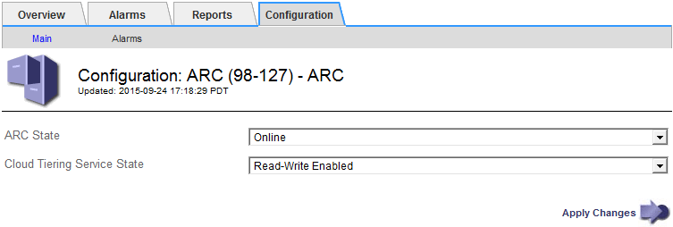

= Modifica dello stato del servizio di tiering cloud
:allow-uri-read: 
:icons: font
:imagesdir: ../media/

[role="lead"]
È possibile controllare la capacità di lettura e scrittura del nodo di archiviazione nel sistema storage di archiviazione esterno di destinazione che si connette attraverso l'API S3 modificando lo stato del servizio di tiering cloud.

.Di cosa hai bisogno
* È necessario accedere a Grid Manager utilizzando un browser supportato.
* È necessario disporre di autorizzazioni di accesso specifiche.
* Il nodo di archiviazione deve essere configurato.

.A proposito di questa attività
È possibile disattivare il nodo di archiviazione modificando lo stato del servizio di tiering cloud in *Read-Write Disabled*.

.Fasi
. Selezionare *supporto* > *Strumenti* > *topologia griglia*.
. Selezionare *_Archive Node_* *ARC*.
. Selezionare *Configurazione* *principale*.
+

. Selezionare un *Cloud Tiering Service state*.
. Fare clic su *Applica modifiche*.

