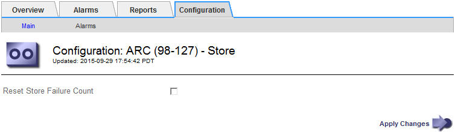

= Reimpostazione del numero di errori di archiviazione per la connessione API S3
:allow-uri-read: 
:icons: font
:imagesdir: ../media/

[role="lead"]
Se il nodo di archiviazione si connette a un sistema di storage di archiviazione tramite l'API S3, è possibile reimpostare il numero di errori di archiviazione, che può essere utilizzato per cancellare l'allarme ARVF (Store Failures).

.Di cosa hai bisogno
* È necessario accedere a Grid Manager utilizzando un browser supportato.
* È necessario disporre di autorizzazioni di accesso specifiche.

.Fasi
. Selezionare *supporto* > *Strumenti* > *topologia griglia*.
. Selezionare *_Archive Node_* *ARC* *Store*.
. Selezionare *Configurazione* *principale*.
+

. Selezionare *Reset Store Failure Count*.
. Fare clic su *Applica modifiche*.
+
L'attributo Store Failures viene reimpostato su zero.

