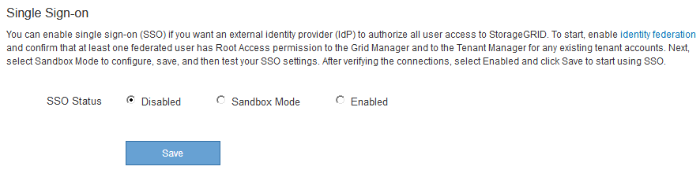

= Utilizzo della modalità sandbox
:allow-uri-read: 
:icons: font
:imagesdir: ../media/

[role="lead"]
È possibile utilizzare la modalità sandbox per configurare e testare i trust delle parti di base di Active Directory Federation Services (ad FS) prima di applicare il single sign-on (SSO) per gli utenti StorageGRID. Una volta attivato SSO, è possibile riabilitare la modalità sandbox per configurare o testare i trust delle parti di base nuove ed esistenti. La riattivazione della modalità sandbox disattiva temporaneamente SSO per gli utenti StorageGRID.

.Di cosa hai bisogno
* È necessario accedere a Grid Manager utilizzando un browser supportato.
* È necessario disporre di autorizzazioni di accesso specifiche.

.A proposito di questa attività
Quando SSO è attivato e un utente tenta di accedere a un nodo amministratore, StorageGRID invia una richiesta di autenticazione ad FS. A sua volta, ad FS invia una risposta di autenticazione a StorageGRID, indicando se la richiesta di autorizzazione ha avuto esito positivo. Per le richieste riuscite, la risposta include un UUID (Universally Unique Identifier) per l'utente.

Per consentire a StorageGRID (il provider di servizi) e ad FS (il provider di identità) di comunicare in modo sicuro sulle richieste di autenticazione dell'utente, è necessario configurare alcune impostazioni in StorageGRID. Quindi, è necessario utilizzare ad FS per creare un trust per la parte di base per ogni nodo di amministrazione. Infine, è necessario tornare a StorageGRID per attivare SSO.

La modalità sandbox semplifica l'esecuzione di questa configurazione e il test di tutte le impostazioni prima di attivare SSO.

NOTE: L'utilizzo della modalità sandbox è altamente consigliato, ma non strettamente necessario. Se si è pronti a creare trust di ad FS contando subito dopo aver configurato SSO in StorageGRID, Inoltre, non è necessario testare i processi SSO e di logout singolo (SLO) per ciascun nodo di amministrazione, fare clic su *Enabled*, immettere le impostazioni StorageGRID, creare un trust per ciascun nodo di amministrazione in ad FS, quindi fare clic su *Save* per attivare SSO.

.Fasi
. Selezionare *Configuration* *Access Control* *Single Sign-on*.
+
Viene visualizzata la pagina Single Sign-on (accesso singolo), con l'opzione *Disabled* (Disattivato) selezionata.

+

+

NOTE: Se le opzioni di stato SSO non vengono visualizzate, verificare di aver configurato Active Directory come origine dell'identità federata. Consulta "`requisiti per l'utilizzo del Single Sign-on`".

. Selezionare l'opzione *Sandbox Mode*.
+
Vengono visualizzate le impostazioni del provider di identità e della parte che si basa. Nella sezione Identity Provider, il campo *Service Type* è di sola lettura. Mostra il tipo di servizio di federazione delle identità in uso (ad esempio, Active Directory).

. Nella sezione Identity Provider:
+
.. Inserire il nome del servizio Federation, esattamente come appare in ad FS.
+

NOTE: Per individuare il nome del servizio Federation, accedere a Gestione server Windows. Selezionare *Tools* *ad FS Management*. Dal menu Action (azione), selezionare *Edit Federation Service Properties* (Modifica proprietà servizio federazione). Il nome del servizio della federazione viene visualizzato nel secondo campo.

.. Specificare se si desidera utilizzare TLS (Transport Layer Security) per proteggere la connessione quando il provider di identità invia le informazioni di configurazione SSO in risposta alle richieste StorageGRID.
+
*** *Usa certificato CA del sistema operativo*: Utilizzare il certificato CA predefinito installato sul sistema operativo per proteggere la connessione.
*** *Usa certificato CA personalizzato*: Utilizza un certificato CA personalizzato per proteggere la connessione.
+
Se si seleziona questa impostazione, copiare e incollare il certificato nella casella di testo *certificato CA*.

*** *Non utilizzare TLS*: Non utilizzare un certificato TLS per proteggere la connessione.

. Nella sezione parte che si basa, specificare l'identificativo della parte che si desidera utilizzare per i nodi di amministrazione StorageGRID quando si configurano i trust della parte che si basa.
+
** Ad esempio, se la griglia dispone di un solo nodo di amministrazione e non si prevede di aggiungere altri nodi di amministrazione in futuro, immettere `SG` oppure `StorageGRID`.
** Se la griglia include più di un nodo di amministrazione, includere la stringa `[HOSTNAME]` nell'identificatore. Ad esempio, `SG-[HOSTNAME]`. In questo modo viene generata una tabella che include un identificativo di parte di base per ciascun nodo di amministrazione, in base al nome host del nodo. + NOTA: È necessario creare un trust per ciascun nodo amministrativo nel sistema StorageGRID. La disponibilità di un trust per ciascun nodo di amministrazione garantisce che gli utenti possano accedere e uscire in modo sicuro da qualsiasi nodo di amministrazione.

+
image::../media/sso_status_sandbox_mode.gif[Single Sign-on (accesso singolo),Sandbox mode enabled,Relying party identifiers shown for several Admin Nodes]

. Fare clic su *Save* (Salva).
+
** Sul pulsante *Save* viene visualizzato un segno di spunta verde per alcuni secondi.
+
image::../media/save_button_green_checkmark.gif[Pulsante Save (Salva) con un segno di spunta verde]

** Viene visualizzato il messaggio di conferma della modalità Sandbox, che conferma l'attivazione della modalità sandbox. È possibile utilizzare questa modalità mentre si utilizza ad FS per configurare un trust di parte per ciascun nodo di amministrazione e testare i processi di accesso singolo (SSO) e di logout singolo (SLO).
+
image::../media/sso_sandbox_mode_enabled.gif[Modalità sandbox SSO attivata]

.Informazioni correlate
link:requirements-for-sso.html["Requisiti per l'utilizzo del single sign-on"]
