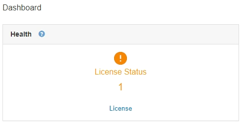

= Visualizzazione delle informazioni sulla licenza StorageGRID
:allow-uri-read: 
:icons: font
:imagesdir: ../media/

[role="lead"]
Se necessario, è possibile visualizzare le informazioni sulla licenza del sistema StorageGRID, ad esempio la capacità di storage massima del grid.

.Di cosa hai bisogno
* È necessario accedere a Grid Manager utilizzando un browser supportato.

.A proposito di questa attività
In caso di problemi con la licenza software per questo sistema StorageGRID, il pannello Stato del dashboard include un'icona Stato licenza e un collegamento *licenza*. Il numero indica il numero di problemi relativi alla licenza.

.Fase
Per visualizzare la licenza, effettuare una delle seguenti operazioni:

* Dal pannello Health (Stato) della dashboard, fare clic sull'icona License status (Stato licenza) o sul collegamento *License* (licenza). Questo collegamento viene visualizzato solo in caso di problemi con la licenza.
* Selezionare *manutenzione* *sistema* *licenza*.

Viene visualizzata la pagina License (licenza) che fornisce le seguenti informazioni di sola lettura sulla licenza corrente:

* ID sistema StorageGRID, che è il numero di identificazione univoco per l'installazione di StorageGRID
* Numero di serie della licenza
* Capacità di storage concessa in licenza del grid
* Data di fine della licenza software
* Data di fine del contratto di assistenza
* Contenuto del file di testo della licenza

NOTE: Per le licenze rilasciate prima di StorageGRID 10.3, la capacità dello storage concesso in licenza non è inclusa nel file di licenza e viene visualizzato il messaggio "vedere il contratto di licenza" invece di un valore.
