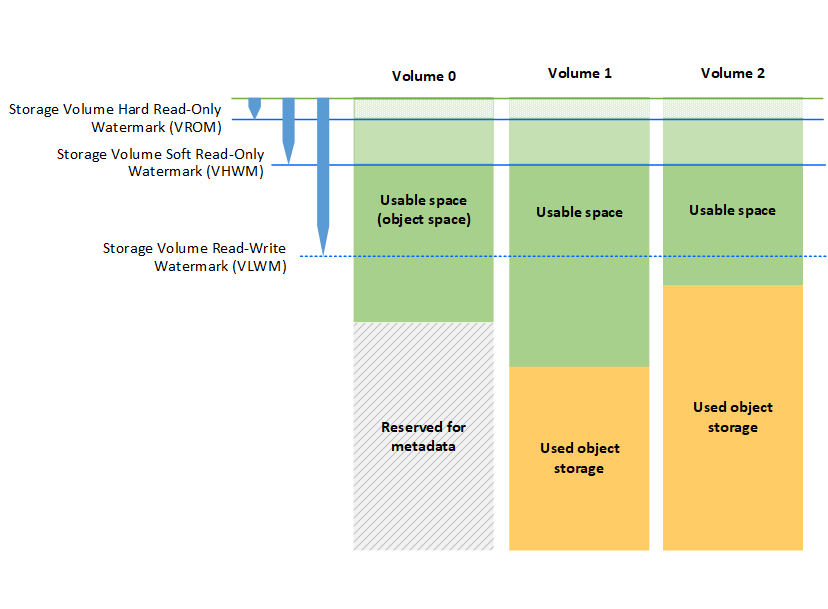

= Quali sono le filigrane dei volumi di storage
:allow-uri-read: 
:icons: font
:imagesdir: ../media/

[role="lead"]
StorageGRID utilizza le filigrane del volume di storage per consentire di monitorare la quantità di spazio utilizzabile disponibile sui nodi di storage. Se la quantità di spazio disponibile su un nodo è inferiore a un'impostazione di filigrana configurata, viene attivato l'allarme Storage Status (SST) per determinare se è necessario aggiungere nodi di storage.

Per visualizzare le impostazioni correnti delle filigrane Storage Volume, selezionare *Configurazione* *Opzioni di archiviazione* *Panoramica*.

image::../media/storage_watermarks.png[Filigrane]

La figura seguente rappresenta un nodo di storage con tre volumi e mostra la posizione relativa delle tre filigrane del volume di storage. All'interno di ciascun nodo di storage, StorageGRID riserva spazio sul volume 0 per i metadati dell'oggetto; qualsiasi spazio rimanente su tale volume viene utilizzato per i dati dell'oggetto. Tutti gli altri volumi vengono utilizzati esclusivamente per i dati degli oggetti, che includono copie replicate e frammenti con codifica di cancellazione.

Le filigrane del volume di storage sono impostazioni predefinite a livello di sistema che indicano la quantità minima di spazio libero richiesta su ciascun volume nel nodo di storage per impedire a StorageGRID di modificare il comportamento di lettura/scrittura del nodo o di attivare un allarme. Tenere presente che tutti i volumi devono raggiungere il watermark prima che StorageGRID agisca. Se alcuni volumi hanno una quantità di spazio libero superiore al minimo richiesto, l'allarme non viene attivato e il comportamento di lettura/scrittura del nodo non cambia.

== Filigrana di sola lettura software del volume di storage (VHWM)

Il watermark Storage Volume Soft Read-Only è il primo watermark a indicare che lo spazio utilizzabile di un nodo per i dati dell'oggetto sta diventando pieno. Questo watermark rappresenta la quantità di spazio libero che deve esistere su ogni volume in un nodo di storage per impedire al nodo di passare alla "modalità `soft Read-only`". La modalità di sola lettura morbida indica che il nodo di storage annuncia servizi di sola lettura al resto del sistema StorageGRID, ma soddisfa tutte le richieste di scrittura in sospeso.

Se la quantità di spazio libero su ciascun volume è inferiore all'impostazione di questo watermark, l'allarme Storage Status (SST) viene attivato al livello Notice e il nodo di storage passa alla modalità soft di sola lettura.

Ad esempio, si supponga che la filigrana Storage Volume Soft Read-Only sia impostata su 10 GB, che è il valore predefinito. Se su ciascun volume nel nodo di storage rimangono meno di 10 GB di spazio libero, l'allarme SSTS viene attivato a livello Notice e il nodo di storage passa alla modalità soft di sola lettura.

== Filigrana di sola lettura (VROM) rigida del volume di storage

Il watermark di sola lettura hard del volume di storage è il watermark successivo per indicare che lo spazio utilizzabile di un nodo per i dati dell'oggetto sta diventando pieno. Questo watermark rappresenta la quantità di spazio libero che deve esistere su ogni volume in un nodo di storage per impedire al nodo di passare alla "`modalità di sola lettura`". La modalità hard Read-only significa che il nodo di storage è di sola lettura e non accetta più richieste di scrittura.

Se la quantità di spazio libero su ogni volume in un nodo di storage è inferiore all'impostazione di questo watermark, l'allarme Storage Status (SST) viene attivato al livello principale e il nodo di storage passa alla modalità hard Read-only.

Ad esempio, supponiamo che il watermark di sola lettura hard del volume di storage sia impostato su 5 GB, che è il valore predefinito. Se su ciascun volume di storage nel nodo di storage rimangono meno di 5 GB di spazio libero, l'allarme SSTS viene attivato al livello principale e il nodo di storage passa alla modalità hard Read-only.

Il valore della filigrana hard Read-only del volume di storage deve essere inferiore al valore della filigrana soft Read-only del volume di storage.

== Filigrana di lettura/scrittura del volume di storage (VLWM)

Il watermark di lettura/scrittura del volume di storage si applica solo ai nodi di storage che sono passati alla modalità di sola lettura. Questo watermark determina quando il nodo di storage può diventare di nuovo in lettura/scrittura.

Ad esempio, supponiamo che un nodo di storage sia passato alla modalità hard Read-only. Se il watermark Read-Write del volume di storage è impostato su 30 GB (impostazione predefinita), lo spazio libero su ogni volume di storage nel nodo di storage deve aumentare da 5 GB a 30 GB prima che il nodo possa tornare in lettura-scrittura.

Il valore della filigrana Read-Write del volume di storage deve essere maggiore del valore della filigrana soft di sola lettura del volume di storage.

.Informazioni correlate
link:managing-full-storage-nodes.html["Gestione dei nodi di storage completi"]
