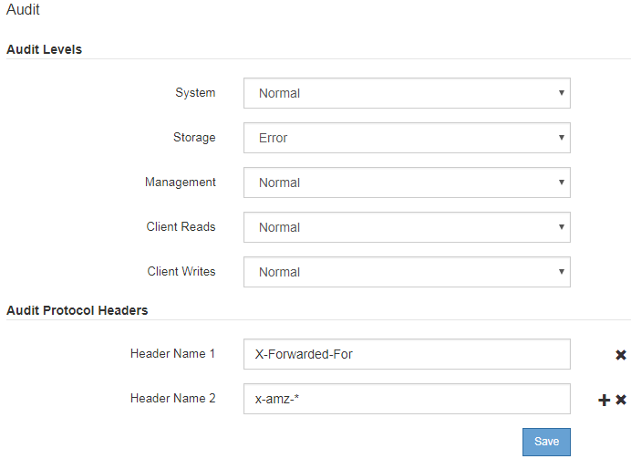

= Modifica dei livelli dei messaggi di audit
:allow-uri-read: 
:icons: font
:imagesdir: ../media/

[role="lead"]
È possibile regolare i livelli di audit per aumentare o diminuire il numero di messaggi di audit registrati nel registro di audit per ciascuna categoria di messaggi di audit.

.Di cosa hai bisogno
* È necessario accedere a Grid Manager utilizzando un browser supportato.
* È necessario disporre di autorizzazioni di accesso specifiche.

.A proposito di questa attività
I messaggi di audit registrati nel log di audit vengono filtrati in base alle impostazioni della pagina *Configurazione* > *monitoraggio* > *controllo*.

È possibile impostare un livello di audit diverso per ciascuna delle seguenti categorie di messaggi:

* *Sistema*: Per impostazione predefinita, questo livello è impostato su normale.
* *Storage*: Per impostazione predefinita, questo livello è impostato su Error.
* *Gestione*: Per impostazione predefinita, questo livello è impostato su normale.
* *Letture client*: Per impostazione predefinita, questo livello è impostato su normale.
* *Client Scritture*: Per impostazione predefinita, questo livello è impostato su Normal (normale).

NOTE: Queste impostazioni predefinite si applicano se StorageGRID è stato installato inizialmente utilizzando la versione 10.3 o successiva. Se è stato eseguito l'aggiornamento da una versione precedente di StorageGRID, l'impostazione predefinita per tutte le categorie è normale.

NOTE: Durante gli aggiornamenti, le configurazioni a livello di audit non saranno effettive immediatamente.

.Fasi
. Selezionare *Configuration* > *Monitoring* > *Audit*.
+

. Per ciascuna categoria di messaggi di audit, selezionare un livello di audit dall'elenco a discesa:
+
[cols="20,80"]
|===
| Livello di audit | Descrizione 

 a| 
Spento
 a| 
Non vengono registrati messaggi di audit della categoria.

 a| 
Errore
 a| 
Vengono registrati solo messaggi di errore - messaggi di audit per i quali il codice risultato non è stato "riuscito" (SUCS).

 a| 
Normale
 a| 
Vengono registrati i messaggi transazionali standard, ovvero i messaggi elencati in queste istruzioni per la categoria.

 a| 
Debug
 a| 
Obsoleto. Questo livello si comporta come il livello di audit normale.

|===
+
I messaggi inclusi per qualsiasi livello specifico includono quelli che verrebbero registrati ai livelli superiori. Ad esempio, il livello normale include tutti i messaggi di errore.

. In *Audit Protocol Headers*, inserire il nome delle intestazioni delle richieste HTTP da includere nei messaggi di controllo lettura client e scrittura client. Utilizzare un asterisco (*) come carattere jolly o la sequenza di escape (*) come asterisco letterale. Fare clic sul segno più per creare un elenco di campi relativi al nome dell'intestazione.
+

NOTE: Le intestazioni dei protocolli di audit si applicano solo alle richieste S3 e Swift.

+
Quando tali intestazioni HTTP vengono trovate in una richiesta, vengono incluse nel messaggio di audit nel campo HTRH.

+

NOTE: Le intestazioni delle richieste del protocollo di audit vengono registrate solo se il livello di audit per *letture client* o *scritture client* non è *disattivato*.

. Fare clic su *Save* (Salva).

.Informazioni correlate
link:system-audit-messages.html["Messaggi di audit del sistema"]

link:object-storage-audit-messages.html["Messaggi di audit dello storage a oggetti"]

link:management-audit-message.html["Messaggio di audit della gestione"]

link:client-read-audit-messages.html["Messaggi di audit in lettura del client"]

link:../admin/index.html["Amministrare StorageGRID"]
