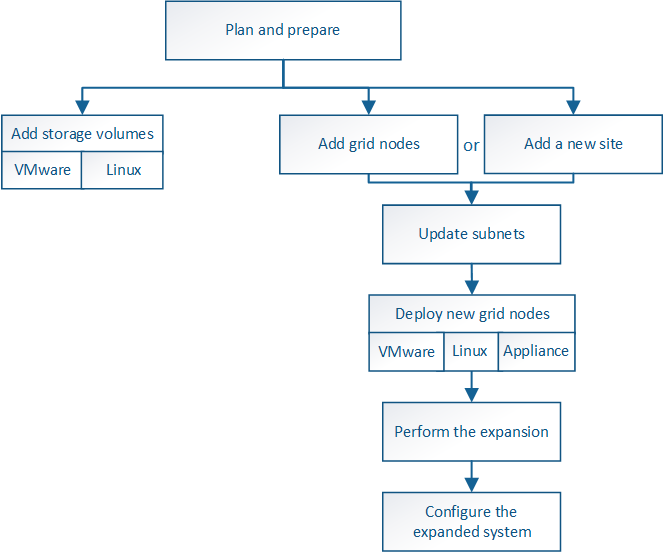

= Panoramica della procedura di espansione
:allow-uri-read: 
:icons: font
:imagesdir: ../media/

[role="lead"]
I passaggi di base per l'esecuzione di un'espansione StorageGRID variano in base ai diversi tipi di espansione: Aggiunta di volumi di storage a un nodo di storage, aggiunta di nuovi nodi a un sito esistente o aggiunta di un nuovo sito. In tutti i casi, è possibile eseguire espansioni senza interrompere il funzionamento del sistema corrente.

Il tipo di nodo che si sta aggiungendo alla griglia o il motivo dell'aggiunta di nodi non influisce sulla procedura di espansione di base. Tuttavia, come illustrato nel diagramma del flusso di lavoro riportato di seguito, i passaggi per l'aggiunta di nodi variano leggermente a seconda che si aggiungano appliance StorageGRID o host che eseguono VMware o Linux.

NOTE: I file e gli script dei dischi delle macchine virtuali forniti da NetApp per nuove installazioni o espansioni di StorageGRID su OpenStack non sono più supportati. Per espandere un'implementazione esistente su OpenStack, fare riferimento alla procedura per la distribuzione Linux.

NOTE: "`Linux`" si riferisce a una distribuzione Red Hat® Enterprise Linux®, Ubuntu®, CentOS o Debian®. Utilizza NetApp Interoperability Matrix Tool per ottenere un elenco delle versioni supportate.

*Informazioni correlate*

https://mysupport.netapp.com/matrix["Tool di matrice di interoperabilità NetApp"^]

link:planning-expansion.html["Pianificazione di un'espansione di StorageGRID"]

link:preparing-for-expansion.html["Preparazione per un'espansione"]

link:adding-storage-volumes-to-storage-nodes.html["Aggiunta di volumi di storage ai nodi di storage"]

link:adding-grid-nodes-to-existing-site-or-adding-new-site.html["Aggiunta di nodi di griglia a un sito esistente o aggiunta di un nuovo sito"]
