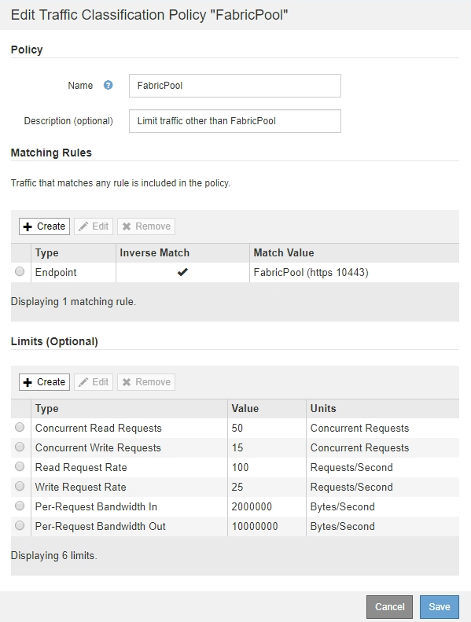

= Creazione di una policy di classificazione del traffico per FabricPool
:allow-uri-read: 
:icons: font
:imagesdir: ../media/

[role="lead"]
È possibile, in via opzionale, progettare una policy di classificazione del traffico StorageGRID per ottimizzare la qualità del servizio per il carico di lavoro FabricPool.

.Di cosa hai bisogno
* È necessario accedere a Grid Manager utilizzando un browser supportato.
* È necessario disporre dell'autorizzazione di accesso root.

.A proposito di questa attività
Le Best practice per la creazione di una policy di classificazione del traffico per FabricPool dipendono dal carico di lavoro, come segue:

* Se si prevede di suddividere i dati del carico di lavoro primario FabricPool in StorageGRID, assicurarsi che il carico di lavoro FabricPool abbia la maggior parte della larghezza di banda. È possibile creare una policy di classificazione del traffico per limitare tutti gli altri carichi di lavoro.
+

NOTE: In generale, le operazioni di lettura FabricPool sono più importanti per le priorità rispetto alle operazioni di scrittura.

+
Ad esempio, se altri client S3 utilizzano questo sistema StorageGRID, è necessario creare un criterio di classificazione del traffico. È possibile limitare il traffico di rete per gli altri bucket, tenant, subnet IP o endpoint del bilanciamento del carico.

* Come regola generale, non è necessario imporre limiti di qualità del servizio su qualsiasi carico di lavoro FabricPool; è necessario limitare solo gli altri carichi di lavoro.
* I limiti imposti su altri workload potrebbero dover essere ampi per tenere conto del comportamento sconosciuto di tali workload. I limiti imposti variano anche in base al dimensionamento e alle funzionalità del tuo grid e alla quantità di utilizzo prevista.

Per saperne di più: link:../admin/managing-traffic-classification-policies.html["Gestione delle policy di classificazione del traffico"]

.Fasi
. Selezionare *Configurazione* > *Impostazioni di rete* > *classificazione del traffico*.
. Inserire un nome e una descrizione.
. Nella sezione regole corrispondenti, creare almeno una regola.
+
.. Selezionare *Crea*.
.. Selezionare *endpoint* e selezionare l'endpoint del bilanciamento del carico creato per FabricPool.
+
È inoltre possibile selezionare l'account o il bucket del tenant FabricPool.

.. Se si desidera che questo criterio di traffico limiti il traffico per gli altri endpoint, selezionare *corrispondenza inversa*.

. Facoltativamente, creare uno o più limiti.
+

NOTE: Anche se non sono stati impostati limiti per una policy di classificazione del traffico, vengono raccolte metriche in modo da poter comprendere le tendenze del traffico.

+
.. Selezionare *Crea*.
.. Selezionare il tipo di traffico che si desidera limitare e il limite da applicare.
+
Questo esempio di classificazione del traffico FabricPool elenca i tipi di traffico di rete che è possibile limitare e i tipi di valori che è possibile selezionare. I tipi di traffico e i valori di una policy effettiva si baserebbero sui requisiti specifici dell'utente.

+

. Dopo aver creato il criterio di classificazione del traffico, selezionare il criterio, quindi selezionare *metriche* per determinare se il criterio limita il traffico come previsto.
+
image::../media/traffic_classification_metrics_fabricpool.png[Metriche di classificazione del traffico FabricPool]

