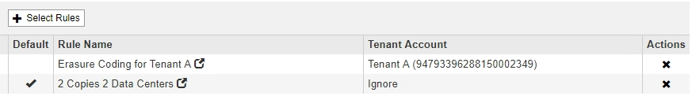

= Creazione di una regola ILM predefinita
:allow-uri-read: 
:icons: font
:imagesdir: ../media/

[role="lead"]
Ogni policy ILM deve disporre di una regola predefinita che non filtra gli oggetti. Prima di creare un criterio ILM, è necessario creare almeno una regola ILM che possa essere utilizzata come regola predefinita per il criterio.

.Di cosa hai bisogno
* È necessario accedere a Grid Manager utilizzando un browser supportato.
* È necessario disporre di autorizzazioni di accesso specifiche.

.A proposito di questa attività
La regola predefinita è l'ultima regola da valutare in un criterio ILM, pertanto non può utilizzare alcun filtro. Le istruzioni di posizionamento per la regola predefinita vengono applicate a tutti gli oggetti che non corrispondono a un'altra regola del criterio.

In questo esempio di policy, la prima regola si applica solo agli oggetti appartenenti al tenant A. La regola predefinita, ultima, si applica agli oggetti appartenenti a tutti gli altri account tenant.

Quando si crea la regola predefinita, tenere presenti i seguenti requisiti:

* La regola predefinita viene automaticamente inserita come ultima regola nel criterio.
* La regola predefinita non può utilizzare filtri di base o avanzati.
* La regola predefinita dovrebbe creare copie replicate.
+

IMPORTANT: Non utilizzare una regola che crea copie con codice di cancellazione come regola predefinita per un criterio. Le regole di erasure coding devono utilizzare un filtro avanzato per evitare che oggetti più piccoli vengano sottoposti a erasure coding.

* In generale, la regola predefinita deve conservare gli oggetti per sempre.
* Se si utilizza (o si intende attivare) l'impostazione globale S3 Object Lock (blocco oggetto S3), la regola predefinita per il criterio attivo o proposto deve essere conforme.

.Fasi
. Selezionare *ILM* > *regole*.
+
Viene visualizzata la pagina ILM Rules (regole ILM).

. Selezionare *Crea*.
+
Viene visualizzata la fase 1 (Definisci le basi) della procedura guidata Crea regola ILM.

. Immettere un nome univoco per la regola nel campo *Nome*.
. Se si desidera, inserire una breve descrizione per la regola nel campo *Descrizione*.
. Lasciare vuoto il campo *account tenant*.
+
La regola predefinita deve essere applicata a tutti gli account tenant.

. Lasciare vuoto il campo *Nome bucket*.
+
La regola predefinita deve essere applicata a tutti i bucket S3 e ai container Swift.

. Non selezionare *Advanced Filtering*
+
La regola predefinita non può specificare alcun filtro.

. Selezionare *Avanti*.
+
Viene visualizzato il punto 2 (definizione delle posizioni).

. Specificare le istruzioni di posizionamento per la regola predefinita.
+
** La regola predefinita deve conservare gli oggetti per sempre. Quando si attiva un nuovo criterio, viene visualizzato un avviso se la regola predefinita non conserva gli oggetti per sempre. Devi confermare che questo è il comportamento che ti aspetti.
** La regola predefinita dovrebbe creare copie replicate.
+

IMPORTANT: Non utilizzare una regola che crea copie con codice di cancellazione come regola predefinita per un criterio. Le regole di erasure coding devono includere il filtro avanzato *Object Size (MB) maggiore di 0.2* per evitare che oggetti più piccoli vengano sottoposti a erasure coding.

** Se si utilizza (o si intende attivare) l'impostazione globale S3 Object Lock (blocco oggetto S3), la regola predefinita deve essere conforme:
+
*** Deve creare almeno due copie di oggetti replicate o una copia con codice di cancellazione.
*** Queste copie devono esistere nei nodi di storage per l'intera durata di ciascuna riga nelle istruzioni di posizionamento.
*** Impossibile salvare le copie degli oggetti in un pool di storage cloud.
*** Impossibile salvare le copie degli oggetti nei nodi di archiviazione.
*** Almeno una riga delle istruzioni di posizionamento deve iniziare al giorno 0, utilizzando l'ora di inizio come ora di riferimento.
*** Almeno una riga delle istruzioni di posizionamento deve essere "`forever`".

. Fare clic su *Refresh* (Aggiorna) per aggiornare il diagramma di conservazione e confermare le istruzioni di posizionamento.
. Fare clic su *Avanti*.
+
Viene visualizzato il punto 3 (definire il comportamento di Ingest).

. Selezionare l'opzione di protezione dei dati da utilizzare quando vengono acquisiti oggetti e selezionare *Salva*.

