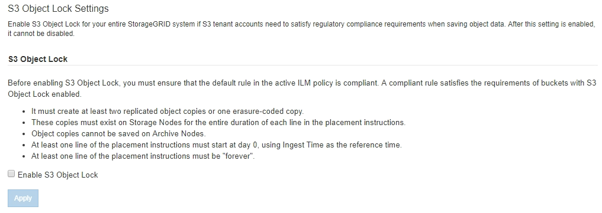

= Abilitazione di S3 Object Lock a livello globale
:allow-uri-read: 
:icons: font
:imagesdir: ../media/

[role="lead"]
Se un account tenant S3 deve rispettare i requisiti normativi durante il salvataggio dei dati degli oggetti, è necessario attivare il blocco oggetti S3 per l'intero sistema StorageGRID. L'attivazione dell'impostazione globale S3 Object Lock consente a qualsiasi utente del tenant S3 di creare e gestire bucket e oggetti con S3 Object Lock.

.Di cosa hai bisogno
* È necessario disporre dell'autorizzazione di accesso root.
* È necessario accedere a Grid Manager utilizzando un browser supportato.
* È necessario aver esaminato il flusso di lavoro S3 Object Lock e comprendere le considerazioni.
* La regola predefinita nel criterio ILM attivo deve essere conforme.
+
link:creating-default-ilm-rule.html["Creazione di una regola ILM predefinita"]

+
link:creating-ilm-policy.html["Creazione di un criterio ILM"]

.A proposito di questa attività
Un amministratore della griglia deve attivare l'impostazione globale S3 Object Lock per consentire agli utenti tenant di creare nuovi bucket con S3 Object Lock attivato. Una volta attivata, questa impostazione non può essere disattivata.

[NOTE]
====
Se l'impostazione di conformità globale è stata attivata utilizzando una versione precedente di StorageGRID, la nuova impostazione blocco oggetti S3 viene attivata automaticamente quando si esegue l'aggiornamento a StorageGRID versione 11.5. È possibile continuare a utilizzare StorageGRID per gestire le impostazioni dei bucket conformi esistenti; tuttavia, non è più possibile creare nuovi bucket conformi.

https://kb.netapp.com/Advice_and_Troubleshooting/Hybrid_Cloud_Infrastructure/StorageGRID/How_to_manage_legacy_Compliant_buckets_in_StorageGRID_11.5["Knowledge base di NetApp: Come gestire i bucket conformi alle versioni precedenti in StorageGRID 11.5"^]

====
.Fasi
. Selezionare *Configuration* > *System Settings* > *S3 Object Lock*.
+
Viene visualizzata la pagina S3 Object Lock Settings (Impostazioni blocco oggetti S3).

+

+
Se l'impostazione di conformità globale era stata attivata utilizzando una versione precedente di StorageGRID, la pagina contiene la seguente nota:

+
image::../media/s3_object_lock_global_setting_compliant_note.png[S3 Object Lock Global Setting Compliance Nota]

. Selezionare *Enable S3 Object Lock* (attiva blocco oggetti S3).
. Selezionare *Applica*.
+
Viene visualizzata una finestra di dialogo di conferma che ricorda che non è possibile disattivare il blocco oggetti S3 dopo averlo attivato.

+
image::../media/s3_object_lock_global_setting_confirm.png[Conferma dell'impostazione globale blocco oggetti S3]

. Se si è certi di voler abilitare in modo permanente il blocco oggetti S3 per l'intero sistema, selezionare *OK*.
+
Quando si seleziona *OK*:

+
** Se la regola predefinita nel criterio ILM attivo è conforme, il blocco oggetti S3 è ora attivato per l'intera griglia e non può essere disattivato.
** Se la regola predefinita non è conforme, viene visualizzato un errore che indica che è necessario creare e attivare un nuovo criterio ILM che include una regola conforme come regola predefinita. Selezionare *OK* e creare una nuova policy proposta, simularla e attivarla.
+
image::../media/s3_object_lock_global_setting_error.gif[S3 Object Lock Global SettingError]

.Al termine
Dopo aver attivato l'impostazione di blocco oggetti S3 globale, potrebbe essere necessario creare un nuovo criterio ILM. Una volta attivata l'impostazione, il criterio ILM può includere facoltativamente una regola predefinita conforme e una regola predefinita non conforme. Ad esempio, è possibile utilizzare una regola non conforme che non dispone di filtri per gli oggetti nei bucket che non hanno attivato il blocco oggetti S3.

.Informazioni correlate
link:creating-ilm-policy-after-s3-object-lock-is-enabled.html["Creazione di un criterio ILM dopo l'attivazione del blocco oggetti S3"]

link:creating-ilm-rule.html["Creazione di una regola ILM"]

link:creating-ilm-policy.html["Creazione di un criterio ILM"]

link:comparing-s3-object-lock-to-legacy-compliance.html["Confronto tra blocco oggetti S3 e conformità legacy"]
