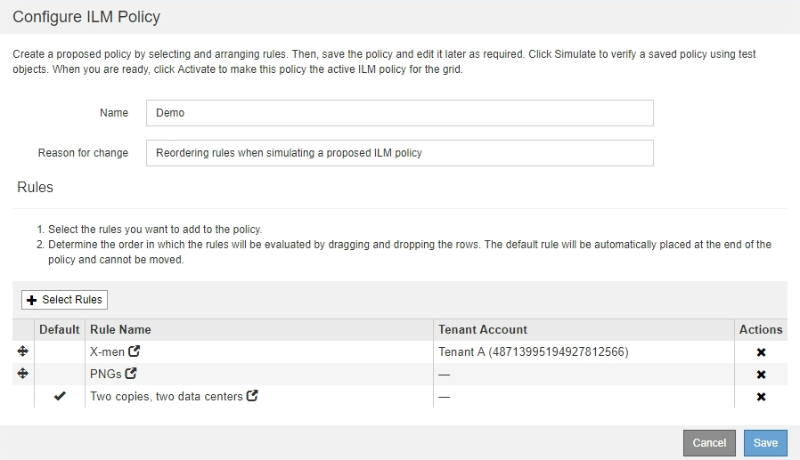

= Esempi di simulazione delle policy ILM
:allow-uri-read: 
:icons: font
:imagesdir: ../media/

[role="lead"]
Questi esempi mostrano come è possibile verificare le regole ILM simulando il criterio ILM prima di attivarlo.

== Esempio 1: Verifica delle regole durante la simulazione di una policy ILM proposta

Questo esempio mostra come verificare le regole quando si simula un criterio proposto.

In questo esempio, la *policy ILM di esempio* viene simulata rispetto agli oggetti acquisiti in due bucket. La policy include tre regole, come segue:

* La prima regola, *due copie, due anni per bucket-a*, si applica solo agli oggetti nel bucket-a.
* La seconda regola, menu:EC objects[1 MB], si applica a tutti i bucket, ma ai filtri sugli oggetti superiori a 1 MB.
* La terza regola è quella predefinita e non include alcun filtro.

image::../media/saved_policy_for_simulation.png[Policy salvata per Simulation]

.Fasi
. Dopo aver aggiunto le regole e salvato il criterio, fare clic su *simulate*.
+
Viene visualizzata la finestra di dialogo Simula policy ILM.

. Nel campo *oggetto*, immettere il bucket S3/object-key o il container Swift/object-name per un oggetto di test e fare clic su *simulate*.
+
Vengono visualizzati i risultati di Simulation, che mostrano quale regola del criterio corrisponde a ciascun oggetto testato.

+
image::../media/simulate_policy_screen.png[Schermata Simula policy]

. Verificare che ogni oggetto sia stato associato alla regola corretta.
+
In questo esempio:

+
.. `bucket-a/bucket-a object.pdf` corrisponde correttamente alla prima regola, che filtra sugli oggetti in `bucket-a`.
.. `bucket-b/test object greater than 1 MB.pdf` è in `bucket-b`, quindi non corrisponde alla prima regola. Al contrario, è stata associata correttamente dalla seconda regola, che filtra su oggetti superiori a 1 MB.
.. `bucket-b/test object less than 1 MB.pdf` i filtri non corrispondono alle prime due regole, quindi verranno posizionati in base alla regola predefinita, che non include filtri.

== Esempio 2: Riordinamento delle regole durante la simulazione di una policy ILM proposta

Questo esempio mostra come è possibile riordinare le regole per modificare i risultati durante la simulazione di un criterio.

In questo esempio, viene simulata la policy *Demo*. Questo criterio, che ha lo scopo di trovare oggetti con metadati utente series=x-men, include tre regole, come segue:

* La prima regola, *PNG*, filtra i nomi delle chiavi che terminano `.png`.
* La seconda regola, *X-MEN*, si applica solo agli oggetti per il tenant A e ai filtri per `series=x-men` metadati dell'utente.
* L'ultima regola, *due copie due data center*, è la regola predefinita, che corrisponde a tutti gli oggetti che non corrispondono alle prime due regole.

image::../media/simulate_reorder_rules_pngs_rule.png[Esempio 2: Riordinamento delle regole durante la simulazione di una policy ILM proposta]

.Fasi
. Dopo aver aggiunto le regole e salvato il criterio, fare clic su *simulate*.
. Nel campo *oggetto*, immettere il bucket S3/object-key o il container Swift/object-name per un oggetto di test e fare clic su *simulate*.
+
Vengono visualizzati i risultati di Simulation, che indicano che il `Havok.png` L'oggetto è stato associato dalla regola *PNG*.

+
image::../media/simulate_reorder_rules_pngs_result.gif[Esempio 2: Riordinamento delle regole durante la simulazione di una policy ILM proposta]

+
Tuttavia, la regola che il `Havok.png` L'oggetto doveva essere testato come la regola *X-MEN*.

. Per risolvere il problema, riordinare le regole.
+
.. Fare clic su *fine* per chiudere la pagina Simula policy ILM.
.. Fare clic su *Edit* (Modifica) per modificare il criterio.
.. Trascinare la regola *X-MEN* all'inizio dell'elenco.
+

.. Fare clic su *Save* (Salva).

. Fare clic su *simulate*.
+
Gli oggetti precedentemente testati vengono rivalutati in base alla policy aggiornata e vengono visualizzati i risultati della nuova simulazione. Nell'esempio, la colonna Rule Matched mostra che il `Havok.png` L'oggetto ora corrisponde alla regola dei metadati X-MEN, come previsto. La colonna Previous Match (confronto precedente) mostra che la regola PNG ha trovato corrispondenza con l'oggetto nella simulazione precedente.

+
image::../media/simulate_reorder_rules_correct_result.gif[Esempio 2: Riordinamento delle regole durante la simulazione di una policy ILM proposta]

+

NOTE: Se si rimane nella pagina Configura criteri, è possibile simulare nuovamente un criterio dopo aver apportato modifiche senza dover immettere nuovamente i nomi degli oggetti di test.

== Esempio 3: Correzione di una regola durante la simulazione di una policy ILM proposta

Questo esempio mostra come simulare una policy, correggere una regola nella policy e continuare la simulazione.

In questo esempio, viene simulata la policy *Demo*. Questo criterio è destinato a trovare gli oggetti che hanno `series=x-men` metadati dell'utente. Tuttavia, si sono verificati risultati imprevisti durante la simulazione di questa policy rispetto a. `Beast.jpg` oggetto. Invece di corrispondere alla regola dei metadati X-MEN, l'oggetto corrisponde alla regola predefinita, due copie di due data center.

image::../media/simulate_results_for_object_wrong_metadata.png[Esempio 3: Correzione di una regola durante la simulazione di una policy ILM proposta]

Quando un oggetto di test non corrisponde alla regola prevista nel criterio, è necessario esaminare ciascuna regola del criterio e correggere eventuali errori.

.Fasi
. Per ogni regola del criterio, visualizzare le impostazioni facendo clic sul nome della regola o sull'icona ulteriori dettagli image:../media/icon_nms_more_details.gif["ulteriori dettagli"] in qualsiasi finestra di dialogo in cui viene visualizzata la regola.
. Esaminare l'account tenant della regola, il tempo di riferimento e i criteri di filtraggio.
+
In questo esempio, i metadati per la regola X-MEN includono un errore. Il valore dei metadati è stato immesso come "`x-men1`" invece di "`x-men`".

+
image::../media/simulate_rules_select_rule_popup_with_wrong_metadata.png[Esempio 3: Correzione di una regola durante la simulazione di una policy ILM proposta]

. Per risolvere l'errore, correggere la regola come segue:
+
** Se la regola fa parte del criterio proposto, è possibile clonarla o rimuoverla dal criterio e modificarla.
** Se la regola fa parte del criterio attivo, è necessario clonarla. Non è possibile modificare o rimuovere una regola dal criterio attivo.
+
[cols="1a,3a"]
|===
| Opzione | Descrizione 

 a| 
Clonare la regola
 a| 
... Selezionare *ILM* > *regole*.
... Selezionare la regola errata e fare clic su *Clone*.
... Modificare le informazioni non corrette e fare clic su *Salva*.
... Selezionare *ILM* > *Policy*.
... Selezionare la policy proposta e fare clic su *Modifica*.
... Fare clic su *Seleziona regole*.
... Selezionare la casella di controllo per la nuova regola, deselezionare la casella di controllo per la regola originale e fare clic su *Applica*.
... Fare clic su *Save* (Salva).

 a| 
Modifica della regola
 a| 
... Selezionare la policy proposta e fare clic su *Modifica*.
... Fare clic sull'icona di eliminazione image:../media/icon_nms_delete_new.gif["icona elimina"] Per rimuovere la regola errata, quindi fare clic su *Salva*.
... Selezionare *ILM* > *regole*.
... Selezionare la regola errata e fare clic su *Modifica*.
... Modificare le informazioni non corrette e fare clic su *Salva*.
... Selezionare *ILM* > *Policy*.
... Selezionare la policy proposta e fare clic su *Modifica*.
... Selezionare la regola corretta, fare clic su *Applica* e fare clic su *Salva*.

|===

. Eseguire nuovamente la simulazione.
+

NOTE: Poiché si è allontanati dalla pagina ILM Policies per modificare la regola, gli oggetti precedentemente immessi per la simulazione non vengono più visualizzati. È necessario immettere nuovamente i nomi degli oggetti.

+
In questo esempio, la regola corretta X-men corrisponde ora a. `Beast.jpg` oggetto basato su `series=x-men` metadati dell'utente, come previsto.

+
image::../media/simulate_results_for_object_corrected_metadata.gif[Esempio 3: Correzione di una regola durante la simulazione di una policy ILM proposta]

