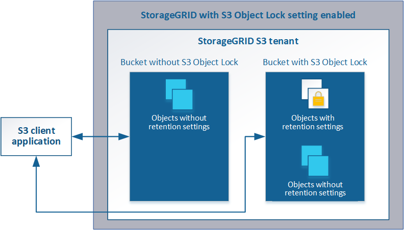

= Gestione degli oggetti con S3 Object Lock
:allow-uri-read: 
:icons: font
:imagesdir: ../media/

[role="lead"]
In qualità di amministratore di rete, è possibile attivare il blocco oggetti S3 per il sistema StorageGRID e implementare un criterio ILM conforme per garantire che gli oggetti in specifici bucket S3 non vengano cancellati o sovrascritti per un determinato periodo di tempo.

== Che cos'è il blocco oggetti S3?

La funzione blocco oggetti StorageGRID S3 è una soluzione di protezione degli oggetti equivalente a blocco oggetti S3 in Amazon Simple Storage Service (Amazon S3).

Come mostrato nella figura, quando l'impostazione globale S3 Object Lock è attivata per un sistema StorageGRID, un account tenant S3 può creare bucket con o senza S3 Object Lock abilitato. Se un bucket ha S3 Object Lock attivato, le applicazioni client S3 possono specificare le impostazioni di conservazione per qualsiasi versione di oggetto in quel bucket. Una versione dell'oggetto deve avere le impostazioni di conservazione specificate per essere protetta da S3 Object Lock.

La funzione blocco oggetto StorageGRID S3 offre una singola modalità di conservazione equivalente alla modalità di conformità Amazon S3. Per impostazione predefinita, una versione dell'oggetto protetto non può essere sovrascritta o eliminata da alcun utente. La funzione blocco oggetti di StorageGRID S3 non supporta una modalità di governance e non consente agli utenti con autorizzazioni speciali di ignorare le impostazioni di conservazione o di eliminare gli oggetti protetti.

Se in un bucket è attivato il blocco oggetti S3, l'applicazione client S3 può specificare una o entrambe le seguenti impostazioni di conservazione a livello di oggetto durante la creazione o l'aggiornamento di un oggetto:

* *Mantieni-fino-data*: Se la data di conservazione di una versione dell'oggetto è futura, l'oggetto può essere recuperato, ma non può essere modificato o cancellato. Come richiesto, è possibile aumentare la data di conservazione di un oggetto fino alla data odierna, ma non è possibile diminuarla.
* *Conservazione legale*: L'applicazione di un blocco legale a una versione oggetto blocca immediatamente tale oggetto. Ad esempio, potrebbe essere necessario sospendere legalmente un oggetto correlato a un'indagine o a una controversia legale. Una conservazione a fini giudiziari non ha una data di scadenza, ma rimane attiva fino a quando non viene esplicitamente rimossa. Le conservazioni legali sono indipendenti dalla conservazione fino alla data odierna.

Per ulteriori informazioni su queste impostazioni, consultare "`Using S3 Object lock`" in link:../s3/s3-rest-api-supported-operations-and-limitations.html["Operazioni e limitazioni supportate dall'API REST S3"].
