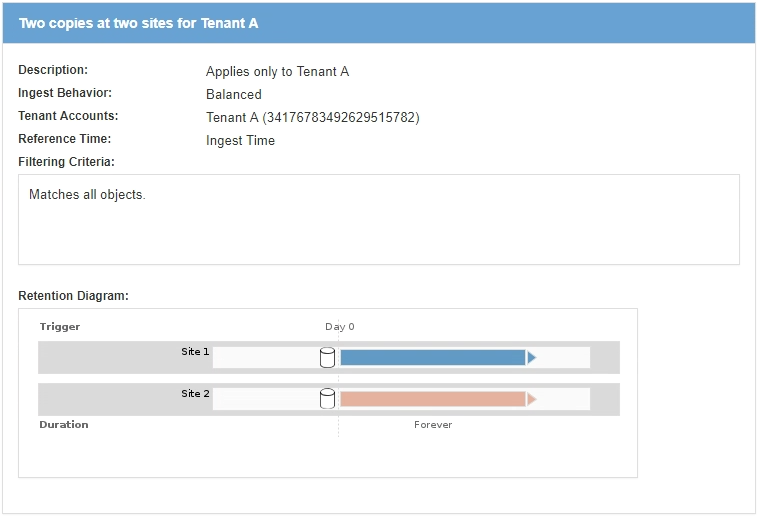

= Che cos'è una regola ILM
:allow-uri-read: 
:icons: font
:imagesdir: ../media/

[role="lead"]
Per gestire gli oggetti, creare un set di regole ILM (Information Lifecycle Management) e organizzarle in un criterio ILM. Ogni oggetto acquisito nel sistema viene valutato in base al criterio attivo. Quando una regola del criterio corrisponde ai metadati di un oggetto, le istruzioni della regola determinano le azioni eseguite da StorageGRID per copiare e memorizzare tale oggetto.

Le regole ILM definiscono:

* Quali oggetti devono essere memorizzati. Una regola può essere applicata a tutti gli oggetti oppure è possibile specificare filtri per identificare gli oggetti a cui si applica una regola. Ad esempio, una regola può essere applicata solo agli oggetti associati a determinati account tenant, a specifici bucket S3 o a contenitori Swift o a specifici valori di metadati.
* Il tipo e la posizione di storage. Gli oggetti possono essere memorizzati nei nodi di storage, nei pool di storage cloud o nei nodi di archiviazione.
* Il tipo di copie a oggetti eseguite. Le copie possono essere replicate o codificate per la cancellazione.
* Per le copie replicate, il numero di copie eseguite.
* Per le copie codificate erasure, viene utilizzato lo schema di erasure coding.
* Il cambia nel tempo nella posizione di storage di un oggetto e nel tipo di copie.
* Modalità di protezione dei dati degli oggetti durante l'acquisizione degli oggetti nella griglia (posizionamento sincrono o doppio commit).

Si noti che i metadati degli oggetti non sono gestiti dalle regole ILM. I metadati degli oggetti vengono invece memorizzati in un database Cassandra in un archivio di metadati. Tre copie dei metadati degli oggetti vengono gestite automaticamente in ogni sito per proteggere i dati dalla perdita. Le copie sono distribuite uniformemente in tutti i nodi di storage.

== Elementi di una regola ILM

Una regola ILM ha tre elementi:

* *Filtering Criteria*: I filtri di base e avanzati di una regola definiscono a quali oggetti si applica la regola. Se un oggetto corrisponde a tutti i filtri, StorageGRID applica la regola e crea le copie dell'oggetto specificate nelle istruzioni di posizionamento della regola.
* *Istruzioni di posizionamento*: Le istruzioni di posizionamento di una regola definiscono il numero, il tipo e la posizione delle copie degli oggetti. Ciascuna regola può includere una sequenza di istruzioni di posizionamento per modificare il numero, il tipo e la posizione delle copie degli oggetti nel tempo. Quando scade il periodo di tempo per un posizionamento, le istruzioni nel posizionamento successivo vengono applicate automaticamente dalla valutazione ILM successiva.
* *Ingest Behavior*: Il comportamento di acquisizione di una regola definisce ciò che accade quando un client S3 o Swift salva un oggetto nella griglia. Il comportamento di acquisizione controlla se le copie degli oggetti vengono posizionate immediatamente in base alle istruzioni della regola o se vengono eseguite copie temporanee e le istruzioni di posizionamento vengono applicate in un secondo momento.

== Esempio di regola ILM

Questo esempio di regola ILM si applica agli oggetti appartenenti al tenant A. Esegue due copie replicate di tali oggetti e memorizza ciascuna copia in un sito diverso. Le due copie vengono conservate "`forever,`", il che significa che StorageGRID non le eliminerà automaticamente. Al contrario, StorageGRID conserverà questi oggetti fino a quando non saranno cancellati da una richiesta di eliminazione del client o dalla scadenza di un ciclo di vita del bucket.

Questa regola utilizza l'opzione bilanciata per il comportamento di acquisizione: L'istruzione di posizionamento a due siti viene applicata non appena il tenant A salva un oggetto in StorageGRID, a meno che non sia possibile eseguire immediatamente entrambe le copie richieste. Ad esempio, se il sito 2 non è raggiungibile quando il tenant A salva un oggetto, StorageGRID eseguirà due copie intermedie sui nodi di storage nel sito 1. Non appena il sito 2 sarà disponibile, StorageGRID effettuerà la copia richiesta presso il sito.

.Informazioni correlate
link:data-protection-options-for-ingest.html["Opzioni di protezione dei dati per l'acquisizione"]

link:what-storage-pool-is.html["Che cos'è un pool di storage"]

link:what-cloud-storage-pool-is.html["Cos'è un pool di storage cloud"]

link:how-objects-are-stored-replication-erasure-coding.html["Modalità di archiviazione degli oggetti (replica o erasure coding)"]

link:what-ilm-rule-filtering-is.html["Che cos'è il filtraggio delle regole ILM"]

link:what-ilm-placement-instructions-are.html["Quali sono le istruzioni per il posizionamento delle regole ILM"]
