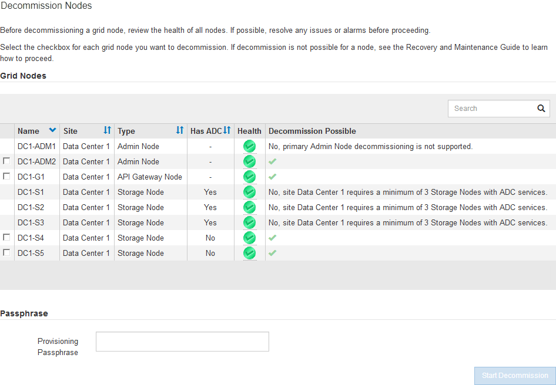

= Accesso alla pagina nodi di decommissionazione
:allow-uri-read: 
:icons: font
:imagesdir: ../media/

[role="lead"]
Quando si accede alla pagina nodi di disattivazione in Grid Manager, è possibile visualizzare a colpo d'occhio i nodi che possono essere disattivati.

.Di cosa hai bisogno
* È necessario accedere a Grid Manager utilizzando un browser supportato.
* È necessario disporre dell'autorizzazione Maintenance (manutenzione) o Root Access (accesso root).

.Fasi
. Selezionare *manutenzione* *attività di manutenzione* *smantellamento*.
+
Viene visualizzata la pagina Decommission.

+
image::../media/decommission_page.png[Pagina di decommissionamento]

. Fare clic sul pulsante *Decommission Nodes* (nodi di decommissionamento).
+
Viene visualizzata la pagina nodi di decommissionazione. Da questa pagina è possibile:

+
** Determinare quali nodi di rete possono essere attualmente dismessi.
** Scopri lo stato di salute di tutti i nodi della griglia
** Ordinare l'elenco in ordine crescente o decrescente per *Nome*, *Sito*, *tipo* o *con ADC*.
** Inserisci i termini di ricerca per trovare rapidamente nodi specifici. Ad esempio, questa pagina mostra tutti i nodi della griglia in un singolo data center. La colonna Decommission possible (possibile dismissione) indica che è possibile decommissionare il nodo Admin non primario, il nodo gateway e due dei cinque nodi storage.

+

. Esaminare la colonna *Dismissione possibile* per ciascun nodo che si desidera decommissionare.
+
Se è possibile disattivare un nodo della griglia, questa colonna include un segno di spunta verde e la colonna più a sinistra include una casella di controllo. Se un nodo non può essere decommissionato, questa colonna descrive il problema. Se vi sono più motivi per cui un nodo non può essere dismesso, viene visualizzato il motivo più critico.

+
[cols="1a,2a,3a"]
|===
| Motivo possibile della decommissionazione | Descrizione | Procedura da seguire per risolvere il problema 

 a| 
No, la disattivazione del tipo di nodo non è supportata.
 a| 
Non è possibile decommissionare il nodo di amministrazione primario o un nodo di archivio.
 a| 
Nessuno.

 a| 
No, almeno un nodo della griglia è scollegato.

*Nota:* questo messaggio viene visualizzato solo per i nodi di rete connessi.
 a| 
Non è possibile decommissionare un nodo di rete connesso se un nodo di rete è scollegato.

La colonna *Health* include una di queste icone per i nodi della griglia disconnessi:

** image:../media/icon_alarm_gray_administratively_down.png["icona del punto interrogativo grigio"] (Grigio): Amministrativamente in basso
** image:../media/icon_alarm_blue_unknown.png["icona del punto interrogativo blu"] (Blu): Sconosciuto

 a| 
Accedere alla <<decommission_procedure_choices,fase che elenca le scelte della procedura di decommissionamento>>.

 a| 
No, uno o più nodi richiesti sono attualmente disconnessi e devono essere ripristinati.

*Nota:* questo messaggio viene visualizzato solo per i nodi della griglia disconnessi.
 a| 
Non è possibile decommissionare un nodo di rete disconnesso se anche uno o più nodi richiesti sono disconnessi (ad esempio, un nodo di storage necessario per il quorum ADC).
 a| 
.. Esaminare i messaggi Decommission possible per tutti i nodi disconnessi.
.. Determinare quali nodi non possono essere dismessi perché sono necessari.
+
*** Se lo stato di salute di un nodo richiesto è amministrativamente inattivo, riportare il nodo in linea.
*** Se l'integrità di un nodo richiesto è sconosciuta, eseguire una procedura di ripristino del nodo per ripristinare il nodo richiesto.

 a| 
No, membro dei gruppi ha: _X_. Prima di poter decommissionare questo nodo, è necessario rimuoverlo da tutti i gruppi ha.
 a| 
Non è possibile decommissionare un nodo amministrativo o un nodo gateway se un'interfaccia di nodo appartiene a un gruppo ad alta disponibilità (ha).
 a| 
Modificare il gruppo ha per rimuovere l'interfaccia del nodo o rimuovere l'intero gruppo ha. Consultare le istruzioni per l'amministrazione di StorageGRID.

 a| 
No, il sito _x_ richiede un minimo di _n_ nodi di storage con servizi ADC.
 a| 
*Solo nodi di storage.* non è possibile decommissionare un nodo di storage se nel sito rimangono nodi insufficienti per supportare i requisiti di quorum ADC.
 a| 
Eseguire un'espansione. Aggiungere un nuovo nodo di storage al sito e specificare che deve disporre di un servizio ADC. Vedere le informazioni sul quorum di ADC.

 a| 
No, uno o più profili di codifica Erasure richiedono almeno _n_ nodi di storage. Se il profilo non viene utilizzato in una regola ILM, è possibile disattivarlo.
 a| 
*Solo nodi di storage.* non è possibile decommissionare un nodo di storage a meno che non resti un numero sufficiente di nodi per i profili di codifica Erasure esistenti.

Ad esempio, se esiste un profilo di codifica Erasure per la codifica di cancellazione 4+2, devono rimanere almeno 6 nodi di storage.
 a| 
Per ciascun profilo di codifica Erasure interessato, eseguire una delle seguenti operazioni in base all'utilizzo del profilo:

** *Utilizzato nel criterio ILM attivo*: Eseguire un'espansione. Aggiungere un numero sufficiente di nuovi nodi di storage per consentire la cancellazione del codice. Consultare le istruzioni per espandere StorageGRID.
** *Utilizzato in una regola ILM ma non nel criterio ILM attivo*: Modificare o eliminare la regola e disattivare il profilo di codifica Erasure.
** *Non utilizzato in alcuna regola ILM*: Disattiva il profilo di codifica Erasure.

*Nota:* viene visualizzato un messaggio di errore se si tenta di disattivare un profilo di codifica Erasure e i dati dell'oggetto sono ancora associati al profilo. Potrebbe essere necessario attendere alcune settimane prima di provare di nuovo il processo di disattivazione.

Scopri come disattivare un profilo di codifica Erasure nelle istruzioni per la gestione degli oggetti con la gestione del ciclo di vita delle informazioni.

|===
. [[decommissionare_procedure_choices]]se è possibile eseguire lo decommissionamento per il nodo, determinare quale procedura eseguire:
+
[cols="1a,1a"]
|===
| Se la griglia include... | Vai a... 

 a| 
Qualsiasi nodo di rete disconnesso
 a| 
link:decommissioning-disconnected-grid-nodes.html["Disattivazione dei nodi di rete disconnessi"]

 a| 
Solo nodi di rete connessi
 a| 
link:decommissioning-connected-grid-nodes.html["Disattivazione dei nodi di rete connessi"]

|===

.Informazioni correlate
link:checking-data-repair-jobs.html["Verifica dei lavori di riparazione dei dati"]

link:understanding-adc-service-quorum.html["Informazioni sul quorum di ADC"]

link:../ilm/index.html["Gestire gli oggetti con ILM"]

link:../expand/index.html["Espandi il tuo grid"]

link:../admin/index.html["Amministrare StorageGRID"]
