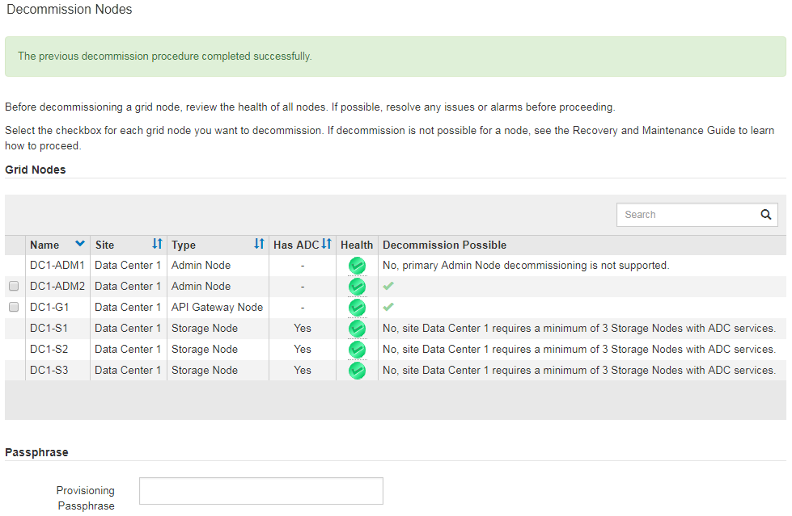

= Disattivazione dei nodi di rete connessi
:allow-uri-read: 
:icons: font
:imagesdir: ../media/

[role="lead"]
È possibile decommissionare e rimuovere in modo permanente i nodi collegati alla rete.

.Di cosa hai bisogno
* Hai compreso i requisiti e le considerazioni per la disattivazione dei nodi grid.
+
link:considerations-for-decommissioning-grid-nodes.html["Considerazioni per la disattivazione dei nodi di rete"]

* Hai raccolto tutti i materiali necessari.
* Hai garantito che non siano attivi lavori di riparazione dei dati.
* Hai confermato che il ripristino del nodo di storage non è in corso in nessun punto della griglia. In tal caso, è necessario attendere il completamento di qualsiasi ricostruzione Cassandra eseguita come parte del ripristino. È quindi possibile procedere con lo smantellamento.
* Si è assicurato che non verranno eseguite altre procedure di manutenzione mentre la procedura di decommissionamento del nodo è in esecuzione, a meno che la procedura di decommissionamento del nodo non sia in pausa.
* Si dispone della passphrase di provisioning.
* I nodi della griglia sono connessi.
* La colonna *Dismissione possibile* per il nodo o i nodi che si desidera decommissionare include un segno di spunta verde.
* Tutti i nodi della griglia hanno uno stato di salute normale (verde) image:../media/icon_alarn_green_checkmark.gif["icona del segno di spunta verde"]. Se nella colonna *Health* viene visualizzata una di queste icone, provare a risolvere il problema:
+
|===

| Icona | Colore | Severità 

 a| 
image:../media/icon_alarm_yellow_notice.gif["icona quadrata gialla"]
 a| 
Giallo
 a| 
Avviso

 a| 
image:../media/icon_alarm_light_orange_minor.gif["icona a forma di diamante arancione chiaro"]
 a| 
Arancione chiaro
 a| 
Minore

 a| 
image:../media/icon_alarm_orange_major.gif["icona a forma di diamante arancione scuro"]
 a| 
Arancione scuro
 a| 
Maggiore

 a| 

 a| 
Rosso
 a| 
Critico

|===
* Se in precedenza è stato dismesso un nodo di storage disconnesso, tutti i lavori di riparazione dei dati sono stati completati correttamente. Consultare le istruzioni per il controllo dei lavori di riparazione dei dati.

IMPORTANT: Non rimuovere la macchina virtuale o altre risorse di un nodo griglia fino a quando non viene richiesto in questa procedura.

.Fasi
. Nella pagina nodi di decommissionazione, selezionare la casella di controllo per ciascun nodo della griglia che si desidera decommissionare.
. Inserire la passphrase di provisioning.
+
Il pulsante *Avvia decommissionazione* è attivato.

. Fare clic su *Avvia decommissionazione*.
+
Viene visualizzata una finestra di dialogo di conferma.

+
image::../media/decommission_confirmation.gif[schermata della finestra di dialogo di conferma della decommissionazione]

. Esaminare l'elenco dei nodi selezionati e fare clic su *OK*.
+
Viene avviata la procedura di decommissionamento del nodo e viene visualizzato l'avanzamento per ciascun nodo. Durante la procedura, viene generato un nuovo pacchetto di ripristino per mostrare la modifica della configurazione della griglia.

+
image::../media/decommission_nodes_procedure_in_progress.png[schermata dello smantellamento del nodo in corso]

+

IMPORTANT: Non scollegare un nodo di storage dopo l'avvio della procedura di decommissionamento. La modifica dello stato potrebbe causare la mancata copia di alcuni contenuti in altre posizioni.

. Una volta disponibile il nuovo pacchetto di ripristino, fare clic sul collegamento o selezionare *manutenzione* > *sistema* > *pacchetto di ripristino* per accedere alla pagina del pacchetto di ripristino. Quindi, scaricare `.zip` file.
+
Consultare le istruzioni per scaricare il pacchetto di ripristino.

+

NOTE: Scarica il pacchetto di ripristino il prima possibile per assicurarti di ripristinare la griglia in caso di problemi durante la procedura di decommissionamento.

. Monitorare periodicamente la pagina nodi di decommissionazione per assicurarsi che tutti i nodi selezionati vengano decommissionati correttamente.
+
I nodi di storage possono richiedere giorni o settimane per la decommissionazione. Una volta completate tutte le attività, viene visualizzato nuovamente l'elenco di selezione dei nodi con un messaggio di esito positivo.

+

. Seguire la fase appropriata per la piattaforma. Ad esempio:
+
** *Linux*: Si consiglia di scollegare i volumi ed eliminare i file di configurazione del nodo creati durante l'installazione.
** *VMware*: Per eliminare la macchina virtuale, utilizzare l'opzione "`DElimina dal disco`" di vCenter. Potrebbe essere necessario eliminare anche i dischi dati indipendenti dalla macchina virtuale.
** *Appliance StorageGRID*: Il nodo appliance torna automaticamente allo stato non distribuito, dove è possibile accedere al programma di installazione dell'appliance StorageGRID. È possibile spegnere l'apparecchio o aggiungerlo a un altro sistema StorageGRID.

Completare questi passaggi dopo aver completato la procedura di decommissionamento del nodo:

* Assicurarsi che i dischi del nodo della griglia decommissionata siano puliti. Utilizzare uno strumento o un servizio di cancellazione dei dati disponibile in commercio per rimuovere in modo permanente e sicuro i dati dai dischi.
* Se un nodo dell'appliance è stato disattivato e i dati dell'appliance sono stati protetti mediante la crittografia del nodo, utilizzare il programma di installazione dell'appliance StorageGRID per cancellare la configurazione del server di gestione delle chiavi (Cancella KMS). Se si desidera utilizzare l'appliance in un'altra griglia, è necessario cancellare la configurazione KMS.
+
link:../sg100-1000/index.html["SG100  SG1000 Services appliance"]

+
link:../sg5600/index.html["Appliance di storage SG5600"]

+
link:../sg5700/index.html["Appliance di storage SG5700"]

+
link:../sg6000/index.html["Appliance di storage SG6000"]

.Informazioni correlate
link:checking-data-repair-jobs.html["Verifica dei lavori di riparazione dei dati"]

link:downloading-recovery-package.html["Download del pacchetto di ripristino"]

link:../rhel/index.html["Installare Red Hat Enterprise Linux o CentOS"]
