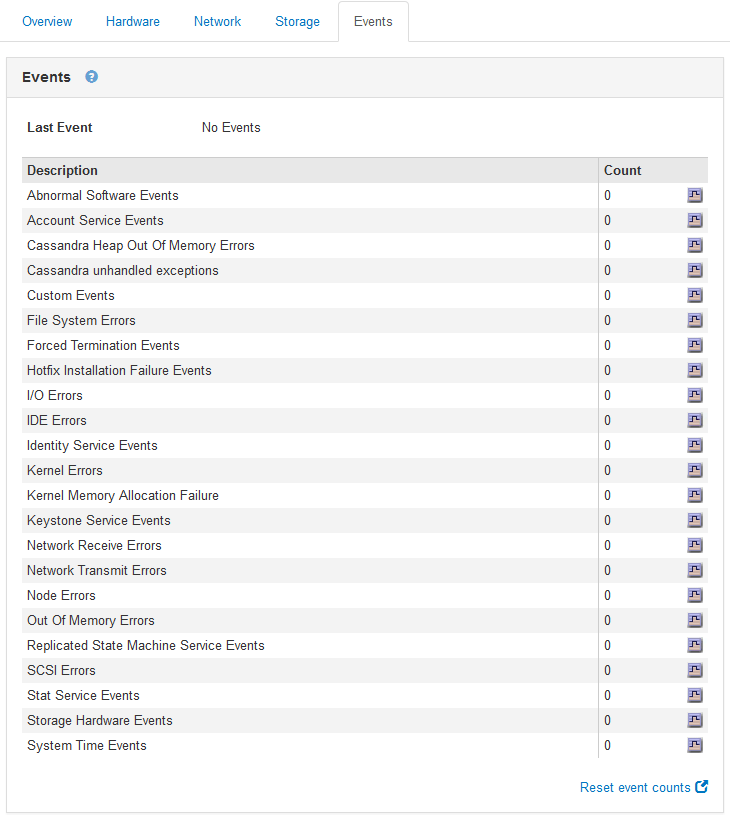

= Creazione di eventi syslog personalizzati
:allow-uri-read: 
:icons: font
:imagesdir: ../media/

[role="lead"]
Gli eventi personalizzati consentono di tenere traccia di tutti gli eventi utente di kernel, daemon, errori e livello critico registrati sul server syslog. Un evento personalizzato può essere utile per monitorare l'occorrenza dei messaggi del registro di sistema (e quindi gli eventi di sicurezza della rete e gli errori hardware).

.A proposito di questa attività
Prendere in considerazione la creazione di eventi personalizzati per monitorare i problemi ricorrenti. Le seguenti considerazioni si applicano agli eventi personalizzati.

* Dopo la creazione di un evento personalizzato, viene monitorata ogni occorrenza. È possibile visualizzare un valore di Conteggio cumulativo per tutti gli eventi personalizzati nella pagina *nodi* *_grid node_* *Eventi*.
* Per creare un evento personalizzato in base alle parole chiave in `/var/log/messages` oppure `/var/log/syslog` i log in questi file devono essere:
+
** Generato dal kernel
** Generato da daemon o programma utente a livello di errore o critico

*Nota:* non tutte le voci in `/var/log/messages` oppure `/var/log/syslog` i file verranno abbinati a meno che non soddisfino i requisiti indicati in precedenza.

.Fasi
. Selezionare *Configurazione* *monitoraggio* *Eventi*.
. Fare clic su *Edit* (Modifica) image:../media/icon_nms_edit.gif["icona a forma di matita"] (O *Inserisci* image:../media/icon_nms_insert.gif["icona più"] se questo non è il primo evento).
. Inserire una stringa di eventi personalizzata, ad esempio shutdown
+
image::../media/custom_events.gif[schermata che mostra dove inserire la stringa di eventi personalizzata]

. Fare clic su *Applica modifiche*.
. Selezionare *nodi*. Quindi, selezionare *_grid node_* *Events*.
. Individuare la voce per gli eventi personalizzati nella tabella Eventi e monitorare il valore per *Conteggio*.
+
Se il numero aumenta, viene attivato un evento personalizzato monitorato su quel nodo della griglia.

+

