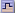
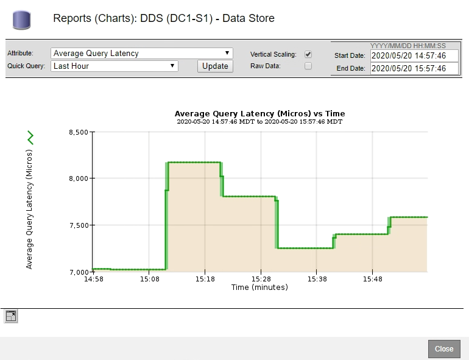
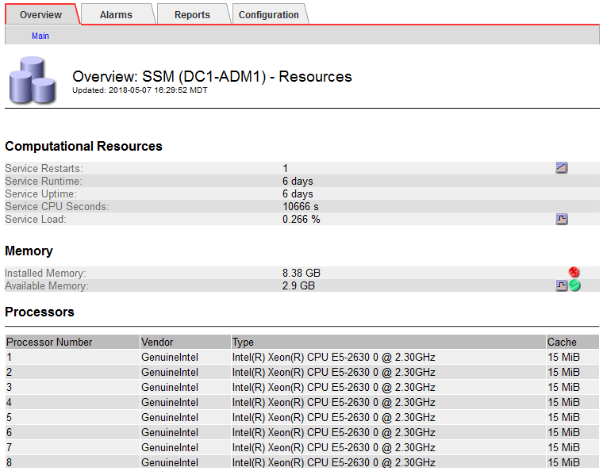

= Visualizzazione di grafici e grafici
:allow-uri-read: 
:icons: font
:imagesdir: ../media/

[role="lead"]
La pagina Nodes (nodi) contiene i grafici e i grafici a cui si dovrebbe accedere regolarmente per monitorare attributi come la capacità dello storage e il throughput. In alcuni casi, in particolare quando si lavora con il supporto tecnico, è possibile utilizzare la pagina *Support* *Tools* *Grid Topology* per accedere a grafici aggiuntivi.

.Di cosa hai bisogno
È necessario accedere a Grid Manager utilizzando un browser supportato.

.Fasi
. Selezionare *nodi*. Quindi, selezionare un nodo, un sito o l'intera griglia.
. Selezionare la scheda per la quale si desidera visualizzare le informazioni.
+
Alcune schede includono uno o più grafici Grafana, utilizzati per tracciare i valori delle metriche Prometheus nel tempo. Ad esempio, la scheda *nodi* *hardware* di un nodo include due grafici Grafana.

+
image::../media/nodes_page_hardware_tab_graphs.png[Grafici della scheda hardware della pagina nodi]

. In alternativa, spostare il cursore sul grafico per visualizzare valori più dettagliati per un determinato punto temporale.
+
image::../media/nodes_page_memory_usage_details.png[Nodes Page Memory Usage Details (Dettagli utilizzo]

. In base alle esigenze, spesso è possibile visualizzare un grafico per un attributo o una metrica specifici. Nella tabella della pagina nodi, fare clic sull'icona del grafico  oppure image:../media/icon_chart_new_for_11_5.png["Icona grafico - Novità per il 11.5"] a destra del nome dell'attributo.
+

NOTE: I grafici non sono disponibili per tutte le metriche e gli attributi.

+
*Esempio 1*: Dalla scheda oggetti di un nodo di storage, è possibile fare clic sull'icona del grafico  per visualizzare la latenza media di una query sui metadati nel tempo.

+
image::../media/icon_nodes_average_latency_chart.png[Icona Nodes Average Latency Chart]

+

+
*Esempio 2*: Dalla scheda oggetti di un nodo di storage, è possibile fare clic sull'icona del grafico image:../media/icon_chart_new_for_11_5.png["Icona grafico - Novità per il 11.5"] Per visualizzare il grafico Grafana del numero di oggetti persi rilevati nel tempo.

+
image::../media/object_count_table.png[Tabella del numero di oggetti]

+
image::../media/charts_lost_object_detected.png[Grafici rilevato oggetto perso]

. Per visualizzare i grafici degli attributi non visualizzati nella pagina nodo, selezionare *supporto* *Strumenti* *topologia griglia*.
. Selezionare *_grid node_* *_component o service_* *Overview* *Main*.
+

. Fare clic sull'icona del grafico  accanto all'attributo.
+
Il display passa automaticamente alla pagina *Report* *grafici*. Il grafico visualizza i dati dell'attributo nel giorno passato.

