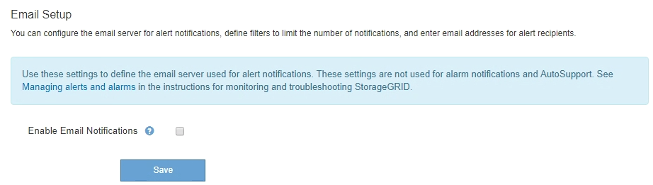

= Gestione degli avvisi
:allow-uri-read: 
:icons: font
:imagesdir: ../media/

[role="lead"]
Gli avvisi consentono di monitorare diversi eventi e condizioni all'interno del sistema StorageGRID. È possibile gestire gli avvisi creando avvisi personalizzati, modificando o disattivando gli avvisi predefiniti, impostando le notifiche e-mail per gli avvisi e tacitando le notifiche.

.Informazioni correlate
link:viewing-current-alerts.html["Visualizzazione degli avvisi correnti"]

link:viewing-resolved-alerts.html["Visualizzazione degli avvisi risolti"]

link:viewing-specific-alert.html["Visualizzazione di un avviso specifico"]

link:alerts-reference.html["Riferimenti agli avvisi"]

== Quali sono gli avvisi

Il sistema di avviso fornisce un'interfaccia di facile utilizzo per rilevare, valutare e risolvere i problemi che possono verificarsi durante il funzionamento di StorageGRID.

* Il sistema di allerta si concentra su problemi pratici nel sistema. A differenza di alcuni allarmi nel sistema precedente, gli avvisi vengono attivati per gli eventi che richiedono attenzione immediata, non per gli eventi che possono essere ignorati in modo sicuro.
* La pagina Current Alerts (Avvisi correnti) fornisce un'interfaccia intuitiva per la visualizzazione dei problemi correnti. È possibile ordinare l'elenco in base a singoli avvisi e gruppi di avvisi. Ad esempio, è possibile ordinare tutti gli avvisi per nodo/sito per visualizzare gli avvisi che interessano un nodo specifico. In alternativa, è possibile ordinare gli avvisi in un gruppo in base all'ora attivata per trovare l'istanza più recente di un avviso specifico.
* La pagina Resolved Alerts (Avvisi risolti) fornisce informazioni simili a quelle della pagina Current Alerts (Avvisi correnti), ma consente di cercare e visualizzare una cronologia degli avvisi risolti, anche quando l'avviso è stato attivato e quando è stato risolto.
* Più avvisi dello stesso tipo sono raggruppati in un'e-mail per ridurre il numero di notifiche. Inoltre, nella pagina Avvisi vengono visualizzati più avvisi dello stesso tipo come gruppo. È possibile espandere e comprimere i gruppi di avvisi per mostrare o nascondere i singoli avvisi. Ad esempio, se diversi nodi segnalano l'avviso *Impossibile comunicare con il nodo* circa contemporaneamente, viene inviato un solo messaggio e-mail e l'avviso viene visualizzato come gruppo nella pagina Avvisi.
* Gli avvisi utilizzano nomi e descrizioni intuitivi per comprendere rapidamente il problema. Le notifiche di avviso includono dettagli sul nodo e sul sito interessati, la severità dell'avviso, l'ora in cui è stata attivata la regola di avviso e il valore corrente delle metriche correlate all'avviso.
* Le notifiche e-mail di avviso e gli elenchi degli avvisi presenti nelle pagine Avvisi correnti e Avvisi risolti forniscono le azioni consigliate per la risoluzione di un avviso. Queste azioni consigliate spesso includono collegamenti diretti al centro di documentazione di StorageGRID per semplificare la ricerca e l'accesso a procedure di risoluzione dei problemi più dettagliate.
* Se è necessario sospendere temporaneamente le notifiche per un avviso a uno o più livelli di severità, è possibile disattivare facilmente una regola di avviso specifica per una durata specificata e per l'intera griglia, un singolo sito o un singolo nodo. È inoltre possibile disattivare tutte le regole di avviso, ad esempio durante una procedura di manutenzione pianificata, ad esempio un aggiornamento del software.
* È possibile modificare le regole di avviso predefinite in base alle esigenze. È possibile disattivare completamente una regola di avviso o modificarne le condizioni di attivazione e la durata.
* È possibile creare regole di avviso personalizzate per definire le condizioni specifiche pertinenti alla situazione e per fornire le azioni consigliate. Per definire le condizioni per un avviso personalizzato, creare espressioni utilizzando le metriche Prometheus disponibili nella sezione metriche dell'API Grid Management.

== Gestione delle regole degli avvisi

Le regole di avviso definiscono le condizioni che attivano avvisi specifici. StorageGRID include una serie di regole di avviso predefinite, che è possibile utilizzare così com'è o modificare, oppure è possibile creare regole di avviso personalizzate.

=== Visualizzazione delle regole degli avvisi

È possibile visualizzare l'elenco di tutte le regole di avviso predefinite e personalizzate per scoprire quali condizioni attiveranno ciascun avviso e per verificare se gli avvisi sono disattivati.

.Di cosa hai bisogno
* È necessario accedere a Grid Manager utilizzando un browser supportato.
* È necessario disporre dell'autorizzazione Manage Alerts (Gestisci avvisi) o Root Access (accesso root).

.Fasi
. Selezionare *Avvisi* *regole avvisi*.
+
Viene visualizzata la pagina regole di avviso.

+
image::../media/alert_rules_page.png[Pagina regole avvisi]

. Esaminare le informazioni nella tabella delle regole di avviso:
+
|===
| Intestazione di colonna | Descrizione 

 a| 
Nome
 a| 
Nome univoco e descrizione della regola di avviso. Vengono elencate per prime le regole di avviso personalizzate, seguite dalle regole di avviso predefinite. Il nome della regola di avviso è l'oggetto delle notifiche e-mail.

 a| 
Condizioni
 a| 
Le espressioni Prometheus che determinano quando viene attivato questo avviso. Un avviso può essere attivato in uno o più dei seguenti livelli di severità, ma non è richiesta alcuna condizione per ogni severità.

** *Critico* image:../media/icon_alert_red_critical.png["Icona Avviso rosso critico"]: Si verifica una condizione anomala che ha interrotto le normali operazioni di un nodo o servizio StorageGRID. È necessario risolvere immediatamente il problema sottostante. Se il problema non viene risolto, potrebbero verificarsi interruzioni del servizio e perdita di dati.
** *Maggiore* image:../media/icon_alert_orange_major.png["Icona Alert arancione maggiore"]: Si verifica una condizione anomala che influisce sulle operazioni correnti o si avvicina alla soglia per un avviso critico. È necessario analizzare gli avvisi principali e risolvere eventuali problemi sottostanti per assicurarsi che le condizioni anomale non interrompano il normale funzionamento di un nodo o servizio StorageGRID.
** *Minore* image:../media/icon_alert_yellow_miinor.png["Icona Avviso giallo minore"]: Il sistema funziona normalmente, ma si verifica una condizione anomala che potrebbe influire sulla capacità di funzionamento del sistema se continua a funzionare. È necessario monitorare e risolvere gli avvisi minori che non vengono risolti da soli per assicurarsi che non causino problemi più gravi.

 a| 
Tipo
 a| 
Il tipo di regola di avviso:

** *Default*: Una regola di avviso fornita con il sistema. È possibile disattivare una regola di avviso predefinita o modificare le condizioni e la durata di una regola di avviso predefinita. Non è possibile rimuovere una regola di avviso predefinita.
** *Default**: Una regola di avviso predefinita che include una condizione o una durata modificate. Se necessario, è possibile ripristinare facilmente le impostazioni predefinite originali di una condizione modificata.
** *Personalizzato*: Una regola di avviso creata dall'utente. È possibile disattivare, modificare e rimuovere regole di avviso personalizzate.

 a| 
Stato
 a| 
Se questa regola di avviso è attualmente attivata o disattivata. Le condizioni per le regole di avviso disabilitate non vengono valutate, quindi non vengono attivati avvisi.

|===

.Informazioni correlate
link:alerts-reference.html["Riferimenti agli avvisi"]

=== Creazione di regole di avviso personalizzate

È possibile creare regole di avviso personalizzate per definire le proprie condizioni di attivazione degli avvisi.

.Di cosa hai bisogno
* È necessario accedere a Grid Manager utilizzando un browser supportato.
* È necessario disporre dell'autorizzazione Manage Alerts (Gestisci avvisi) o Root Access (accesso root).

.A proposito di questa attività
StorageGRID non convalida gli avvisi personalizzati. Se si decide di creare regole di avviso personalizzate, attenersi alle seguenti linee guida generali:

* Esaminare le condizioni per le regole di avviso predefinite e utilizzarle come esempi per le regole di avviso personalizzate.
* Se si definiscono più condizioni per una regola di avviso, utilizzare la stessa espressione per tutte le condizioni. Quindi, modificare il valore di soglia per ciascuna condizione.
* Controllare attentamente ogni condizione per verificare la presenza di errori di tipo e logici.
* Utilizzare solo le metriche elencate nell'API Grid Management.
* Quando si esegue il test di un'espressione utilizzando l'API Grid Management, tenere presente che una risposta "`scompleta`" potrebbe essere semplicemente un corpo di risposta vuoto (nessun avviso attivato). Per verificare se l'avviso è effettivamente attivato, è possibile impostare temporaneamente una soglia su un valore che si prevede sia vero al momento.
+
Ad esempio, per testare l'espressione `node_memory_MemTotal_bytes < 24000000000`, eseguire prima `node_memory_MemTotal_bytes >= 0` e assicurati di ottenere i risultati attesi (tutti i nodi restituiscono un valore). Quindi, riportare l'operatore e la soglia ai valori previsti ed eseguire di nuovo. Nessun risultato indica che non sono presenti avvisi correnti per questa espressione.

* Non presumere che un avviso personalizzato funzioni a meno che non sia stata convalidata l'attivazione dell'avviso quando previsto.

.Fasi
. Selezionare *Avvisi* *regole avvisi*.
+
Viene visualizzata la pagina regole di avviso.

. Selezionare *Crea regola personalizzata*.
+
Viene visualizzata la finestra di dialogo Create Custom Rule (Crea regola personalizzata).

+
image::../media/alerts_create_custom_rule.png[Avvisi Crea regola personalizzata]

. Selezionare o deselezionare la casella di controllo *Enabled* per determinare se questa regola di avviso è attualmente attivata.
+
Se una regola di avviso è disattivata, le relative espressioni non vengono valutate e non vengono attivati avvisi.

. Inserire le seguenti informazioni:
+
|===
| Campo | Descrizione 

 a| 
Nome univoco
 a| 
Un nome univoco per questa regola. Il nome della regola di avviso viene visualizzato nella pagina Avvisi ed è anche l'oggetto delle notifiche e-mail. I nomi delle regole di avviso possono essere compresi tra 1 e 64 caratteri.

 a| 
Descrizione
 a| 
Una descrizione del problema che si verifica. La descrizione è il messaggio di avviso visualizzato nella pagina Avvisi e nelle notifiche e-mail. Le descrizioni delle regole di avviso possono essere comprese tra 1 e 128 caratteri.

 a| 
Azioni consigliate
 a| 
Facoltativamente, le azioni consigliate da intraprendere quando viene attivato questo avviso. Immettere le azioni consigliate come testo normale (senza codici di formattazione). Le azioni consigliate per le regole di avviso possono essere comprese tra 0 e 1,024 caratteri.

|===
. Nella sezione Condizioni, immettere un'espressione Prometheus per uno o più livelli di gravità dell'avviso.
+
Un'espressione di base è in genere della forma:

+
[listing]
----
[metric] [operator] [value]
----
+
Le espressioni possono essere di qualsiasi lunghezza, ma vengono visualizzate su una singola riga dell'interfaccia utente. È richiesta almeno un'espressione.

+
Per visualizzare le metriche disponibili e verificare le espressioni Prometheus, fare clic sull'icona della guida image:../media/icon_nms_question.gif["icona del punto interrogativo"] E segui il link alla sezione metriche dell'API Grid Management.

+
Per ulteriori informazioni sull'utilizzo dell'API di gestione griglia, consultare le istruzioni per l'amministrazione di StorageGRID. Per ulteriori informazioni sulla sintassi delle query Prometheus, consultare la documentazione di Prometheus.

+
Questa espressione attiva un avviso se la quantità di RAM installata per un nodo è inferiore a 24,000,000,000 byte (24 GB).

+
[listing]
----
node_memory_MemTotal_bytes < 24000000000
----
. Nel campo *durata*, immettere il periodo di tempo in cui una condizione deve rimanere in vigore continuamente prima che l'allarme venga attivato e selezionare un'unità di tempo.
+
Per attivare un avviso immediatamente quando una condizione diventa vera, immettere *0*. Aumentare questo valore per evitare che condizioni temporanee attivino avvisi.

+
L'impostazione predefinita è 5 minuti.

. Fare clic su *Save* (Salva).
+
La finestra di dialogo si chiude e la nuova regola di avviso personalizzata viene visualizzata nella tabella regole di avviso.

.Informazioni correlate
link:../admin/index.html["Amministrare StorageGRID"]

link:commonly-used-prometheus-metrics.html["Metriche Prometheus comunemente utilizzate"]

https://prometheus.io/docs/querying/basics/["Prometheus: Nozioni di base sulle query"]

=== Modifica di una regola di avviso

È possibile modificare una regola di avviso per modificare le condizioni di attivazione; per una regola di avviso personalizzata, è anche possibile aggiornare il nome della regola, la descrizione e le azioni consigliate.

.Di cosa hai bisogno
* È necessario accedere a Grid Manager utilizzando un browser supportato.
* È necessario disporre dell'autorizzazione Manage Alerts (Gestisci avvisi) o Root Access (accesso root).

.A proposito di questa attività
Quando si modifica una regola di avviso predefinita, è possibile modificare le condizioni per gli avvisi minori, maggiori e critici e la durata. Quando si modifica una regola di avviso personalizzata, è anche possibile modificare il nome, la descrizione e le azioni consigliate della regola.

IMPORTANT: Prestare attenzione quando si decide di modificare una regola di avviso. Se si modificano i valori di attivazione, potrebbe non essere rilevato un problema sottostante fino a quando non viene impedita l'esecuzione di un'operazione critica.

.Fasi
. Selezionare *Avvisi* *regole avvisi*.
+
Viene visualizzata la pagina regole di avviso.

. Selezionare il pulsante di opzione corrispondente alla regola di avviso che si desidera modificare.
. Selezionare *Modifica regola*.
+
Viene visualizzata la finestra di dialogo Edit Rule (Modifica regola). Questo esempio mostra una regola di avviso predefinita: I campi Nome univoco, Descrizione e azioni consigliate sono disattivati e non possono essere modificati.

+
image::../media/alert_rules_edit_rule.png[Regola di modifica degli avvisi]

. Selezionare o deselezionare la casella di controllo *Enabled* per determinare se questa regola di avviso è attualmente attivata.
+
Se una regola di avviso è disattivata, le relative espressioni non vengono valutate e non vengono attivati avvisi.

+

NOTE: Se si disattiva la regola di avviso per un avviso corrente, è necessario attendere alcuni minuti affinché l'avviso non venga più visualizzato come avviso attivo.

+

IMPORTANT: In generale, la disattivazione di una regola di avviso predefinita non è consigliata. Se una regola di avviso è disattivata, potrebbe non essere rilevato un problema sottostante fino a quando non viene impedita l'esecuzione di un'operazione critica.

. Per le regole di avviso personalizzate, aggiornare le seguenti informazioni secondo necessità.
+

NOTE: Non è possibile modificare queste informazioni per le regole di avviso predefinite.

+
|===
| Campo | Descrizione 

 a| 
Nome univoco
 a| 
Un nome univoco per questa regola. Il nome della regola di avviso viene visualizzato nella pagina Avvisi ed è anche l'oggetto delle notifiche e-mail. I nomi delle regole di avviso possono essere compresi tra 1 e 64 caratteri.

 a| 
Descrizione
 a| 
Una descrizione del problema che si verifica. La descrizione è il messaggio di avviso visualizzato nella pagina Avvisi e nelle notifiche e-mail. Le descrizioni delle regole di avviso possono essere comprese tra 1 e 128 caratteri.

 a| 
Azioni consigliate
 a| 
Facoltativamente, le azioni consigliate da intraprendere quando viene attivato questo avviso. Immettere le azioni consigliate come testo normale (senza codici di formattazione). Le azioni consigliate per le regole di avviso possono essere comprese tra 0 e 1,024 caratteri.

|===
. Nella sezione Condizioni, immettere o aggiornare l'espressione Prometheus per uno o più livelli di gravità dell'avviso.
+

NOTE: Se si desidera ripristinare il valore originale di una condizione per una regola di avviso predefinita modificata, fare clic sui tre punti a destra della condizione modificata.

+
image::../media/alert_rules_edit_revert_to_default.png[Alert rules (regole di avviso): Ripristino di una condizione modificata al valore predefinito]

+

NOTE: Se si aggiornano le condizioni per un avviso corrente, le modifiche potrebbero non essere implementate fino a quando la condizione precedente non viene risolta. Al successivo soddisfacimento di una delle condizioni per la regola, l'avviso rifletterà i valori aggiornati.

+
Un'espressione di base è in genere della forma:

+
[listing]
----
[metric] [operator] [value]
----
+
Le espressioni possono essere di qualsiasi lunghezza, ma vengono visualizzate su una singola riga dell'interfaccia utente. È richiesta almeno un'espressione.

+
Per visualizzare le metriche disponibili e verificare le espressioni Prometheus, fare clic sull'icona della guida image:../media/icon_nms_question.gif["icona del punto interrogativo"] E segui il link alla sezione metriche dell'API Grid Management.

+
Per ulteriori informazioni sull'utilizzo dell'API di gestione griglia, consultare le istruzioni per l'amministrazione di StorageGRID. Per ulteriori informazioni sulla sintassi delle query Prometheus, consultare la documentazione di Prometheus.

+
Questa espressione attiva un avviso se la quantità di RAM installata per un nodo è inferiore a 24,000,000,000 byte (24 GB).

+
[listing]
----
node_memory_MemTotal_bytes < 24000000000
----
. Nel campo *durata*, immettere il periodo di tempo in cui una condizione deve rimanere in vigore continuamente prima che l'allarme venga attivato, quindi selezionare l'unità di tempo.
+
Per attivare un avviso immediatamente quando una condizione diventa vera, immettere *0*. Aumentare questo valore per evitare che condizioni temporanee attivino avvisi.

+
L'impostazione predefinita è 5 minuti.

. Fare clic su *Save* (Salva).
+
Se è stata modificata una regola di avviso predefinita, nella colonna tipo viene visualizzato *Default**. Se è stata disattivata una regola di avviso predefinita o personalizzata, nella colonna *Status* viene visualizzato *Disabled*.

.Informazioni correlate
link:../admin/index.html["Amministrare StorageGRID"]

link:commonly-used-prometheus-metrics.html["Metriche Prometheus comunemente utilizzate"]

https://prometheus.io/docs/querying/basics/["Prometheus: Nozioni di base sulle query"]

=== Disattivazione di una regola di avviso

È possibile modificare lo stato attivato/disattivato per una regola di avviso predefinita o personalizzata.

.Di cosa hai bisogno
* È necessario accedere a Grid Manager utilizzando un browser supportato.
* È necessario disporre dell'autorizzazione Manage Alerts (Gestisci avvisi) o Root Access (accesso root).

.A proposito di questa attività
Quando una regola di avviso viene disattivata, le relative espressioni non vengono valutate e non vengono attivati avvisi.

IMPORTANT: In generale, la disattivazione di una regola di avviso predefinita non è consigliata. Se una regola di avviso è disattivata, potrebbe non essere rilevato un problema sottostante fino a quando non viene impedita l'esecuzione di un'operazione critica.

.Fasi
. Selezionare *Avvisi* *regole avvisi*.
+
Viene visualizzata la pagina regole di avviso.

. Selezionare il pulsante di opzione corrispondente alla regola di avviso che si desidera attivare o disattivare.
. Selezionare *Modifica regola*.
+
Viene visualizzata la finestra di dialogo Edit Rule (Modifica regola).

. Selezionare o deselezionare la casella di controllo *Enabled* per determinare se questa regola di avviso è attualmente attivata.
+
Se una regola di avviso è disattivata, le relative espressioni non vengono valutate e non vengono attivati avvisi.

+

NOTE: Se si disattiva la regola di avviso per un avviso corrente, è necessario attendere alcuni minuti affinché l'avviso non venga più visualizzato come avviso attivo.

. Fare clic su *Save* (Salva).
+
*Disabled* viene visualizzato nella colonna *Status*.

=== Rimozione di una regola di avviso personalizzata

È possibile rimuovere una regola di avviso personalizzata se non si desidera più utilizzarla.

.Di cosa hai bisogno
* È necessario accedere a Grid Manager utilizzando un browser supportato.
* È necessario disporre dell'autorizzazione Manage Alerts (Gestisci avvisi) o Root Access (accesso root).

.Fasi
. Selezionare *Avvisi* *regole avvisi*.
+
Viene visualizzata la pagina regole di avviso.

. Selezionare il pulsante di opzione per la regola di avviso personalizzata che si desidera rimuovere.
+
Non è possibile rimuovere una regola di avviso predefinita.

. Fare clic su *Rimuovi regola personalizzata*.
+
Viene visualizzata una finestra di dialogo di conferma.

. Fare clic su *OK* per rimuovere la regola di avviso.
+
Tutte le istanze attive dell'avviso verranno risolte entro 10 minuti.

== Gestione delle notifiche di avviso

Quando viene attivato un avviso, StorageGRID può inviare notifiche e-mail e notifiche SNMP (Simple Network Management Protocol) (trap).

=== Impostazione delle notifiche SNMP per gli avvisi

Se si desidera che StorageGRID invii notifiche SNMP quando si verificano avvisi, è necessario attivare l'agente SNMP StorageGRID e configurare una o più destinazioni trap.

.A proposito di questa attività
È possibile utilizzare l'opzione *Configurazione* *monitoraggio* *Agente SNMP* in Gestione griglia o gli endpoint SNMP per l'API di gestione griglia per attivare e configurare l'agente SNMP di StorageGRID. L'agente SNMP supporta tutte e tre le versioni del protocollo SNMP.

Per informazioni sulla configurazione dell'agente SNMP, consultare la sezione relativa all'utilizzo del monitoraggio SNMP.

Dopo aver configurato l'agente SNMP StorageGRID, è possibile inviare due tipi di notifiche basate sugli eventi:

* I trap sono notifiche inviate dall'agente SNMP che non richiedono un riconoscimento da parte del sistema di gestione. Le trap servono a notificare al sistema di gestione che si è verificato qualcosa all'interno di StorageGRID, ad esempio un avviso attivato. I trap sono supportati in tutte e tre le versioni di SNMP
* Le informazioni sono simili alle trap, ma richiedono un riconoscimento da parte del sistema di gestione. Se l'agente SNMP non riceve una conferma entro un determinato periodo di tempo, invia nuovamente l'informazione fino a quando non viene ricevuta una conferma o non viene raggiunto il valore massimo di ripetizione. Le informazioni sono supportate in SNMPv2c e SNMPv3.

Le notifiche di trap e notifica vengono inviate quando viene attivato un avviso predefinito o personalizzato a qualsiasi livello di gravità. Per eliminare le notifiche SNMP per un avviso, è necessario configurare un silenzio per l'avviso. Le notifiche di avviso vengono inviate da qualsiasi nodo amministrativo configurato come mittente preferito. Per impostazione predefinita, viene selezionato il nodo di amministrazione principale. Per ulteriori informazioni, consultare le istruzioni per l'amministrazione di StorageGRID.

NOTE: Le notifiche di trap e notifica vengono inviate anche quando determinati allarmi (sistema legacy) vengono attivati a livelli di gravità specificati o superiori; tuttavia, le notifiche SNMP non vengono inviate per ogni allarme o per ogni gravità.

.Informazioni correlate
link:using-snmp-monitoring.html["Utilizzo del monitoraggio SNMP"]

link:managing-alerts.html["Tacitare le notifiche di avviso"]

link:../admin/index.html["Amministrare StorageGRID"]

link:alarms-that-generate-snmp-notifications.html["Allarmi che generano notifiche SNMP (sistema legacy)"]

=== Impostazione delle notifiche e-mail per gli avvisi

Se si desidera che le notifiche e-mail vengano inviate quando si verificano avvisi, è necessario fornire informazioni sul server SMTP. È inoltre necessario immettere gli indirizzi e-mail per i destinatari delle notifiche di avviso.

.Di cosa hai bisogno
* È necessario accedere a Grid Manager utilizzando un browser supportato.
* È necessario disporre dell'autorizzazione Manage Alerts (Gestisci avvisi) o Root Access (accesso root).

.Di cosa hai bisogno
Poiché gli allarmi e gli avvisi sono sistemi indipendenti, la configurazione dell'e-mail utilizzata per le notifiche di avviso non viene utilizzata per le notifiche di allarme e i messaggi AutoSupport. Tuttavia, è possibile utilizzare lo stesso server di posta elettronica per tutte le notifiche.

Se l'implementazione di StorageGRID include più nodi di amministrazione, è possibile selezionare quale nodo di amministrazione deve essere il mittente preferito delle notifiche di avviso. Lo stesso "`Preferred sender`" viene utilizzato anche per le notifiche di allarme e i messaggi AutoSupport. Per impostazione predefinita, viene selezionato il nodo di amministrazione principale. Per ulteriori informazioni, consultare le istruzioni per l'amministrazione di StorageGRID.

.Fasi
. Selezionare *Avvisi* *Configurazione e-mail*.
+
Viene visualizzata la pagina Configurazione e-mail.

+

. Selezionare la casella di controllo *Enable Email Notifications* (attiva notifiche e-mail) per indicare che si desidera inviare e-mail di notifica quando gli avvisi raggiungono le soglie configurate.
+
Vengono visualizzate le sezioni Server e-mail (SMTP), TLS (Transport Layer Security), indirizzi e-mail e filtri.

. Nella sezione Server e-mail (SMTP), immettere le informazioni necessarie per l'accesso al server SMTP da parte di StorageGRID.
+
Se il server SMTP richiede l'autenticazione, è necessario fornire sia un nome utente che una password. È inoltre necessario richiedere TLS e fornire un certificato CA.

+
|===
| Campo | Invio 

 a| 
Server di posta
 a| 
Il nome di dominio completo (FQDN) o l'indirizzo IP del server SMTP.

 a| 
Porta
 a| 
Porta utilizzata per accedere al server SMTP. Deve essere compreso tra 1 e 65535.

 a| 
Nome utente (opzionale)
 a| 
Se il server SMTP richiede l'autenticazione, immettere il nome utente con cui eseguire l'autenticazione.

 a| 
Password (opzionale)
 a| 
Se il server SMTP richiede l'autenticazione, immettere la password con cui eseguire l'autenticazione.

|===
+
image:../media/alerts_email_smtp_server.png["Avvisi e-mail server SMTP"]

. Nella sezione indirizzi e-mail, immettere gli indirizzi e-mail per il mittente e per ciascun destinatario.
+
.. Per *Sender Email Address*, specificare un indirizzo e-mail valido da utilizzare come indirizzo da per le notifiche degli avvisi.
+
Ad esempio: `storagegrid-alerts@example.com`

.. Nella sezione destinatari, immettere un indirizzo e-mail per ciascun elenco o persona che deve ricevere un'e-mail quando si verifica un avviso.
+
Fare clic sull'icona più image:../media/icon_plus_sign_black_on_white.gif["icona più"] per aggiungere destinatari.

+
image::../media/alerts_email_recipients.png[Avvisa i destinatari e-mail]

. Nella sezione Transport Layer Security (TLS), selezionare la casella di controllo *Require TLS* (Richiedi TLS*) se Transport Layer Security (TLS) è richiesto per le comunicazioni con il server SMTP.
+
.. Nel campo *certificato CA*, fornire il certificato CA che verrà utilizzato per verificare l'identificazione del server SMTP.
+
È possibile copiare e incollare il contenuto in questo campo oppure fare clic su *Sfoglia* e selezionare il file.

+
È necessario fornire un singolo file contenente i certificati di ogni autorità di certificazione di emissione intermedia (CA). Il file deve contenere ciascuno dei file di certificato CA con codifica PEM, concatenati in ordine di catena del certificato.

.. Selezionare la casella di controllo *Send Client Certificate* (Invia certificato client) se il server di posta SMTP richiede l'invio di certificati client per l'autenticazione da parte dei mittenti di posta elettronica.
.. Nel campo *certificato client*, fornire il certificato client con codifica PEM da inviare al server SMTP.
+
È possibile copiare e incollare il contenuto in questo campo oppure fare clic su *Sfoglia* e selezionare il file.

.. Nel campo *Private Key* (chiave privata), immettere la chiave privata per il certificato client in codifica PEM non crittografata.
+
È possibile copiare e incollare il contenuto in questo campo oppure fare clic su *Sfoglia* e selezionare il file.

+

NOTE: Per modificare la configurazione dell'e-mail, fare clic sull'icona a forma di matita per aggiornare questo campo.

+
image::../media/alerts_email_tls.png[Avvisi e-mail TLS]

. Nella sezione filtri, selezionare i livelli di severità degli avvisi che devono generare le notifiche via email, a meno che la regola per uno specifico avviso non sia stata tacitata.
+
|===
| Severità | Descrizione 

 a| 
Minore, maggiore, critico
 a| 
Viene inviata una notifica via email quando viene soddisfatta la condizione minore, maggiore o critica di una regola di avviso.

 a| 
Importante, critico
 a| 
Viene inviata una notifica via email quando viene soddisfatta la condizione principale o critica per una regola di avviso. Le notifiche non vengono inviate per avvisi minori.

 a| 
Solo critico
 a| 
Una notifica via email viene inviata solo quando viene soddisfatta la condizione critica per una regola di avviso. Le notifiche non vengono inviate per avvisi minori o maggiori.

|===
+
image:../media/alerts_email_filters.png["Avvisi e-mail Filters"]

. Quando si è pronti a verificare le impostazioni e-mail, attenersi alla seguente procedura:
+
.. Fare clic su *Invia email di prova*.
+
Viene visualizzato un messaggio di conferma che indica l'invio di un'e-mail di prova.

.. Selezionare le caselle di posta in arrivo di tutti i destinatari e confermare che è stata ricevuta un'e-mail di prova.
+

NOTE: Se l'e-mail non viene ricevuta entro pochi minuti o se viene attivato l'avviso *errore notifica e-mail*, controllare le impostazioni e riprovare.

.. Accedi a qualsiasi altro nodo Admin e invia un'e-mail di prova per verificare la connettività da tutti i siti.
+

NOTE: Quando si verificano le notifiche di avviso, è necessario accedere a ogni nodo amministratore per verificare la connettività. Ciò è in contrasto con il test delle notifiche di allarme e dei messaggi AutoSupport, in cui tutti i nodi amministrativi inviano l'email di test.

. Fare clic su *Save* (Salva).
+
L'invio di un'e-mail di prova non salva le impostazioni. Fare clic su *Save* (Salva).

+
Le impostazioni e-mail vengono salvate.

.Informazioni correlate
link:managing-alerts.html["Risoluzione dei problemi relativi alle notifiche email di avviso"]

link:../maintain/index.html["Mantieni  Ripristina"]

=== Informazioni incluse nelle notifiche e-mail di avviso

Dopo aver configurato il server di posta SMTP, le notifiche e-mail vengono inviate ai destinatari designati quando viene attivato un avviso, a meno che la regola di avviso non venga soppressa da un silenzio.

Le notifiche e-mail includono le seguenti informazioni:

image::../media/alerts_email_notification.png[Notifiche e-mail]

[cols="1a,5a"]
|===
|  | Descrizione 

 a| 
1
 a| 
Il nome dell'avviso, seguito dal numero di istanze attive dell'avviso.

 a| 
2
 a| 
La descrizione dell'avviso.

 a| 
3
 a| 
Qualsiasi azione consigliata per l'avviso.

 a| 
4
 a| 
Dettagli su ogni istanza attiva dell'avviso, inclusi il nodo e il sito interessati, la severità dell'avviso, l'ora UTC in cui è stata attivata la regola di avviso e il nome del servizio e del processo interessati.

 a| 
5
 a| 
Il nome host del nodo amministratore che ha inviato la notifica.

|===
.Informazioni correlate
link:managing-alerts.html["Tacitare le notifiche di avviso"]

=== Come StorageGRID raggruppa gli avvisi nelle notifiche e-mail

Per impedire l'invio di un numero eccessivo di notifiche e-mail quando vengono attivati gli avvisi, StorageGRID tenta di raggruppare più avvisi nella stessa notifica.

Fare riferimento alla tabella seguente per alcuni esempi di come StorageGRID raggruppa più avvisi nelle notifiche e-mail.

|===
| Comportamento | Esempio 

 a| 
Ogni notifica di avviso si applica solo agli avvisi con lo stesso nome. Se vengono attivati contemporaneamente due avvisi con nomi diversi, vengono inviate due notifiche e-mail.
 a| 
* L'avviso A viene attivato su due nodi contemporaneamente. Viene inviata una sola notifica.
* L'allarme A viene attivato sul nodo 1 e l'allarme B viene attivato contemporaneamente sul nodo 2. Vengono inviate due notifiche, una per ogni avviso.

 a| 
Per un avviso specifico su un nodo specifico, se le soglie vengono raggiunte per più di una severità, viene inviata una notifica solo per l'avviso più grave.
 a| 
* Viene attivato l'allarme A e vengono raggiunte le soglie di allarme minore, maggiore e critico. Viene inviata una notifica per l'avviso critico.

 a| 
La prima volta che viene attivato un avviso, StorageGRID attende 2 minuti prima di inviare una notifica. Se durante questo periodo vengono attivati altri avvisi con lo stesso nome, StorageGRID raggruppa tutti gli avvisi nella notifica iniziale.​
 a| 
. L'allarme A viene attivato sul nodo 1 alle 08:00. Non viene inviata alcuna notifica.
. L'allarme A viene attivato sul nodo 2 alle 08:01. Non viene inviata alcuna notifica.
. Alle 08:02, viene inviata una notifica per segnalare entrambe le istanze dell'avviso.

 a| 
Se viene attivato un altro avviso con lo stesso nome, StorageGRID attende 10 minuti prima di inviare una nuova notifica. La nuova notifica riporta tutti gli avvisi attivi (gli avvisi correnti che non sono stati tacitati), anche se precedentemente segnalati.
 a| 
. L'allarme A viene attivato sul nodo 1 alle 08:00. Viene inviata una notifica alle ore 08:02.
. L'allarme A viene attivato sul nodo 2 alle 08:05. Una seconda notifica viene inviata alle 08:15 (10 minuti dopo). Vengono segnalati entrambi i nodi.

 a| 
Se sono presenti più avvisi correnti con lo stesso nome e uno di questi viene risolto, non viene inviata una nuova notifica se l'avviso si ripresenta sul nodo per il quale l'avviso è stato risolto.
 a| 
. Viene attivato l'avviso A per il nodo 1. Viene inviata una notifica.
. Viene attivato l'avviso A per il nodo 2. Viene inviata una seconda notifica.
. L'avviso A è stato risolto per il nodo 2, ma rimane attivo per il nodo 1.
. L'avviso A viene nuovamente attivato per il nodo 2. Non viene inviata alcuna nuova notifica perché l'avviso è ancora attivo per il nodo 1.

 a| 
StorageGRID continua a inviare notifiche via email ogni 7 giorni fino a quando tutte le istanze dell'avviso non vengono risolte o la regola dell'avviso non viene tacitata.
 a| 
. L'allarme A viene attivato per il nodo 1 l'8 marzo. Viene inviata una notifica.
. L'avviso A non viene risolto o tacitato. Ulteriori notifiche verranno inviate il 15 marzo, il 22 marzo, il 29 marzo e così via.

|===

=== Risoluzione dei problemi relativi alle notifiche email di avviso

Se viene attivato l'avviso *errore notifica email* o non si riesce a ricevere la notifica email di avviso del test, attenersi alla procedura descritta di seguito per risolvere il problema.

.Di cosa hai bisogno
* È necessario accedere a Grid Manager utilizzando un browser supportato.
* È necessario disporre dell'autorizzazione Manage Alerts (Gestisci avvisi) o Root Access (accesso root).

.Fasi
. Verificare le impostazioni.
+
.. Selezionare *Avvisi* *Configurazione e-mail*.
.. Verificare che le impostazioni del server e-mail (SMTP) siano corrette.
.. Verificare di aver specificato indirizzi e-mail validi per i destinatari.

. Controllare il filtro antispam e assicurarsi che l'e-mail non sia stata inviata a una cartella di posta indesiderata.
. Chiedere all'amministratore dell'e-mail di confermare che le e-mail dell'indirizzo del mittente non vengono bloccate.
. Raccogliere un file di log per l'Admin Node, quindi contattare il supporto tecnico.
+
Il supporto tecnico può utilizzare le informazioni contenute nei registri per determinare l'errore. Ad esempio, il file prometheus.log potrebbe visualizzare un errore durante la connessione al server specificato.

.Informazioni correlate
link:collecting-log-files-and-system-data.html["Raccolta di file di log e dati di sistema"]

== Tacitare le notifiche di avviso

In alternativa, è possibile configurare le silenzi in modo da eliminare temporaneamente le notifiche di avviso.

.Di cosa hai bisogno
* È necessario accedere a Grid Manager utilizzando un browser supportato.
* È necessario disporre dell'autorizzazione Manage Alerts (Gestisci avvisi) o Root Access (accesso root).

.A proposito di questa attività
È possibile disattivare le regole di avviso sull'intera griglia, su un singolo sito o su un singolo nodo e per una o più severità. Ogni silenzio elimina tutte le notifiche per una singola regola di avviso o per tutte le regole di avviso.

Se è stato attivato l'agente SNMP, le silenzi sopprimono anche i trap SNMP e informano.

IMPORTANT: Prestare attenzione quando si decide di tacitare una regola di avviso. Se si tacita un avviso, potrebbe non essere possibile rilevare un problema sottostante fino a quando non si impedisce il completamento di un'operazione critica.

NOTE: Poiché gli allarmi e gli avvisi sono sistemi indipendenti, non è possibile utilizzare questa funzionalità per eliminare le notifiche di allarme.

.Fasi
. Selezionare *Avvisi* *silenzi*.
+
Viene visualizzata la pagina Silences (silenzi).

+
image::../media/alerts_silences_page.png[Pagina dei silenzi degli avvisi]

. Selezionare *Crea*.
+
Viene visualizzata la finestra di dialogo Crea silenzio.

+
image::../media/alerts_create_silence.png[Avvisi Crea silenzio]

. Selezionare o inserire le seguenti informazioni:
+
[cols="1a,3a"]
|===
| Campo | Descrizione 

 a| 
Regola di avviso
 a| 
Il nome della regola di avviso che si desidera disattivare. È possibile selezionare qualsiasi regola di avviso predefinita o personalizzata, anche se la regola di avviso è disattivata.

*Nota:* selezionare *tutte le regole* se si desidera disattivare tutte le regole di avviso utilizzando i criteri specificati in questa finestra di dialogo.

 a| 
Descrizione
 a| 
Facoltativamente, una descrizione del silenzio. Ad esempio, descrivi lo scopo di questo silenzio.

 a| 
Durata
 a| 
Per quanto tempo si desidera che questo silenzio rimanga attivo, in minuti, ore o giorni. Un silenzio può essere in vigore da 5 minuti a 1,825 giorni (5 anni).

*Nota:* non disattivare una regola di avviso per un periodo di tempo prolungato. Se una regola di avviso viene tacitata, è possibile che non si rilevi un problema sottostante fino a quando non si impedisce il completamento di un'operazione critica. Tuttavia, potrebbe essere necessario utilizzare un silenzio esteso se un avviso viene attivato da una configurazione specifica e intenzionale, ad esempio per gli avvisi *link down* dell'appliance di servizi e *link down* dell'appliance di storage.

 a| 
Severità
 a| 
Quale severità o severità degli avvisi deve essere tacitata. Se l'avviso viene attivato in una delle severità selezionate, non viene inviata alcuna notifica.

 a| 
Nodi
 a| 
A quale nodo o nodi si desidera applicare questo silenzio. È possibile eliminare una regola di avviso o tutte le regole dell'intera griglia, di un singolo sito o di un singolo nodo. Se si seleziona l'intera griglia, il silenzio viene applicato a tutti i siti e a tutti i nodi. Se si seleziona un sito, il silenzio si applica solo ai nodi di quel sito.

*Nota:* non è possibile selezionare più di un nodo o più siti per ciascun silenzio. Se si desidera eliminare la stessa regola di avviso su più di un nodo o più siti contemporaneamente, è necessario creare silenzi aggiuntivi.

|===
. Fare clic su *Save* (Salva).
. Se si desidera modificare o terminare un silenzio prima della scadenza, è possibile modificarlo o rimuoverlo.
+
[cols="1a,3a"]
|===
| Opzione | Descrizione 

 a| 
Modificare un silenzio
 a| 
.. Selezionare *Avvisi* *silenzi*.
.. Dalla tabella, selezionare il pulsante di opzione relativo al silenzio che si desidera modificare.
.. Fare clic su *Edit* (Modifica).
.. Modificare la descrizione, il tempo rimanente, le severità selezionate o il nodo interessato.
.. Fare clic su *Save* (Salva).

 a| 
Eliminare un silenzio
 a| 
.. Selezionare *Avvisi* *silenzi*.
.. Dalla tabella, selezionare il pulsante di opzione per il silenzio che si desidera rimuovere.
.. Fare clic su *Rimuovi*.
.. Fare clic su *OK* per confermare che si desidera rimuovere il silenzio.
+
*Nota*: Le notifiche verranno inviate quando viene attivato questo avviso (a meno che non venga eliminato da un altro silenzio). Se questo avviso viene attivato, potrebbero essere necessari alcuni minuti per l'invio di notifiche e-mail o SNMP e per l'aggiornamento della pagina Avvisi.

|===

.Informazioni correlate
link:configuring-snmp-agent.html["Configurazione dell'agente SNMP"]
