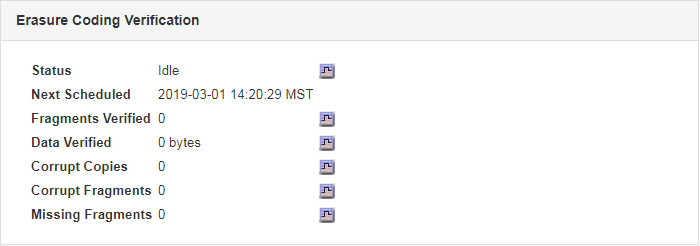

= Monitoraggio delle operazioni di verifica degli oggetti
:allow-uri-read: 
:icons: font
:imagesdir: ../media/

[role="lead"]
Il sistema StorageGRID è in grado di verificare l'integrità dei dati degli oggetti sui nodi di storage, verificando la presenza di oggetti danneggiati e mancanti.

.Di cosa hai bisogno
È necessario accedere a Grid Manager utilizzando un browser supportato.

.A proposito di questa attività
Esistono due processi di verifica che lavorano insieme per garantire l'integrità dei dati:

* *La verifica in background* viene eseguita automaticamente, controllando continuamente la correttezza dei dati dell'oggetto.
+
La verifica in background verifica automaticamente e continuamente tutti i nodi di storage per determinare se sono presenti copie corrotte dei dati degli oggetti replicati e codificati in cancellazione. In caso di problemi, il sistema StorageGRID tenta automaticamente di sostituire i dati dell'oggetto corrotto da copie memorizzate in un'altra parte del sistema. La verifica in background non viene eseguita sui nodi di archiviazione o sugli oggetti in un pool di storage cloud.

+

NOTE: L'avviso *rilevato oggetto corrotto non identificato* viene attivato se il sistema rileva un oggetto corrotto che non può essere corretto automaticamente.

* *La verifica Foreground* può essere attivata da un utente per verificare più rapidamente l'esistenza (anche se non la correttezza) dei dati dell'oggetto.
+
La verifica in primo piano consente di verificare l'esistenza di dati di oggetti replicati e codificati in cancellazione su un nodo di storage specifico, verificando che vi sia ogni oggetto che si prevede sia presente. È possibile eseguire la verifica in primo piano su tutti o alcuni archivi di oggetti di un nodo di storage per determinare se si verificano problemi di integrità con un dispositivo di storage. Un numero elevato di oggetti mancanti potrebbe indicare la presenza di un problema di storage.

Per esaminare i risultati delle verifiche in background e in primo piano, ad esempio oggetti corrotti o mancanti, è possibile consultare la pagina nodi relativa a un nodo di storage. Per determinare la causa principale, è necessario esaminare immediatamente eventuali istanze di dati degli oggetti corrotti o mancanti.

.Fasi
. Selezionare *nodi*.
. Selezionare *_Storage Node_* *Objects*.
. Per verificare i risultati della verifica:
+
** Per controllare la verifica dei dati degli oggetti replicati, esaminare gli attributi nella sezione verifica.
+
image::../media/nodes_storage_node_object_verification.png[Nodes Storage Node Object Verification (verifica oggetti nodo]

+

NOTE: Fare clic sul nome di un attributo nella tabella per visualizzare il testo della guida.

** Per controllare la verifica dei frammenti con codifica di cancellazione, selezionare *_Storage Node_* *ILM* e osservare gli attributi nella tabella Erasure Coding Verification.
+

+

NOTE: Fare clic sul nome di un attributo nella tabella per visualizzare il testo della guida.

.Informazioni correlate
link:../troubleshoot/troubleshooting-storagegrid-system.html["Verifica dell'integrità degli oggetti"]
