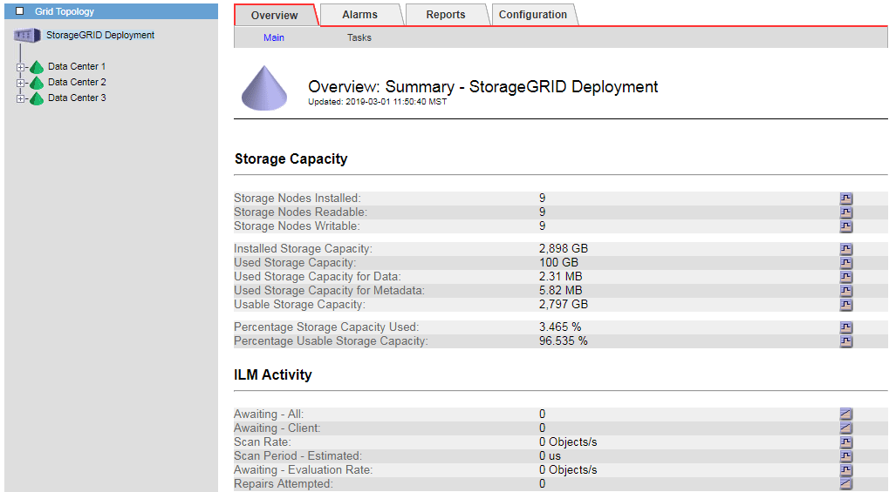

= Monitoraggio della capacità di storage per l'intero grid
:allow-uri-read: 
:icons: font
:imagesdir: ../media/

[role="lead"]
È necessario monitorare la capacità di storage globale del grid per garantire che rimanga spazio libero adeguato per i dati degli oggetti e i metadati degli oggetti. Comprendere come la capacità dello storage cambia nel tempo può aiutarti a pianificare l'aggiunta di nodi o volumi di storage prima che la capacità dello storage utilizzabile del grid venga consumata.

.Di cosa hai bisogno
È necessario accedere a Grid Manager utilizzando un browser supportato.

.A proposito di questa attività
La dashboard di Grid Manager consente di valutare rapidamente la quantità di storage disponibile per l'intero grid e per ciascun data center. La pagina nodi fornisce valori più dettagliati per i dati degli oggetti e i metadati degli oggetti.

.Fasi
. Valutare la quantità di storage disponibile per l'intero grid e per ciascun data center.
+
.. Selezionare *Dashboard*.
.. Nel pannello Available Storage (Storage disponibile), annotare il riepilogo generale della capacità di storage libera e utilizzata.
+

NOTE: Il riepilogo non include i supporti di archiviazione.

+
image::../media/grid_manager_dashboard_cropped.png[Dashboard di Grid Manager]

.. Posiziona il cursore sulle sezioni Free o USed Capacity del grafico per vedere esattamente quanto spazio è libero o utilizzato.
+
image::../media/storage_capacity_used.gif[Dashboard grafico della capacità libera o utilizzata]

.. Per le griglie multi-sito, esaminare il grafico di ciascun data center.
.. Fare clic sull'icona del grafico image:../media/icon_chart_new.gif["Icona del grafico"] per visualizzare il grafico generale o per un singolo data center un grafico che mostra l'utilizzo della capacità nel tempo.
+
Un grafico che mostra la percentuale di capacità di storage utilizzata (%) rispetto a. Viene visualizzata l'ora.

. Determinare la quantità di storage utilizzata e la quantità di storage disponibile per i dati a oggetti e i metadati a oggetti.
+
.. Selezionare *nodi*.
.. Selezionare *_grid_* *Storage*.
+
image::../media/nodes_deployment_storage_tab.png[Scheda Node Deployment Storage (Storage di implementazione]

.. Spostare il cursore sui grafici Storage used - Object Data e Storage Used - Object Metadata per visualizzare la quantità di storage a oggetti e metadati a oggetti disponibile per l'intera griglia e la quantità di storage utilizzata nel tempo.
+

NOTE: I valori totali di un sito o di una griglia non includono i nodi che non hanno riportato metriche per almeno cinque minuti, come i nodi offline.

. Come indicato dal supporto tecnico, visualizzare ulteriori dettagli sulla capacità di storage per il tuo grid.
+
.. Selezionare *supporto* > *Strumenti* > *topologia griglia*.
.. Selezionare *_Grid_* *Panoramica* *principale*.
+

. Pianificare un'espansione per aggiungere nodi di storage o volumi di storage prima che la capacità di storage utilizzabile del grid venga consumata.
+
Quando si pianifica la tempistica di un'espansione, considerare quanto tempo sarà necessario per procurarsi e installare storage aggiuntivo.

+

NOTE: Se la policy ILM utilizza la codifica erasure, è preferibile eseguire un'espansione quando i nodi di storage esistenti sono pieni al 70% circa per ridurre il numero di nodi da aggiungere.

+
Per ulteriori informazioni sulla pianificazione di un'espansione dello storage, consultare le istruzioni relative all'espansione di StorageGRID.

.Informazioni correlate
link:../expand/index.html["Espandi il tuo grid"]
