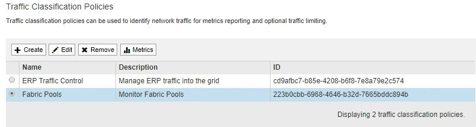

= Monitoraggio dell'attività del tenant
:allow-uri-read: 
:icons: font
:imagesdir: ../media/

[role="lead"]
Tutte le attività del client sono associate a un account tenant. È possibile utilizzare Grid Manager per monitorare l'utilizzo dello storage o il traffico di rete di un tenant, oppure utilizzare il registro di controllo o le dashboard Grafana per ottenere informazioni più dettagliate sull'utilizzo di StorageGRID da parte dei tenant.

.Di cosa hai bisogno
* È necessario accedere a Grid Manager utilizzando un browser supportato.
* È necessario disporre dell'autorizzazione di accesso root o di amministratore.

.A proposito di questa attività

IMPORTANT: I valori di spazio utilizzato sono stime. Queste stime sono influenzate dai tempi di acquisizione, dalla connettività di rete e dallo stato dei nodi.

.Fasi
. Selezionare *tenant* per esaminare la quantità di storage utilizzata da tutti i tenant.
+
Per ogni tenant vengono elencati lo spazio utilizzato, l'utilizzo della quota, la quota e il numero di oggetti. Se una quota non è impostata per un tenant, il campo di utilizzo della quota contiene un trattino (--) e il campo della quota indica "`Unlimited`".

+
image::../media/tenant_accounts_page.png[Pagina account tenant]

+
Se il sistema include più di 20 elementi, è possibile specificare quante righe vengono visualizzate su ogni pagina contemporaneamente. Utilizzare la casella di ricerca per cercare un account tenant in base al nome visualizzato o all'ID tenant.

+
Puoi accedere a un account tenant selezionando il link nella colonna *Accedi* della tabella.

. Facoltativamente, selezionare *Export to CSV* (Esporta in CSV) per visualizzare ed esportare un file .csv contenente i valori di utilizzo per tutti i tenant.
+
Viene richiesto di aprire o salvare `.csv` file.

+
Il contenuto di un file .csv è simile al seguente esempio:

+
image::../media/tenant_accounts_example_csv.png[Esempio di account tenant .csv]

+
È possibile aprire il file .csv in un'applicazione per fogli di calcolo o utilizzarlo in automazione.

. Per visualizzare i dettagli di un tenant specifico, inclusi i grafici di utilizzo, selezionare l'account tenant dalla pagina account tenant, quindi selezionare *Visualizza dettagli*.
+
Viene visualizzata la pagina account Details (Dettagli account) che mostra le informazioni di riepilogo, un grafico che rappresenta la quantità di quota utilizzata e rimanente e un grafico che rappresenta la quantità di dati oggetto nei bucket (S3) o nei container (Swift).

+
image::../media/tenant_usage_modal.png[Modale di utilizzo del tenant]

+
** *Quota*
+
Se è stata impostata una quota per questo tenant, il grafico *quota* mostra la quantità di tale quota utilizzata dal tenant e la quantità ancora disponibile. Se non è stata impostata alcuna quota, il tenant dispone di una quota illimitata e viene visualizzato un messaggio informativo. Se il tenant ha superato la quota di storage di oltre l'1% e di almeno 1 GB, il grafico mostra la quota totale e la quantità in eccesso.

+
È possibile posizionare il cursore sul segmento di spazio utilizzato per visualizzare il numero di oggetti memorizzati e i byte totali utilizzati. Puoi posizionare il cursore sul segmento spazio libero per vedere quanti byte di spazio di storage sono disponibili.

+

IMPORTANT: L'utilizzo delle quote si basa su stime interne e in alcuni casi potrebbe essere superato. Ad esempio, StorageGRID controlla la quota quando un tenant avvia il caricamento degli oggetti e rifiuta le nuove ricerche se il tenant ha superato la quota. Tuttavia, StorageGRID non tiene conto delle dimensioni del caricamento corrente quando determina se la quota è stata superata. Se gli oggetti vengono eliminati, a un tenant potrebbe essere temporaneamente impedito di caricare nuovi oggetti fino a quando l'utilizzo della quota non viene ricalcolato. I calcoli di utilizzo delle quote possono richiedere 10 minuti o più.

+

NOTE: L'utilizzo della quota di un tenant indica la quantità totale di dati oggetto che il tenant ha caricato in StorageGRID (dimensione logica). L'utilizzo della quota non rappresenta lo spazio utilizzato per memorizzare le copie di tali oggetti e dei relativi metadati (dimensione fisica).

+

NOTE: È possibile attivare l'avviso *quota elevata del tenant* per determinare se i tenant consumano le proprie quote. Se attivato, questo avviso viene attivato quando un tenant utilizza il 90% della propria quota. Per ulteriori informazioni, vedere il riferimento agli avvisi.

** *Spazio utilizzato*
+
Il grafico *spazio utilizzato dai bucket* (S3) o *spazio utilizzato dai container* (Swift) mostra i bucket più grandi per il tenant. Lo spazio utilizzato è la quantità totale di dati oggetto nel bucket. Questo valore non rappresenta lo spazio di storage richiesto per le copie ILM e i metadati degli oggetti.

+
Se il tenant ha più di nove bucket o container, vengono combinati in un segmento chiamato other. Alcuni segmenti del grafico potrebbero essere troppo piccoli per includere un'etichetta. È possibile posizionare il cursore su uno dei segmenti per visualizzare l'etichetta e ottenere ulteriori informazioni, tra cui il numero di oggetti memorizzati e i byte totali per ciascun bucket o container.

+
image::../media/tenant_dashboard_storage_usage_segment_other.png[Segmento di utilizzo dello storage - Altro]

. Selezionare *Dettagli bucket* (S3) o *Dettagli container* (Swift) per visualizzare un elenco dello spazio utilizzato e del numero di oggetti per ciascun bucket o container del tenant.
+
image::../media/tenant_bucket_details.png[Dettagli bucket tenant]

. Facoltativamente, selezionare *Export to CSV* (Esporta in CSV) per visualizzare ed esportare un file .csv contenente i valori di utilizzo per ciascun bucket o container.
+
Viene richiesto di aprire o salvare il file .csv.

+
Il contenuto del file .csv di un singolo tenant S3 è simile al seguente esempio:

+
image::../media/tenant_bucket_details_csv.png[Esempio CSV dettagli bucket tenant]

+
È possibile aprire il file .csv in un'applicazione per fogli di calcolo o utilizzarlo in automazione.

. Se per un tenant sono in vigore criteri di classificazione del traffico, esaminare il traffico di rete per tale tenant.
+
.. Selezionare *Configurazione* > *Impostazioni di rete* > *classificazione del traffico*.
+
Viene visualizzata la pagina Traffic Classification Policies (Criteri di classificazione del traffico) e i criteri esistenti sono elencati nella tabella.

+

.. Esaminare l'elenco delle policy per identificare quelle applicabili a un tenant specifico.
.. Per visualizzare le metriche associate a un criterio, selezionare il pulsante di opzione a sinistra del criterio, quindi fare clic su *metriche*.
.. Analizzare i grafici per determinare la frequenza con cui il criterio limita il traffico e se è necessario modificare il criterio.
+
Per creare, modificare o eliminare i criteri di classificazione del traffico, consultare le istruzioni per l'amministrazione di StorageGRID.

. Facoltativamente, utilizzare il registro di audit per un monitoraggio più granulare delle attività di un tenant.
+
Ad esempio, è possibile monitorare i seguenti tipi di informazioni:

+
** Operazioni client specifiche, come PUT, GET o DELETE
** Dimensioni degli oggetti
** La regola ILM applicata agli oggetti
** L'IP di origine delle richieste del client

+
I registri di audit vengono scritti in file di testo che è possibile analizzare utilizzando lo strumento di analisi dei log scelto. Ciò consente di comprendere meglio le attività del cliente o di implementare sofisticati modelli di chargeback e fatturazione. Per ulteriori informazioni, consultare le istruzioni relative ai messaggi di audit.

. Facoltativamente, utilizza le metriche Prometheus per generare report sull'attività del tenant:
+
** In Grid Manager, selezionare *Support* *Tools* *Metrics*. È possibile utilizzare dashboard esistenti, ad esempio S3 Overview, per esaminare le attività del client.
+

IMPORTANT: Gli strumenti disponibili nella pagina metriche sono destinati principalmente all'utilizzo da parte del supporto tecnico. Alcune funzioni e voci di menu di questi strumenti sono intenzionalmente non funzionali.

** Selezionare *Help* *API Documentation*. È possibile utilizzare le metriche nella sezione metriche dell'API Grid Management per creare regole di avviso e dashboard personalizzati per l'attività del tenant.

.Informazioni correlate
link:alerts-reference.html["Riferimenti agli avvisi"]

link:../audit/index.html["Esaminare i registri di audit"]

link:../admin/index.html["Amministrare StorageGRID"]

link:reviewing-support-metrics.html["Analisi delle metriche di supporto"]
