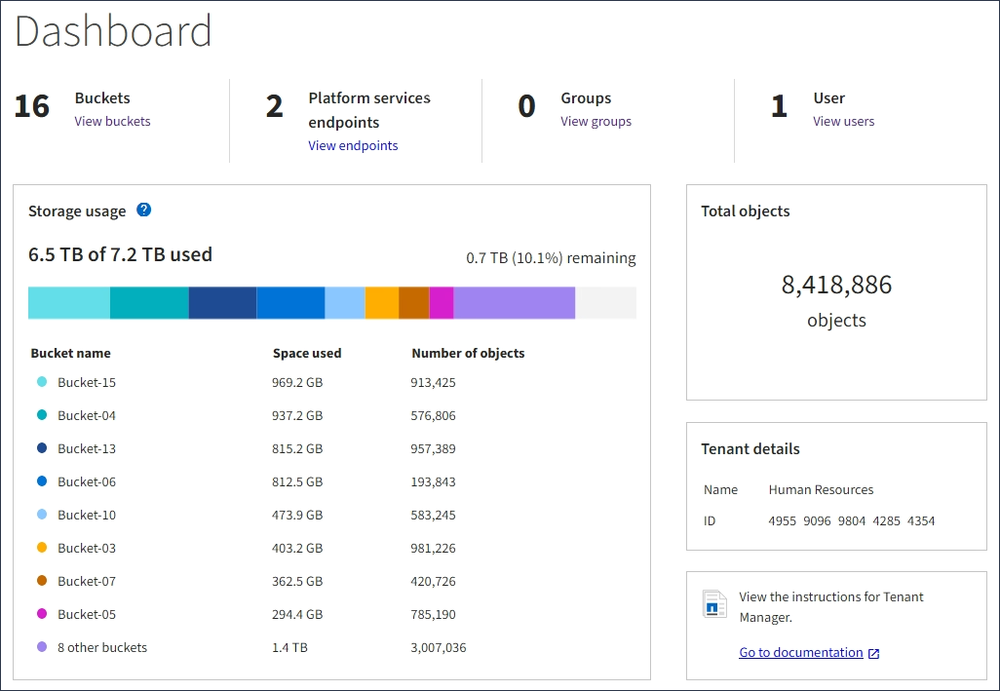
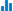

= Tipi di grafici
:allow-uri-read: 
:icons: font
:imagesdir: ../media/

[role="lead"]
I grafici e i grafici riassumono i valori delle metriche e degli attributi specifici di StorageGRID.

La dashboard di Grid Manager include grafici a torta (ciambella) per riepilogare lo storage disponibile per la griglia e per ciascun sito.

image::../media/dashboard_available_storage_panel.png[Pannello di storage disponibile]

Il pannello Storage Use (utilizzo dello storage) del pannello di controllo di Tenant Manager visualizza quanto segue:

* Un elenco dei bucket più grandi (S3) o container (Swift) per il tenant
* Un grafico a barre che rappresenta le dimensioni relative dei bucket o dei container più grandi
* La quantità totale di spazio utilizzato e, se viene impostata una quota, la quantità e la percentuale di spazio rimanente

Inoltre, i grafici che mostrano come le metriche e gli attributi StorageGRID cambiano nel tempo sono disponibili dalla pagina nodi e dalla pagina *supporto* *Strumenti* *topologia griglia*.

Esistono quattro tipi di grafici:

* *Grafici Grafana*: Mostrati nella pagina dei nodi, i grafici Grafana vengono utilizzati per tracciare i valori delle metriche Prometheus nel tempo. Ad esempio, la scheda *Nodes* *Load Balancer* di un nodo di amministrazione include quattro grafici Grafana.
+
image::../media/nodes_page_load_balancer_tab.png[Scheda bilanciamento carico pagina nodi]

+

NOTE: I grafici Grafana sono inclusi anche nelle dashboard predefinite disponibili nella pagina *Support* *Tools* *Metrics*.

* *Grafici delle linee*: Disponibili dalla pagina nodi e dalla pagina *supporto* *Strumenti* *topologia della griglia* (fare clic sull'icona del grafico image:../media/icon_chart_new.gif["Grafico a icone (nuovo)"] Dopo un valore di dati), i grafici a linee vengono utilizzati per rappresentare graficamente i valori degli attributi StorageGRID che hanno un valore unitario (ad esempio, offset di frequenza NTP, in ppm). Le modifiche al valore vengono tracciate a intervalli di dati regolari (bin) nel tempo.
+
image::../media/line_graph.gif[Grafico a linee]

* *Area Graphs*: Disponibile dalla pagina Nodes e dalla pagina *Support* *Tools* *Grid Topology* (fare clic sull'icona del grafico) image:../media/icon_chart_new.gif["Grafico a icone (nuovo)"] dopo un valore di dati), i grafici di area vengono utilizzati per rappresentare graficamente le quantità di attributi volumetrici, come i conteggi di oggetti o i valori di carico del servizio. I grafici dell'area sono simili ai grafici a linee, ma includono un'ombreggiatura marrone chiaro sotto la linea. Le modifiche al valore vengono tracciate a intervalli di dati regolari (bin) nel tempo.
+
image::../media/area_graph.gif[Grafico area]

* Alcuni grafici sono contrassegnati da un diverso tipo di icona del grafico  e hanno un formato diverso:
+
image::../media/charts_lost_object_detected.png[Grafici rilevato oggetto perso]

* *Grafico stato*: Disponibile nella pagina *supporto* *Strumenti* *topologia griglia* (fare clic sull'icona del grafico) image:../media/icon_chart_new.gif["Grafico a icone (nuovo)"] dopo un valore di dati), i grafici di stato vengono utilizzati per rappresentare i valori degli attributi che rappresentano stati distinti, ad esempio uno stato del servizio che può essere in linea, in standby o offline. I grafici di stato sono simili ai grafici a linee, ma la transizione è discontinua, ovvero il valore passa da un valore di stato all'altro.
+
image::../media/state_graph.gif[Grafico di stato]

.Informazioni correlate
link:viewing-nodes-page.html["Visualizzazione della pagina nodi"]

link:viewing-grid-topology-tree.html["Visualizzazione della struttura Grid Topology"]

link:reviewing-support-metrics.html["Analisi delle metriche di supporto"]
