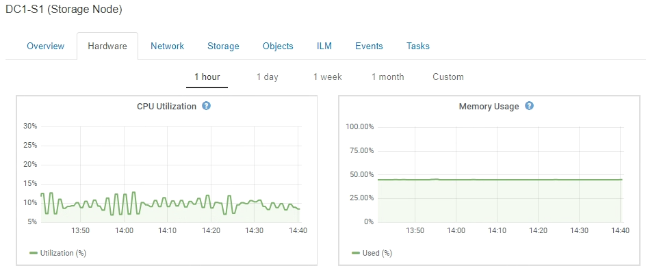

= Visualizzazione della scheda hardware
:allow-uri-read: 
:icons: font
:imagesdir: ../media/

[role="lead"]
La scheda hardware visualizza l'utilizzo della CPU e della memoria per ciascun nodo, oltre a informazioni aggiuntive sull'hardware delle appliance.

Viene visualizzata la scheda hardware per tutti i nodi.

Per visualizzare un intervallo di tempo diverso, selezionare uno dei comandi sopra il grafico o il grafico. È possibile visualizzare le informazioni disponibili per intervalli di 1 ora, 1 giorno, 1 settimana o 1 mese. È inoltre possibile impostare un intervallo personalizzato, che consente di specificare intervalli di data e ora.

Per visualizzare i dettagli relativi all'utilizzo della CPU e della memoria, spostare il cursore su ciascun grafico.

image::../media/nodes_page_memory_usage_details.png[Dettagli sull'utilizzo della memoria hardware della pagina Nodes]

Se il nodo è un nodo appliance, questa scheda include anche una sezione con ulteriori informazioni sull'hardware dell'appliance.

.Informazioni correlate
link:viewing-information-about-appliance-storage-nodes.html["Visualizzazione delle informazioni sui nodi di storage dell'appliance"]

link:viewing-information-about-appliance-admin-nodes-and-gateway-nodes.html["Visualizzazione di informazioni sui nodi di amministrazione e sui nodi gateway dell'appliance"]
