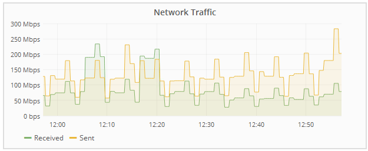

= Visualizzazione di informazioni sui nodi di amministrazione e sui nodi gateway dell'appliance
:allow-uri-read: 
:icons: font
:imagesdir: ../media/

[role="lead"]
La pagina Nodes (nodi) elenca le informazioni sullo stato del servizio e tutte le risorse di calcolo, di dispositivo su disco e di rete per ogni appliance di servizi utilizzata per un nodo Admin o un nodo Gateway. È inoltre possibile visualizzare memoria, hardware di storage, risorse di rete, interfacce di rete, indirizzi di rete, e ricevere e trasmettere dati.

.Fasi
. Dalla pagina Nodes (nodi), selezionare un nodo Admin dell'appliance o un nodo Gateway dell'appliance.
. Selezionare *Panoramica*.
+
La tabella Node Information (informazioni nodo) nella scheda Overview (Panoramica) visualizza l'ID e il nome del nodo, il tipo di nodo, la versione software installata e gli indirizzi IP associati al nodo. La colonna Interface (interfaccia) contiene il nome dell'interfaccia, come segue:

+
** *Adllb* e *adlli*: Visualizzato se si utilizza il bonding Active/backup per l'interfaccia di Admin Network
** *eth*: Rete griglia, rete amministrativa o rete client.
** *Hic*: Una delle porte fisiche 10, 25 o 100 GbE dell'appliance. Queste porte possono essere collegate tra loro e collegate alla rete griglia StorageGRID (eth0) e alla rete client (eth2).
** *mtc*: Una delle porte 1 GbE fisiche dell'appliance, che può essere collegata o collegata in alias alla rete amministrativa StorageGRID (eth1).image:../media/nodes_page_overview_tab_services_appliance.png["Scheda Nodes Page Overview (Panoramica pagina nodi) per l'appliance Services"]

. Selezionare *hardware* per visualizzare ulteriori informazioni sull'appliance.
+
.. Visualizzare i grafici relativi all'utilizzo della CPU e della memoria per determinare le percentuali di utilizzo della CPU e della memoria nel tempo. Per visualizzare un intervallo di tempo diverso, selezionare uno dei comandi sopra il grafico o il grafico. È possibile visualizzare le informazioni disponibili per intervalli di 1 ora, 1 giorno, 1 settimana o 1 mese. È inoltre possibile impostare un intervallo personalizzato, che consente di specificare intervalli di data e ora.
+
image::../media/nodes_page_hardware_tab_graphs_services_appliance.png[Pagina nodi grafici della scheda hardware per l'appliance di servizi]

.. Scorrere verso il basso per visualizzare la tabella dei componenti dell'appliance. Questa tabella contiene informazioni come il nome del modello, il numero di serie, la versione del firmware del controller e lo stato di ciascun componente.
+
image::../media/nodes_page_hardware_tab_services_appliance_do_not_use.png[Scheda hardware della pagina nodi per l'appliance di servizi]

+
|===
| Nella tabella Appliance | Descrizione 

 a| 
Modello di appliance
 a| 
Il numero di modello dell'appliance StorageGRID.

 a| 
Storage Controller Failed Drive Count (Conteggio dischi guasto
 a| 
Il numero di dischi non ottimali.

 a| 
Tipo di unità dati di storage
 a| 
Il tipo di dischi dell'appliance, ad esempio HDD (disco rigido) o SSD (disco a stato solido).

 a| 
Dimensioni dell'unità dati di storage
 a| 
La capacità totale, incluse tutte le unità dati dell'appliance.

 a| 
Storage RAID Mode (modalità RAID storage)
 a| 
La modalità RAID per l'appliance.

 a| 
Alimentatore generale
 a| 
Lo stato di tutti gli alimentatori dell'apparecchio.

 a| 
Compute Controller BMC IP
 a| 
L'indirizzo IP della porta BMC (Baseboard Management Controller) nel controller di calcolo. È possibile utilizzare questo IP per connettersi all'interfaccia BMC per monitorare e diagnosticare l'hardware dell'appliance.

Questo campo non viene visualizzato per i modelli di appliance che non contengono un BMC.

 a| 
Numero di serie del controller di calcolo
 a| 
Il numero di serie del controller di calcolo.

 a| 
Hardware di calcolo
 a| 
Lo stato dell'hardware del controller di calcolo.

 a| 
Temperatura CPU del controller di calcolo
 a| 
Lo stato della temperatura della CPU del controller di calcolo.

 a| 
Temperatura dello chassis del controller di calcolo
 a| 
Lo stato della temperatura del controller di calcolo.

|===
.. Verificare che tutti gli stati siano "`nominali`".
+
Se uno stato non è "`nominale`", rivedere gli avvisi correnti.

. Selezionare *Network* per visualizzare le informazioni relative a ciascuna rete.
+
Il grafico del traffico di rete fornisce un riepilogo del traffico di rete complessivo.

+

+
.. Consultare la sezione interfacce di rete.
+
image::../media/nodes_page_hardware_tab_network_services_appliance.png[Pagina nodi scheda hardware Network Services Appliance]

+
Utilizzare la seguente tabella con i valori nella colonna *Speed* della tabella Network Interfaces (interfacce di rete) per determinare se le quattro porte di rete 40/100-GbE dell'appliance sono state configurate per l'utilizzo della modalità Active/backup o LACP.

+

NOTE: I valori mostrati nella tabella presuppongono che siano utilizzati tutti e quattro i collegamenti.

+
|===
| Modalità link | Modalità bond | Velocità di collegamento HIC singola (hic1, hic2, hic3, hic4) | Velocità rete client/griglia prevista (eth0, eth2) 

 a| 
Aggregato
 a| 
LACP
 a| 
100
 a| 
400

 a| 
Corretto
 a| 
LACP
 a| 
100
 a| 
200

 a| 
Corretto
 a| 
Attivo/Backup
 a| 
100
 a| 
100

 a| 
Aggregato
 a| 
LACP
 a| 
40
 a| 
160

 a| 
Corretto
 a| 
LACP
 a| 
40
 a| 
80

 a| 
Corretto
 a| 
Attivo/Backup
 a| 
40
 a| 
40

|===
.. Consultare la sezione comunicazione di rete.
+
Le tabelle di ricezione e trasmissione mostrano quanti byte e pacchetti sono stati ricevuti e inviati attraverso ciascuna rete, nonché altre metriche di ricezione e trasmissione.

+
image::../media/nodes_page_network_communication.gif[COM. Rete pagina nodi]

. Selezionare *Storage* per visualizzare le informazioni relative ai dischi e ai volumi sull'appliance di servizi.
+
image::../media/nodes_page_storage_tab_services_appliance.png[Scheda Nodes Page Storage Services Appliance]

.Informazioni correlate
link:../sg100-1000/index.html["SG100  SG1000 Services appliance"]
