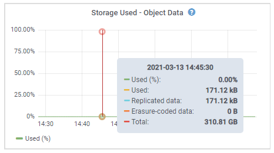

= Visualizzazione delle informazioni sui nodi di storage dell'appliance
:allow-uri-read: 
:icons: font
:imagesdir: ../media/

[role="lead"]
La pagina Nodes (nodi) elenca le informazioni sullo stato di salute del servizio e tutte le risorse di calcolo, di dispositivo su disco e di rete per ciascun nodo di storage dell'appliance. È inoltre possibile visualizzare memoria, hardware di storage, versione del firmware del controller, risorse di rete, interfacce di rete, indirizzi di rete e ricevere e trasmettere dati.

.Fasi
. Dalla pagina Nodes (nodi), selezionare un nodo di storage dell'appliance.
. Selezionare *Panoramica*.
+
La tabella Node Information (informazioni nodo) nella scheda Overview (Panoramica) visualizza l'ID e il nome del nodo, il tipo di nodo, la versione software installata e gli indirizzi IP associati al nodo. La colonna Interface (interfaccia) contiene il nome dell'interfaccia, come segue:

+
** *eth*: Rete griglia, rete amministrativa o rete client.
** *Hic*: Una delle porte fisiche 10, 25 o 100 GbE dell'appliance. Queste porte possono essere collegate tra loro e collegate alla rete griglia StorageGRID (eth0) e alla rete client (eth2).
** *mtc*: Una delle porte 1 GbE fisiche dell'appliance, che può essere collegata o collegata in alias alla rete amministrativa StorageGRID (eth1).image:../media/nodes_page_overview_tab_extended.png["Panoramica pagina nodi estesa"]

. Selezionare *hardware* per visualizzare ulteriori informazioni sull'appliance.
+
.. Visualizzare i grafici relativi all'utilizzo della CPU e della memoria per determinare le percentuali di utilizzo della CPU e della memoria nel tempo. Per visualizzare un intervallo di tempo diverso, selezionare uno dei comandi sopra il grafico o il grafico. È possibile visualizzare le informazioni disponibili per intervalli di 1 ora, 1 giorno, 1 settimana o 1 mese. È inoltre possibile impostare un intervallo personalizzato, che consente di specificare intervalli di data e ora.
+
image::../media/nodes_page_hardware_tab_graphs.png[Grafici hardware]

.. Scorrere verso il basso per visualizzare la tabella dei componenti dell'appliance. Questa tabella contiene informazioni quali il nome del modello dell'appliance, i nomi dei controller, i numeri di serie e gli indirizzi IP e lo stato di ciascun componente.
+

NOTE: Alcuni campi, ad esempio Compute Controller BMC IP e Compute hardware, vengono visualizzati solo per le appliance dotate di tale funzionalità.

+
I componenti per gli shelf di storage e gli shelf di espansione, se sono parte dell'installazione, vengono visualizzati in una tabella separata sotto la tabella dell'appliance.

+
image::../media/nodes_page_hardware_tab_for_appliance.png[Scheda Nodes Page hardware (hardware pagina nodi) per Appliance]

+
|===
| Nella tabella Appliance | Descrizione 

 a| 
Modello di appliance
 a| 
Il numero di modello di questo dispositivo StorageGRID mostrato nel software SANtricity.

 a| 
Nome controller storage
 a| 
Il nome dell'appliance StorageGRID indicato nel software SANtricity.

 a| 
Storage Controller A IP di gestione
 a| 
Indirizzo IP per la porta di gestione 1 sul controller storage A. Questo IP viene utilizzato per accedere al software SANtricity e risolvere i problemi di storage.

 a| 
IP di gestione dello storage controller B.
 a| 
Indirizzo IP per la porta di gestione 1 sul controller di storage B. Questo IP viene utilizzato per accedere al software SANtricity e risolvere i problemi di storage.

Alcuni modelli di appliance non dispongono di un controller di storage B.

 a| 
WWID dello storage controller
 a| 
L'identificatore mondiale del controller di storage mostrato nel software SANtricity.

 a| 
Numero di serie dello chassis dell'appliance di storage
 a| 
Il numero di serie dello chassis dell'appliance.

 a| 
Versione del firmware dello storage controller
 a| 
La versione del firmware del controller di storage per l'appliance.

 a| 
Hardware di storage
 a| 
Lo stato generale dell'hardware del controller dello storage. Se Gestore di sistema di SANtricity riporta lo stato di intervento richiesto per l'hardware di storage, anche il sistema StorageGRID riporta questo valore.

Se lo stato è "`needs Attention`" (richiede attenzione), controllare innanzitutto il controller dello storage utilizzando il software SANtricity. Quindi, assicurarsi che non esistano altri allarmi applicabili al controller di calcolo.

 a| 
Storage Controller Failed Drive Count (Conteggio dischi guasto
 a| 
Il numero di dischi non ottimali.

 a| 
Controller dello storage A
 a| 
Lo stato dello storage controller A.

 a| 
Controller dello storage B
 a| 
Lo stato dello storage controller B. Alcuni modelli di appliance non dispongono di un controller di storage B.

 a| 
Alimentatore controller storage A
 a| 
Lo stato dell'alimentatore A per il controller dello storage.

 a| 
Alimentatore controller storage B
 a| 
Lo stato dell'alimentazione B del controller di storage.

 a| 
Tipo di unità dati di storage
 a| 
Il tipo di dischi dell'appliance, ad esempio HDD (disco rigido) o SSD (disco a stato solido).

 a| 
Dimensioni dell'unità dati di storage
 a| 
La capacità totale, incluse tutte le unità dati dell'appliance.

 a| 
Storage RAID Mode (modalità RAID storage)
 a| 
La modalità RAID configurata per l'appliance.

 a| 
Connettività dello storage
 a| 
Lo stato di connettività dello storage.

 a| 
Alimentatore generale
 a| 
Lo stato di tutti gli alimentatori dell'apparecchio.

 a| 
Compute Controller BMC IP
 a| 
L'indirizzo IP della porta BMC (Baseboard Management Controller) nel controller di calcolo. Questo IP viene utilizzato per connettersi all'interfaccia BMC per monitorare e diagnosticare l'hardware dell'appliance.

Questo campo non viene visualizzato per i modelli di appliance che non contengono un BMC.

 a| 
Numero di serie del controller di calcolo
 a| 
Il numero di serie del controller di calcolo.

 a| 
Hardware di calcolo
 a| 
Lo stato dell'hardware del controller di calcolo. Questo campo non viene visualizzato per i modelli di appliance che non dispongono di hardware di calcolo e storage separati.

 a| 
Temperatura CPU del controller di calcolo
 a| 
Lo stato della temperatura della CPU del controller di calcolo.

 a| 
Temperatura dello chassis del controller di calcolo
 a| 
Lo stato della temperatura del controller di calcolo.

|===
+
|===
| Nella tabella Storage Shelf | Descrizione 

 a| 
Numero di serie dello shelf chassis
 a| 
Il numero di serie dello chassis dello shelf di storage.

 a| 
ID shelf
 a| 
L'identificativo numerico dello shelf di storage.

*** 99: Shelf dello storage controller
*** 0: Primo shelf di espansione
*** 1: Secondo shelf di espansione

*Nota:* gli shelf di espansione si applicano solo a SG6060.

 a| 
Stato dello shelf
 a| 
Lo stato generale dello shelf di storage.

 a| 
Stato IOM
 a| 
Lo stato dei moduli di input/output (IOM) in qualsiasi shelf di espansione. N/D se non si tratta di uno shelf di espansione.

 a| 
Stato dell'alimentatore
 a| 
Lo stato generale degli alimentatori per lo shelf di storage.

 a| 
Stato cassetto
 a| 
Lo stato dei cassetti nello shelf di archiviazione. N/D se il ripiano non contiene cassetti.

 a| 
Fan Status (Stato ventola)
 a| 
Lo stato generale delle ventole di raffreddamento nello shelf di storage.

 a| 
Slot per dischi
 a| 
Il numero totale di slot per dischi nello shelf di storage.

 a| 
Unità dati
 a| 
Il numero di dischi nello shelf di storage utilizzati per lo storage dei dati.

 a| 
Dimensione unità dati
 a| 
La dimensione effettiva di un'unità dati nello shelf di storage.

 a| 
Dischi cache
 a| 
Il numero di dischi nello shelf di storage utilizzati come cache.

 a| 
Dimensione unità cache
 a| 
La dimensione dell'unità cache più piccola nello shelf di storage. Normalmente, le unità cache sono tutte delle stesse dimensioni.

 a| 
Configuration Status (Stato configurazione)
 a| 
Lo stato di configurazione dello shelf di storage.

|===

. Verificare che tutti gli stati siano "`nominali`".
+
Se uno stato non è "`nominale`", rivedere gli avvisi correnti. Puoi anche utilizzare Gestione di sistema di SANtricity per saperne di più su alcuni di questi valori hardware. Consultare le istruzioni per l'installazione e la manutenzione dell'apparecchio.

. Selezionare *Network* per visualizzare le informazioni relative a ciascuna rete.
+
Il grafico del traffico di rete fornisce un riepilogo del traffico di rete complessivo.

+
image::../media/nodes_page_network_traffic_graph.gif[Pagina nodi grafico traffico di rete]

+
.. Consultare la sezione interfacce di rete.
+
image::../media/nodes_page_network_interfaces.gif[Interfacce di rete della pagina Nodes (nodi)]

+
Utilizzare la seguente tabella con i valori nella colonna *Speed* della tabella Network Interfaces (interfacce di rete) per determinare se le porte di rete 10/25-GbE dell'appliance sono state configurate per l'utilizzo della modalità Active/backup o LACP.

+

NOTE: I valori mostrati nella tabella presuppongono che siano utilizzati tutti e quattro i collegamenti.

+
|===
| Modalità link | Modalità bond | Velocità di collegamento HIC singola (hic1, hic2, hic3, hic4) | Velocità rete client/griglia prevista (eth0,eth2) 

 a| 
Aggregato
 a| 
LACP
 a| 
25
 a| 
100

 a| 
Corretto
 a| 
LACP
 a| 
25
 a| 
50

 a| 
Corretto
 a| 
Attivo/Backup
 a| 
25
 a| 
25

 a| 
Aggregato
 a| 
LACP
 a| 
10
 a| 
40

 a| 
Corretto
 a| 
LACP
 a| 
10
 a| 
20

 a| 
Corretto
 a| 
Attivo/Backup
 a| 
10
 a| 
10

|===
+
Per ulteriori informazioni sulla configurazione delle porte 10/25-GbE, consultare le istruzioni di installazione e manutenzione dell'appliance.

.. Consultare la sezione comunicazione di rete.
+
Le tabelle di ricezione e trasmissione mostrano quanti byte e pacchetti sono stati ricevuti e inviati attraverso ciascuna rete, nonché altre metriche di ricezione e trasmissione.

+
image::../media/nodes_page_network_communication.gif[COM. Rete pagina nodi]

. Selezionare *Storage* per visualizzare i grafici che mostrano le percentuali di storage utilizzate nel tempo per i dati degli oggetti e i metadati degli oggetti, nonché informazioni su dischi, volumi e archivi di oggetti.
+

+
image::../media/storage_used_object_metadata.png[Storage utilizzato - metadati oggetto]

+
.. Scorrere verso il basso per visualizzare le quantità di storage disponibili per ciascun volume e archivio di oggetti.
+
Il nome internazionale di ciascun disco corrisponde all'identificativo mondiale del volume (WWID) visualizzato quando si visualizzano le proprietà standard del volume nel software SANtricity (il software di gestione collegato al controller di storage dell'appliance).

+
Per semplificare l'interpretazione delle statistiche di lettura e scrittura dei dischi relative ai punti di montaggio del volume, la prima parte del nome visualizzato nella colonna *Name* della tabella Disk Devices (periferiche disco) (ovvero _sdc_, _sdd_, _sde_ e così via) corrisponde al valore visualizzato nella colonna *Device* della tabella Volumes (volumi).

+
image::../media/nodes_page_storage_tables.png[Tabelle di archiviazione delle pagine dei nodi]

.Informazioni correlate
link:../sg6000/index.html["Appliance di storage SG6000"]

link:../sg5700/index.html["Appliance di storage SG5700"]

link:../sg5600/index.html["Appliance di storage SG5600"]
