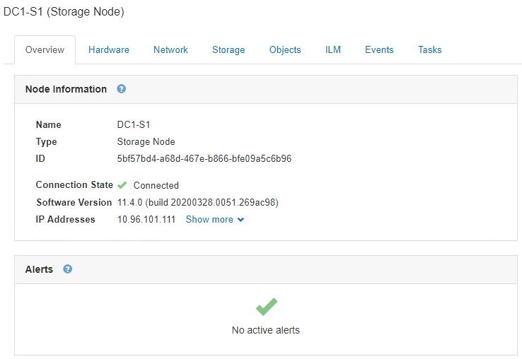

= Visualizzazione della scheda Panoramica
:allow-uri-read: 
:icons: font
:imagesdir: ../media/

[role="lead"]
La scheda Panoramica fornisce informazioni di base su ciascun nodo. Inoltre, vengono visualizzati tutti gli avvisi che attualmente influiscono sul nodo.

Viene visualizzata la scheda Overview (Panoramica) per tutti i nodi.

== Informazioni sul nodo

La sezione Node Information (informazioni nodo) della scheda Overview (Panoramica) elenca le informazioni di base sul nodo Grid (griglia).

Le informazioni generali per un nodo includono quanto segue:

* *Name*: Nome host assegnato al nodo e visualizzato in Grid Manager.
* *Type*: Il tipo di nodo -- nodo Admin, nodo storage, nodo gateway o nodo archivio.
* *ID*: Identificatore univoco del nodo, chiamato anche UUID.
* *Stato connessione*: Uno dei tre stati. Viene visualizzata l'icona dello stato più grave.
+
** *Non connesso - Sconosciuto* : Il nodo non è connesso alla rete per un motivo sconosciuto. Ad esempio, la connessione di rete tra i nodi è stata persa o l'alimentazione è inattiva. Potrebbe essere attivato anche l'avviso *Impossibile comunicare con il nodo*. Potrebbero essere attivi anche altri avvisi. Questa situazione richiede un'attenzione immediata.
+

NOTE: Un nodo potrebbe apparire come sconosciuto durante le operazioni di shutdown gestite. In questi casi, è possibile ignorare lo stato Unknown (Sconosciuto).

** *Non connesso - amministrazione non attiva* image:../media/icon_alarm_gray_administratively_down.png["icona del punto interrogativo grigio"]: Il nodo non è connesso alla rete per un motivo previsto. Ad esempio, il nodo o i servizi sul nodo sono stati normalmente spenti, il nodo è in fase di riavvio o il software è in fase di aggiornamento. Potrebbero essere attivi anche uno o più avvisi.
** *Connesso* image:../media/icon_alert_green_checkmark.png["icona di avviso segno di spunta verde"]: Il nodo è collegato alla rete.

* *Versione software*: La versione di StorageGRID installata sul nodo.
* *Ha Groups*: Solo per nodi Admin Node e Gateway. Viene visualizzato se un'interfaccia di rete sul nodo è inclusa in un gruppo ad alta disponibilità e se tale interfaccia è Master o Backup.
+
image::../media/ha_group_master_interface.png[Interfaccia master del gruppo HA]

* *IP Addresses* (indirizzi IP): Gli indirizzi IP del nodo. Fare clic su *Mostra altro* per visualizzare gli indirizzi IPv4 e IPv6 e le mappature dell'interfaccia del nodo:
+
** Eth0: Rete griglia
** Eth1: Admin Network (rete amministrativa)
** Eth2: Rete client

== Avvisi

La sezione Avvisi della scheda Panoramica elenca gli avvisi che attualmente interessano questo nodo e che non sono stati tacitati. Fare clic sul nome dell'avviso per visualizzare ulteriori dettagli e azioni consigliate.

image::../media/nodes_page_alerts_table.png[Tabella Notifiche pagina nodi]

.Informazioni correlate
link:monitoring-node-connection-states.html["Monitoraggio degli stati di connessione del nodo"]

link:viewing-current-alerts.html["Visualizzazione degli avvisi correnti"]

link:viewing-specific-alert.html["Visualizzazione di un avviso specifico"]
