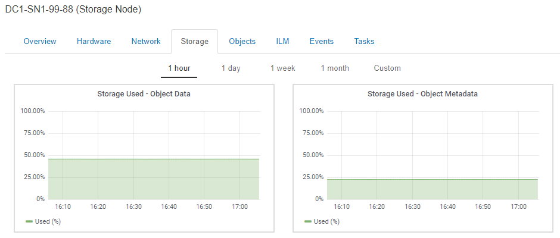

= Visualizzazione della scheda Storage (archiviazione)
:allow-uri-read: 
:icons: font
:imagesdir: ../media/

[role="lead"]
La scheda Storage riepiloga la disponibilità dello storage e altre metriche di storage.

Viene visualizzata la scheda Storage (archiviazione) per tutti i nodi, ciascun sito e l'intera griglia.

== Grafici utilizzati per lo storage

Per i nodi di storage, ciascun sito e l'intero grid, la scheda Storage include grafici che mostrano la quantità di storage utilizzata dai dati degli oggetti e dai metadati degli oggetti nel tempo.

NOTE: I valori totali di un sito o di una griglia non includono i nodi che non hanno riportato metriche per almeno cinque minuti, come i nodi offline.

== Dischi, volumi e tabelle di archiviazione oggetti

Per tutti i nodi, la scheda Storage contiene i dettagli relativi ai dischi e ai volumi sul nodo. Per i nodi di storage, la tabella degli archivi di oggetti fornisce informazioni su ciascun volume di storage.

image::../media/nodes_page_storage_tables.png[Tabelle di archiviazione delle pagine dei nodi]

.Informazioni correlate
link:monitoring-storage-capacity-for-entire-grid.html["Monitoraggio della capacità di storage per l'intero grid"]

link:monitoring-storage-capacity-for-each-storage-node.html["Monitoraggio della capacità di storage per ciascun nodo di storage"]

link:monitoring-object-metadata-capacity-for-each-storage-node.html["Monitoraggio della capacità dei metadati degli oggetti per ciascun nodo di storage"]
