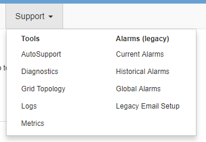
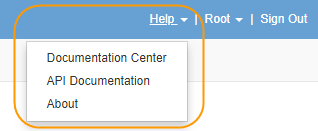

= Analisi di Grid Manager
:allow-uri-read: 
:icons: font
:imagesdir: ../media/

[role="lead"]
Grid Manager è l'interfaccia grafica basata su browser che consente di configurare, gestire e monitorare il sistema StorageGRID.

Quando si accede a Grid Manager, si sta effettuando la connessione a un nodo amministratore. Ogni sistema StorageGRID include un nodo di amministrazione primario e un numero qualsiasi di nodi di amministrazione non primari. È possibile connettersi a qualsiasi nodo amministratore e ciascun nodo amministratore visualizza una vista simile del sistema StorageGRID.

È possibile accedere a Grid Manager utilizzando un browser Web supportato.

== Requisiti del browser Web

È necessario utilizzare un browser Web supportato.

[cols="1a,1a"]
|===
| Browser Web | Versione minima supportata 

 a| 
Google Chrome
 a| 
87

 a| 
Microsoft Edge
 a| 
87

 a| 
Mozilla Firefox
 a| 
84

|===
Impostare la larghezza consigliata per la finestra del browser.

[cols="1a,1a"]
|===
| Larghezza del browser | Pixel 

 a| 
Minimo
 a| 
1024

 a| 
Ottimale
 a| 
1280

|===

== Dashboard di Grid Manager

Quando accedi per la prima volta a Grid Manager, puoi utilizzare la dashboard per monitorare le attività del sistema in un colpo d'occhio.

La dashboard include informazioni riepilogative sullo stato di salute del sistema, sull'utilizzo dello storage, sui processi ILM e sulle operazioni S3 e Swift.

image::../media/grid_manager_dashboard.png[Dashboard in Grid Manager]

Per una spiegazione delle informazioni su ciascun pannello, fare clic sull'icona della guida image:../media/icon_nms_question.gif["icona del punto interrogativo"] per quel pannello.

.Informazioni correlate
link:../monitor/index.html["Monitor  risoluzione dei problemi"]

== Menu Avvisi

Il menu Avvisi fornisce un'interfaccia di facile utilizzo per rilevare, valutare e risolvere i problemi che potrebbero verificarsi durante il funzionamento di StorageGRID.

image::../media/alerts_menu.png[Menu Avvisi]

Dal menu Alerts (Avvisi), è possibile effettuare le seguenti operazioni:

* Rivedere gli avvisi correnti
* Esaminare gli avvisi risolti
* Configurare i silenzi per eliminare le notifiche di avviso
* Configurare il server di posta elettronica per le notifiche degli avvisi
* Definire le regole di avviso per le condizioni che attivano gli avvisi

.Informazioni correlate
link:monitoring-and-managing-alerts.html["Monitoraggio e gestione degli avvisi"]

link:../monitor/index.html["Monitor  risoluzione dei problemi"]

== Pagina nodi

La pagina Nodes (nodi) visualizza informazioni sull'intera griglia, su ciascun sito della griglia e su ciascun nodo di un sito.

La home page dei nodi visualizza le metriche combinate per l'intera griglia. Per visualizzare le informazioni relative a un determinato sito o nodo, fare clic sul collegamento appropriato a sinistra.

image::../media/nodes_menu.png[pagina principale nodi]

.Informazioni correlate
link:viewing-nodes-page.html["Visualizzazione della pagina nodi"]

link:../monitor/index.html["Monitor  risoluzione dei problemi"]

== Pagina account tenant

La pagina account tenant consente di creare e monitorare gli account tenant di storage per il sistema StorageGRID. È necessario creare almeno un account tenant per specificare chi può memorizzare e recuperare gli oggetti e quali funzionalità sono disponibili.

La pagina account tenant fornisce inoltre dettagli sull'utilizzo di ciascun tenant, tra cui la quantità di storage utilizzato e il numero di oggetti. Se si imposta una quota al momento della creazione del tenant, è possibile visualizzare la quantità di tale quota utilizzata.

image::../media/tenants_menu_and_page.png[Menu e pagina dei tenant]

.Informazioni correlate
link:managing-tenants-and-client-connections.html["Gestione di tenant e connessioni client"]

link:../admin/index.html["Amministrare StorageGRID"]

link:../tenant/index.html["Utilizzare un account tenant"]

== Menu ILM

Il menu ILM consente di configurare le regole e le policy ILM (Information Lifecycle Management) che regolano la durata e la disponibilità dei dati. È inoltre possibile inserire un identificatore di oggetto per visualizzare i metadati relativi a tale oggetto.

image::../media/ilm_menu_and_page.png[Menu e pagina ILM]

.Informazioni correlate
link:using-information-lifecycle-management.html["Utilizzo della gestione del ciclo di vita delle informazioni"]

link:../ilm/index.html["Gestire gli oggetti con ILM"]

== Menu di configurazione

Il menu Configuration (Configurazione) consente di specificare le impostazioni di rete, le impostazioni di sistema, le opzioni di monitoraggio e le opzioni di controllo degli accessi.

image::../media/configuration_menu.png[Menu Configuration (Configurazione)]

.Informazioni correlate
link:configuring-network-settings.html["Configurazione delle impostazioni di rete"]

link:managing-tenants-and-client-connections.html["Gestione di tenant e connessioni client"]

link:reviewing-audit-messages.html["Revisione dei messaggi di audit"]

link:controlling-storagegrid-access.html["Controllo dell'accesso a StorageGRID"]

link:../admin/index.html["Amministrare StorageGRID"]

link:../monitor/index.html["Monitor  risoluzione dei problemi"]

link:../audit/index.html["Esaminare i registri di audit"]

== Menu di manutenzione

Il menu Maintenance (manutenzione) consente di eseguire attività di manutenzione, di rete e di sistema.

image::../media/maintenance_menu_and_page.png[Pagina e menu di manutenzione]

=== Attività di manutenzione

Le attività di manutenzione includono:

* Decommissionare le operazioni per rimuovere i nodi e i siti grid inutilizzati.
* Operazioni di espansione per aggiungere nuovi nodi e siti grid.
* Operazioni di recovery per sostituire un nodo guasto e ripristinare i dati.

=== Rete

Le attività di rete che è possibile eseguire dal menu manutenzione includono:

* Modifica delle informazioni sui server DNS.
* Configurazione delle subnet utilizzate nella rete Grid.
* Modifica delle informazioni sui server NTP.

=== Sistema

Le attività di sistema che è possibile eseguire dal menu Maintenance (manutenzione) includono:

* Revisione dei dettagli della licenza StorageGRID corrente o caricamento di una nuova licenza.
* Generazione di un pacchetto di ripristino.
* Esecuzione di aggiornamenti software StorageGRID, inclusi aggiornamenti software, hotfix e aggiornamenti del software SANtricity OS su alcune appliance.

.Informazioni correlate
link:performing-maintenance-procedures.html["Esecuzione delle procedure di manutenzione"]

link:downloading-recovery-package.html["Download del pacchetto di ripristino"]

link:../expand/index.html["Espandi il tuo grid"]

link:../upgrade/index.html["Aggiornare il software"]

link:../maintain/index.html["Mantieni  Ripristina"]

link:../sg6000/index.html["Appliance di storage SG6000"]

link:../sg5700/index.html["Appliance di storage SG5700"]

link:../sg5600/index.html["Appliance di storage SG5600"]

== Menu Support (supporto)

Il menu Support (supporto) fornisce opzioni che consentono al supporto tecnico di analizzare e risolvere i problemi del sistema. Il menu Support (supporto) comprende due parti: Tools (Strumenti) e Alarms (Allarmi) (legacy).

=== Strumenti

Dalla sezione Tools (Strumenti) del menu Support (supporto), è possibile:

* Abilitare AutoSupport.
* Eseguire una serie di controlli diagnostici sullo stato corrente della griglia.
* Accedere alla struttura topologia griglia per visualizzare informazioni dettagliate su nodi griglia, servizi e attributi.
* Recuperare i file di log e i dati di sistema.
* Esamina metriche e grafici dettagliati.
+

IMPORTANT: I tool disponibili nell'opzione *metriche* sono destinati all'utilizzo da parte del supporto tecnico. Alcune funzioni e voci di menu di questi strumenti sono intenzionalmente non funzionali.

=== Allarmi (legacy)

Dalla sezione Allarmi (legacy) del menu supporto, è possibile rivedere gli allarmi correnti, storici e globali ed è possibile impostare notifiche e-mail per allarmi legacy e AutoSupport.

.Informazioni correlate
link:storagegrid-architecture-and-network-topology.html["Architettura StorageGRID e topologia di rete"]

link:storagegrid-attributes.html["Attributi StorageGRID"]

link:using-storagegrid-support-options.html["Utilizzo delle opzioni di supporto di StorageGRID"]

link:../admin/index.html["Amministrare StorageGRID"]

link:../monitor/index.html["Monitor  risoluzione dei problemi"]

== Menu Guida

L'opzione Guida consente di accedere al Centro documentazione StorageGRID per la release corrente e alla documentazione API. È inoltre possibile determinare quale versione di StorageGRID è attualmente installata.

.Informazioni correlate
link:../admin/index.html["Amministrare StorageGRID"]
