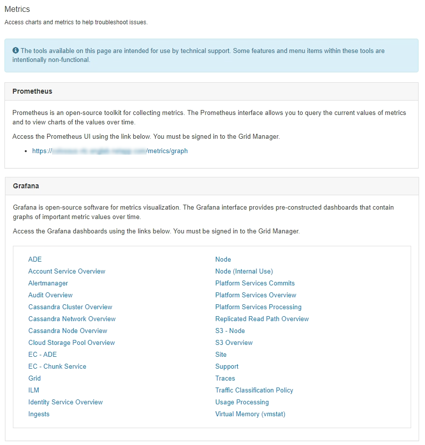
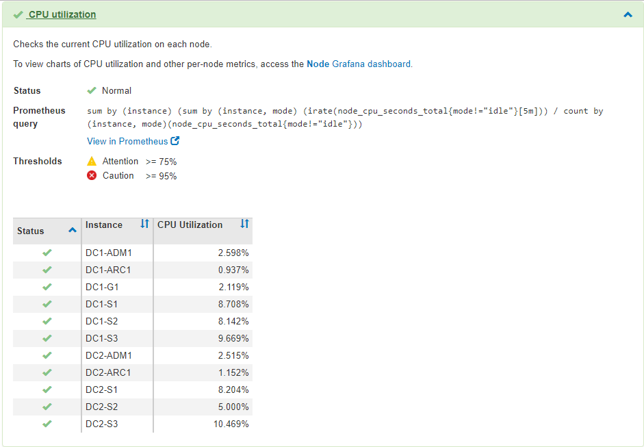

= Utilizzo delle opzioni di supporto di StorageGRID
:allow-uri-read: 
:icons: font
:imagesdir: ../media/

[role="lead"]
Grid Manager offre opzioni per aiutarti a lavorare con il supporto tecnico in caso di problemi con il tuo sistema StorageGRID.

== Configurazione di AutoSupport

La funzione AutoSupport consente al sistema StorageGRID di inviare messaggi di stato e di stato al supporto tecnico. L'utilizzo di AutoSupport può accelerare notevolmente la determinazione e la risoluzione dei problemi. Il supporto tecnico può anche monitorare le esigenze di storage del sistema e aiutare a determinare se è necessario aggiungere nuovi nodi o siti. In alternativa, è possibile configurare i messaggi AutoSupport in modo che vengano inviati a una destinazione aggiuntiva.

=== Informazioni incluse nei messaggi AutoSupport

I messaggi AutoSupport includono informazioni quali:

* Versione del software StorageGRID
* Versione del sistema operativo
* Informazioni sugli attributi a livello di sistema e di posizione
* Avvisi e allarmi recenti (sistema legacy)
* Stato corrente di tutte le attività della griglia, inclusi i dati storici
* Informazioni sugli eventi elencate nella pagina *nodi* *_nodo_* *Eventi*
* Utilizzo del database Admin Node
* Numero di oggetti persi o mancanti
* Impostazioni di configurazione della griglia
* Entità NMS
* Policy ILM attiva
* File delle specifiche della griglia con provisioning
* Metriche diagnostiche

È possibile attivare la funzione AutoSupport e le singole opzioni AutoSupport quando si installa StorageGRID per la prima volta oppure attivarle in un secondo momento. Se AutoSupport non è attivato, viene visualizzato un messaggio sul dashboard di gestione della griglia. Il messaggio include un collegamento alla pagina di configurazione di AutoSupport.

image::../media/autosupport_disabled_message.png[Messaggio AutoSupport disattivato]

È possibile selezionare il simbolo "`x`" image:../media/autosupport_close_message.png["simbolo x."] per chiudere il messaggio. Il messaggio non viene visualizzato fino a quando la cache del browser non viene cancellata, anche se AutoSupport rimane disattivato.

=== Utilizzando Active IQ

Active IQ è un consulente digitale basato sul cloud che sfrutta l'analisi predittiva e la saggezza della community della base installata di NetApp. Le valutazioni continue dei rischi, gli avvisi predittivi, le indicazioni prescrittive e le azioni automatizzate consentono di prevenire i problemi prima che si verifichino, migliorando lo stato di salute del sistema e la disponibilità del sistema.

Se si desidera utilizzare le dashboard e le funzionalità di Active IQ sul sito del supporto, è necessario attivare AutoSupport.

https://docs.netapp.com/us-en/active-iq/index.html["Documentazione di Active IQ Digital Advisor"^]

=== Accesso alle impostazioni AutoSupport

Si configura AutoSupport utilizzando Gestione griglia (*supporto* *Strumenti* *AutoSupport*). La pagina *AutoSupport* contiene due schede: *Impostazioni* e *risultati*.

image::../media/autosupport_accessing_settings.png[Accesso alle impostazioni AutoSupport]

=== Protocolli per l'invio di messaggi AutoSupport

È possibile scegliere uno dei tre protocolli per l'invio dei messaggi AutoSupport:

* HTTPS
* HTTP
* SMTP

Se si inviano messaggi AutoSupport utilizzando HTTPS o HTTP, è possibile configurare un server proxy non trasparente tra i nodi di amministrazione e il supporto tecnico.

Se si utilizza SMTP come protocollo per i messaggi AutoSupport, è necessario configurare un server di posta SMTP.

=== Opzioni AutoSupport

È possibile utilizzare qualsiasi combinazione delle seguenti opzioni per inviare messaggi AutoSupport al supporto tecnico:

* *Settimanale*: Invia automaticamente i messaggi AutoSupport una volta alla settimana. Impostazione predefinita: Enabled (attivato).
* *Evento attivato*: Invia automaticamente i messaggi AutoSupport ogni ora o quando si verificano eventi di sistema significativi. Impostazione predefinita: Enabled (attivato).
* *Su richiesta*: Consente al supporto tecnico di richiedere che il sistema StorageGRID invii automaticamente messaggi AutoSupport, utile quando si verifica un problema (richiede il protocollo di trasmissione HTTPS AutoSupport). Impostazione predefinita: Disattivata.
* *Attivato dall'utente*: Consente di inviare manualmente i messaggi AutoSupport in qualsiasi momento.

.Informazioni correlate
link:../admin/index.html["Amministrare StorageGRID"]

link:configuring-network-settings.html["Configurazione delle impostazioni di rete"]

== Raccolta dei log di StorageGRID

Per risolvere un problema, potrebbe essere necessario raccogliere i file di log e inoltrarli al supporto tecnico.

StorageGRID utilizza i file di registro per acquisire eventi, messaggi di diagnostica e condizioni di errore. Il file bycast.log viene gestito per ogni nodo grid ed è il file principale per la risoluzione dei problemi. StorageGRID crea inoltre file di log per i singoli servizi StorageGRID, file di log relativi alle attività di implementazione e manutenzione e file di log relativi alle applicazioni di terze parti.

Gli utenti che dispongono delle autorizzazioni appropriate e conoscono la passphrase di provisioning per il sistema StorageGRID possono utilizzare la pagina registri di Gestione griglia per raccogliere file di log, dati di sistema e dati di configurazione. Quando si raccolgono i registri, selezionare uno o più nodi e specificare un periodo di tempo. I dati vengono raccolti e archiviati in un `.tar.gz` che è possibile scaricare su un computer locale. All'interno di questo file è presente un archivio di file di log per ciascun nodo della griglia.

image::../media/support_logs_select_nodes.gif[Schermata dell'interfaccia utente della raccolta dei log]

.Informazioni correlate
link:../monitor/index.html["Monitor  risoluzione dei problemi"]

link:../admin/index.html["Amministrare StorageGRID"]

== Utilizzando metriche ed eseguendo la diagnostica

Durante la risoluzione di un problema, puoi lavorare con il supporto tecnico per rivedere metriche e grafici dettagliati per il tuo sistema StorageGRID. È inoltre possibile eseguire query diagnostiche precostruite per valutare in modo proattivo i valori chiave per il sistema StorageGRID.

=== Pagina Metrics (metriche)

La pagina metriche consente di accedere alle interfacce utente Prometheus e Grafana. Prometheus è un software open-source per la raccolta di metriche. Grafana è un software open-source per la visualizzazione delle metriche.

IMPORTANT: Gli strumenti disponibili nella pagina metriche sono destinati all'utilizzo da parte del supporto tecnico. Alcune funzioni e voci di menu di questi strumenti sono intenzionalmente non funzionali e sono soggette a modifiche.

Il collegamento nella sezione Prometheus della pagina metriche consente di eseguire query sui valori correnti delle metriche StorageGRID e di visualizzare i grafici dei valori nel tempo.

image::../media/metrics_page_prometheus.png[Pagina delle metriche Prometheus]

NOTE: Le metriche che includono _private_ nei loro nomi sono destinate esclusivamente all'uso interno e sono soggette a modifiche tra le release di StorageGRID senza preavviso.

I collegamenti nella sezione Grafana della pagina metriche consentono di accedere ai dashboard predefiniti contenenti grafici delle metriche StorageGRID nel tempo.

image::../media/metrics_page_grafana.png[Pagina delle metriche Grafana]

=== Pagina di diagnostica

La pagina Diagnostics (Diagnostica) esegue una serie di controlli diagnostici predefiniti sullo stato corrente della griglia. Nell'esempio, tutte le diagnostiche hanno uno stato normale.

image::../media/support_diagnostics_page.png[Pagina Support Diagnostics (Diagnostica di supporto)]

Facendo clic su una diagnostica specifica, è possibile visualizzare i dettagli della diagnostica e dei relativi risultati correnti.

In questo esempio, viene mostrato l'utilizzo corrente della CPU per ogni nodo in un sistema StorageGRID. Tutti i valori dei nodi sono al di sotto delle soglie di attenzione e attenzione, quindi lo stato generale della diagnostica è normale.

.Informazioni correlate
link:../monitor/index.html["Monitor  risoluzione dei problemi"]
