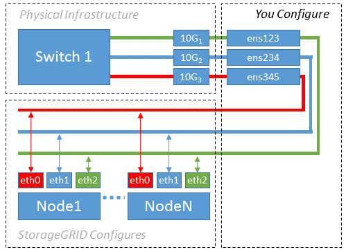

= Esempio 1: Mappatura 1 a 1 su NIC fisiche o virtuali
:allow-uri-read: 
:icons: font
:imagesdir: ../media/

[role="lead"]
L'esempio 1 descrive una semplice mappatura dell'interfaccia fisica che richiede una configurazione minima o nulla sul lato host.

Il sistema operativo Linux crea `ensXYZ` si interfaccia automaticamente durante l'installazione o l'avvio o quando le interfacce vengono aggiunte a caldo. Non è richiesta alcuna configurazione se non quella di garantire che le interfacce siano impostate in modo che si avviino automaticamente dopo l'avvio. È necessario determinare quale `ensXYZ` Corrisponde a quale rete StorageGRID (griglia, amministratore o client) in modo da poter fornire le mappature corrette in un secondo momento del processo di configurazione.

Si noti che la figura mostra più nodi StorageGRID; tuttavia, normalmente si utilizza questa configurazione per macchine virtuali a nodo singolo.

Se lo switch 1 è uno switch fisico, configurare le porte collegate alle interfacce da 10G1 a 10G3 per la modalità di accesso e posizionarle sulle VLAN appropriate.
