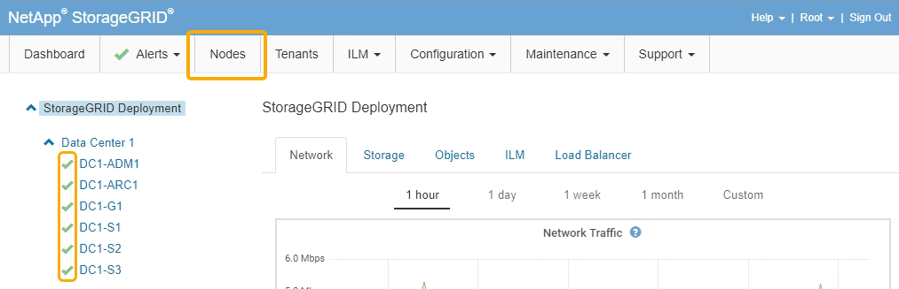

= Sostituzione del controller E2800
:allow-uri-read: 
:icons: font
:imagesdir: ../media/

[role="lead"]
Potrebbe essere necessario sostituire il controller E2800 se non funziona in modo ottimale o se si è verificato un guasto.

.A proposito di questa attività
* Si dispone di un controller sostitutivo con lo stesso numero di parte del controller che si sta sostituendo.
* Sono state scaricate le istruzioni per la sostituzione della configurazione simplex di un elemento filtrante del controller E2800 guasto.
+

IMPORTANT: Fare riferimento alle istruzioni e-Series solo quando richiesto o se sono necessari ulteriori dettagli per eseguire un passaggio specifico. Non fare affidamento sulle istruzioni e-Series per sostituire un controller nell'appliance StorageGRID, perché le procedure non sono le stesse.

* Sono presenti etichette per identificare ciascun cavo collegato al controller.
* Se tutti i dischi sono protetti, è stata esaminata la procedura di sostituzione del controller simplex E2800, che include il download e l'installazione di Gestione dello storage e-Series SANtricity dal sito di supporto NetApp e l'utilizzo della finestra di gestione aziendale per sbloccare i dischi protetti dopo la sostituzione del controller.
+

IMPORTANT: Non sarà possibile utilizzare l'apparecchio fino a quando non si sbloccano i dischi con la chiave salvata.

* È necessario disporre di autorizzazioni di accesso specifiche.
* È necessario accedere a Grid Manager utilizzando un browser supportato.

.A proposito di questa attività
È possibile determinare se si dispone di un contenitore del controller guasto in due modi:

* Il guru del ripristino in Gestione di sistema di SANtricity indica di sostituire il controller.
* Il LED di attenzione ambra sul controller è acceso, a indicare che il controller è guasto.

Il nodo di storage dell'appliance non sarà accessibile quando si sostituisce il controller. Se il controller E2800 funziona a sufficienza, è possibile impostare il controller E5700SG in modalità di manutenzione.

link:placing-appliance-into-maintenance-mode.html["Attivazione della modalità di manutenzione dell'appliance"]

Quando si sostituisce un controller, è necessario rimuovere la batteria dal controller originale e installarlo nel controller sostitutivo.

NOTE: Il controller E2800 nell'appliance non include una scheda di interfaccia host (HIC).

.Fasi
. Seguire le istruzioni della procedura di sostituzione del controller E2800 per prepararsi a rimuovere il controller.
+
Per eseguire questa procedura, utilizzare Gestione di sistema di SANtricity.

+
.. Prendere nota della versione del software SANtricity OS attualmente installata sul controller.
.. Prendere nota della versione DI NVSRAM attualmente installata.
.. Se la funzione Drive Security è attivata, assicurarsi che esista una chiave salvata e di conoscere la password richiesta per l'installazione.
+

IMPORTANT: *Possibile perdita di accesso ai dati --* se tutti i dischi dell'appliance sono abilitati per la sicurezza, il nuovo controller non sarà in grado di accedere all'appliance fino a quando non si sbloccano i dischi protetti utilizzando la finestra di gestione aziendale in Gestione storage di SANtricity.

.. Eseguire il backup del database di configurazione.
+
Se si verifica un problema durante la rimozione di un controller, è possibile utilizzare il file salvato per ripristinare la configurazione.

.. Raccogliere i dati di supporto per l'appliance.
+

NOTE: La raccolta dei dati di supporto prima e dopo la sostituzione di un componente consente di inviare una serie completa di registri al supporto tecnico nel caso in cui la sostituzione non risolva il problema.

. Se l'appliance StorageGRID è in esecuzione in un sistema StorageGRID, impostare il controller E5700SG in modalità di manutenzione.
+
link:placing-appliance-into-maintenance-mode.html["Attivazione della modalità di manutenzione dell'appliance"]

. Se il controller E2800 funziona a sufficienza per consentire un arresto controllato, verificare che tutte le operazioni siano state completate.
+
.. Dalla home page di Gestione sistema SANtricity, selezionare *Visualizza operazioni in corso*.
.. Verificare che tutte le operazioni siano state completate.

. Rimuovere il controller dall'apparecchio:
+
.. Indossare un braccialetto ESD o adottare altre precauzioni antistatiche.
.. Etichettare i cavi, quindi scollegarli.
+

IMPORTANT: Per evitare prestazioni degradate, non attorcigliare, piegare, pizzicare o salire sui cavi.

.. Rilasciare il controller dall'apparecchio premendo il fermo sull'impugnatura della camma fino a rilasciarlo, quindi aprire l'impugnatura della camma verso destra.
.. Estrarre il controller dall'apparecchio con due mani e la maniglia della camma.
+

IMPORTANT: Utilizzare sempre due mani per sostenere il peso del controller.

.. Posizionare il controller su una superficie piana e priva di scariche elettrostatiche con il coperchio rimovibile rivolto verso l'alto.
.. Rimuovere il coperchio premendo verso il basso il pulsante e facendo scorrere il coperchio verso l'esterno.

. Rimuovere la batteria dal controller guasto e installarla nel controller sostitutivo:
+
.. Verificare che il LED verde all'interno del controller (tra la batteria e i DIMM) sia spento.
+
Se questo LED verde è acceso, il controller sta ancora utilizzando l'alimentazione a batteria. Prima di rimuovere qualsiasi componente, è necessario attendere che il LED si spenga.

+
image::../media/e2800_internal_cache_active_led.gif[LED verde su E2800]

+
|===
| Elemento | Descrizione 

 a| 
image:../media/icon_legend_01.gif["icona numero 1"]
 a| 
LED cache interna attiva

 a| 
image:../media/icon_legend_02.gif["icona numero 2"]
 a| 
Batteria

|===
.. Individuare il dispositivo di chiusura blu della batteria.
.. Sganciare la batteria spingendo il dispositivo di chiusura verso il basso e allontanandolo dal controller.
+
image::../media/e2800_remove_battery.gif[Dispositivo di chiusura della batteria]

+
|===
| Elemento | Descrizione 

 a| 
image:../media/icon_legend_01.gif["icona numero 1"]
 a| 
Dispositivo di chiusura a scatto della batteria

 a| 
image:../media/icon_legend_02.gif["icona numero 2"]
 a| 
Batteria

|===
.. Sollevare la batteria ed estrarla dal controller.
.. Rimuovere il coperchio dal controller sostitutivo.
.. Orientare il controller sostitutivo in modo che lo slot della batteria sia rivolto verso di sé.
.. Inserire la batteria nel controller inclinandola leggermente verso il basso.
+
Inserire la flangia metallica nella parte anteriore della batteria nello slot sul fondo del controller e far scorrere la parte superiore della batteria sotto il piccolo perno di allineamento sul lato sinistro del controller.

.. Spostare il dispositivo di chiusura della batteria verso l'alto per fissare la batteria.
+
Quando il dispositivo di chiusura scatta in posizione, la parte inferiore del dispositivo di chiusura si aggancia in uno slot metallico sul telaio.

.. Capovolgere il controller per verificare che la batteria sia installata correttamente.
+

IMPORTANT: *Possibili danni all'hardware* -- la flangia metallica sulla parte anteriore della batteria deve essere inserita completamente nello slot del controller (come mostrato nella prima figura). Se la batteria non è installata correttamente (come mostrato nella seconda figura), la flangia metallica potrebbe entrare in contatto con la scheda del controller, causando danni.

+
*** *Esatto -- la flangia metallica della batteria è completamente inserita nello slot del controller:*
+
image::../media/e2800_battery_flange_ok.gif[Flangia della batteria corretta]

*** *Errato -- la flangia metallica della batteria non è inserita nello slot del controller:*
+
image::../media/e2800_battery_flange_not_ok.gif[Flangia della batteria non corretta]

.. Riposizionare il coperchio del controller.

. Installare il controller sostitutivo nell'appliance.
+
.. Capovolgere il controller, in modo che il coperchio rimovibile sia rivolto verso il basso.
.. Con la maniglia della camma in posizione aperta, far scorrere il controller fino in fondo nell'apparecchio.
.. Spostare la maniglia della camma verso sinistra per bloccare il controller in posizione.
.. Sostituire i cavi e gli SFP.
.. Attendere il riavvio del controller E2800. Verificare che il display a sette segmenti visualizzi uno stato di `99`.
.. Determinare come assegnare un indirizzo IP al controller sostitutivo.
+

NOTE: La procedura per assegnare un indirizzo IP al controller sostitutivo dipende dal fatto che la porta di gestione 1 sia collegata a una rete con un server DHCP e che tutti i dischi siano protetti.

+
*** Se la porta di gestione 1 è connessa a una rete con un server DHCP, il nuovo controller otterrà il proprio indirizzo IP dal server DHCP. Questo valore potrebbe essere diverso dall'indirizzo IP del controller originale.
*** Se tutti i dischi sono protetti, è necessario utilizzare la finestra di gestione aziendale in Gestione storage SANtricity per sbloccare i dischi protetti. Non è possibile accedere al nuovo controller fino a quando non si sbloccano i dischi con la chiave salvata. Consultare le istruzioni e-Series per la sostituzione di un controller E2800 simplex.

. Se l'apparecchio utilizza dischi protetti, seguire le istruzioni della procedura di sostituzione del controller E2800 per importare la chiave di sicurezza del disco.
. Riportare l'apparecchio alla normale modalità operativa. Dal programma di installazione dell'appliance StorageGRID, selezionare *Avanzate* > *Riavvia controller*, quindi selezionare *Riavvia in StorageGRID*.
+
image::../media/reboot_controller_from_maintenance_mode.png[Riavviare il controller in modalità di manutenzione]

+
Durante il riavvio, viene visualizzata la seguente schermata:

+
image::../media/reboot_controller_in_progress.png[Riavvio in corso]

+
L'apparecchio si riavvia e si ricongiunge alla griglia. Questo processo può richiedere fino a 20 minuti.

. Verificare che il riavvio sia completo e che il nodo sia stato riconentrato nella griglia. In Grid Manager, verificare che la scheda *Nodes* visualizzi uno stato normale image:../media/icon_alert_green_checkmark.png["icona di avviso segno di spunta verde"] per il nodo appliance, che indica che non sono attivi avvisi e che il nodo è connesso alla griglia.
+

. Da Gestore di sistema di SANtricity, verificare che il nuovo controller sia ottimale e raccogliere i dati di supporto.

.Informazioni correlate
http://mysupport.netapp.com/info/web/ECMP1658252.html["Sito di documentazione dei sistemi NetApp e-Series"^]
