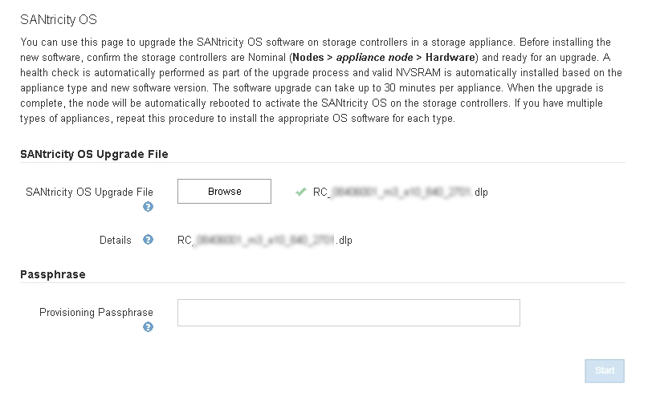

= Aggiornamento del sistema operativo SANtricity sui controller di storage mediante Grid Manager
:allow-uri-read: 
:icons: font
:imagesdir: ../media/

[role="lead"]
Per i controller di storage che attualmente utilizzano SANtricity OS 08.42.20.00 (11.42) o versione successiva, è necessario utilizzare Grid Manager per applicare un aggiornamento.

.Di cosa hai bisogno
* Hai consultato lo strumento matrice di interoperabilità NetApp (IMT) per confermare che la versione del sistema operativo SANtricity che stai utilizzando per l'aggiornamento è compatibile con l'appliance.
* È necessario disporre dell'autorizzazione di manutenzione.
* È necessario accedere a Grid Manager utilizzando un browser supportato.
* È necessario disporre della passphrase di provisioning.
* È necessario accedere alla pagina dei download NetApp per SANtricity OS.

.A proposito di questa attività
Non è possibile eseguire altri aggiornamenti software (aggiornamento del software StorageGRID o hotfix) fino a quando non viene completato il processo di aggiornamento del sistema operativo SANtricity. Se si tenta di avviare una correzione rapida o un aggiornamento del software StorageGRID prima che il processo di aggiornamento del sistema operativo SANtricity sia terminato, si viene reindirizzati alla pagina di aggiornamento del sistema operativo SANtricity.

La procedura non sarà completa fino a quando l'aggiornamento del sistema operativo SANtricity non sarà stato applicato correttamente a tutti i nodi applicabili. Potrebbero essere necessari più di 30 minuti per caricare il sistema operativo SANtricity su ciascun nodo e fino a 90 minuti per riavviare ogni appliance di storage StorageGRID.

CAUTION: I seguenti passaggi sono applicabili solo quando si utilizza Grid Manager per eseguire l'aggiornamento. Non è possibile aggiornare i controller di storage nell'appliance della serie SG5700 utilizzando Grid Manager se i controller utilizzano un sistema operativo SANtricity precedente alla 08.42.20.00 (11.42).

NOTE: Questa procedura aggiornerà AUTOMATICAMENTE NVSRAM alla versione più recente associata all'aggiornamento del sistema operativo SANtricity. Non è necessario applicare un file di aggiornamento NVSRAM separato.

.Fasi
. Da un laptop di assistenza, scaricare il nuovo file del software SANtricity OS dal sito di supporto NetApp.
+
Assicurarsi di scegliere la versione del sistema operativo SANtricity per i controller di storage E2800.

+
https://mysupport.netapp.com/site/products/all/details/eseries-santricityos/downloads-tab["Download NetApp: Sistema operativo SANtricity"^]

. Accedere a Grid Manager utilizzando un browser supportato.
. Selezionare *manutenzione*. Quindi, nella sezione sistema del menu, selezionare *aggiornamento software*.
+
Viene visualizzata la pagina Software Update (aggiornamento software).

+
image::../media/software_update_landing.png[Landing page per l'aggiornamento del software]

. Fare clic su *SANtricity OS*.
+
Viene visualizzata la pagina SANtricity OS.

+
image::../media/santricity_os_upgrade_first.png[Schermata che mostra la pagina StorageGRID First SANtricity OS]

. Selezionare il file di aggiornamento del sistema operativo SANtricity scaricato dal sito del supporto NetApp.
+
.. Fare clic su *Sfoglia*.
.. Individuare e selezionare il file.
.. Fare clic su *Apri*.
+
Il file viene caricato e validato. Al termine del processo di convalida, il nome del file viene visualizzato nel campo Dettagli.

+

NOTE: Non modificare il nome del file poiché fa parte del processo di verifica.

+

. Inserire la passphrase di provisioning.
+
Il pulsante *Start* è attivato.

+
image::../media/santricity_start_button.png[Schermata che mostra la pagina StorageGRID First SANtricity OS]

. Fare clic su *Start*.
+
Viene visualizzata una finestra di avviso che indica che la connessione del browser potrebbe andare persa temporaneamente quando i servizi sui nodi aggiornati vengono riavviati.

+
image::../media/santricity_upgrade_warning.png[schermata che mostra la connessione temporaneamente persa]

. Fare clic su *OK* per inserire il file di aggiornamento del sistema operativo SANtricity nel nodo di amministrazione principale.
+
All'avvio dell'aggiornamento del sistema operativo SANtricity:

+
.. Viene eseguito il controllo dello stato di salute. Questo processo verifica che nessun nodo abbia lo stato di intervento richiesto.
+

NOTE: Se vengono segnalati errori, risolverli e fare nuovamente clic su *Avvia*.

.. Viene visualizzata la tabella di avanzamento dell'aggiornamento del sistema operativo SANtricity. Questa tabella mostra tutti i nodi di storage nella griglia e la fase corrente dell'aggiornamento per ciascun nodo.
+

NOTE: La tabella mostra tutti i nodi di storage, inclusi i nodi di storage basati su software. È necessario approvare l'aggiornamento per tutti i nodi di storage, anche se un aggiornamento del sistema operativo SANtricity non ha alcun effetto sui nodi di storage basati su software. Il messaggio di aggiornamento restituito per i nodi di storage basati su software è "`l'aggiornamento del sistema operativo SANtricity non è applicabile a questo nodo`".

+
image::../media/santricity_upgrade_progress_table.png[Schermata che mostra la parte relativa all'avanzamento dell'aggiornamento del sistema operativo SANtricity della pagina aggiornamento sistema operativo SANtricity]

. Facoltativamente, ordinare l'elenco dei nodi in ordine crescente o decrescente per *Sito*, *Nome*, *avanzamento*, *fase* o *Dettagli*. In alternativa, inserire un termine nella casella *Search* per cercare nodi specifici.
+
È possibile scorrere l'elenco dei nodi utilizzando le frecce sinistra e destra nell'angolo inferiore destro della sezione.

. Approvare i nodi della griglia che si desidera aggiungere alla coda di aggiornamento. I nodi approvati dello stesso tipo vengono aggiornati uno alla volta.
+

IMPORTANT: Non approvare l'aggiornamento del sistema operativo SANtricity per un nodo storage dell'appliance a meno che non si sia certi che il nodo sia pronto per essere arrestato e riavviato.quando l'aggiornamento del sistema operativo SANtricity viene approvato su un nodo, i servizi su quel nodo vengono interrotti. In seguito, quando il nodo viene aggiornato, il nodo appliance viene riavviato. Queste operazioni potrebbero causare interruzioni del servizio per i client che comunicano con il nodo.

+
** Fare clic su uno dei pulsanti *approva tutto* per aggiungere tutti i nodi di storage alla coda di aggiornamento del sistema operativo SANtricity.
+

NOTE: Se l'ordine in cui i nodi vengono aggiornati è importante, approvare i nodi o i gruppi di nodi uno alla volta e attendere il completamento dell'aggiornamento su ciascun nodo prima di approvare i nodi successivi.

** Fare clic su uno o più pulsanti *approva* per aggiungere uno o più nodi alla coda di aggiornamento del sistema operativo SANtricity.
+

NOTE: È possibile ritardare l'applicazione di un aggiornamento del sistema operativo SANtricity a un nodo, ma il processo di aggiornamento del sistema operativo SANtricity non sarà completo fino a quando non si approva l'aggiornamento del sistema operativo SANtricity su tutti i nodi di storage elencati.

+
Dopo aver fatto clic su *Approve*, il processo di aggiornamento determina se il nodo può essere aggiornato. Se è possibile aggiornare un nodo, questo viene aggiunto alla coda di aggiornamento. +

+
Per alcuni nodi, il file di aggiornamento selezionato non viene intenzionalmente applicato ed è possibile completare il processo di aggiornamento senza aggiornare questi nodi specifici. Per i nodi intenzionalmente non aggiornati, il processo mostrerà la fase di completamento con uno dei seguenti messaggi nella colonna Details (Dettagli):

+
*** Il nodo di storage è già stato aggiornato.
*** L'aggiornamento del sistema operativo SANtricity non è applicabile a questo nodo.
*** Il file del sistema operativo SANtricity non è compatibile con questo nodo.

+
Il messaggio "`SANtricity OS upgrade is not application to this node`" (aggiornamento sistema operativo non applicabile a questo nodo) indica che il nodo non dispone di un controller di storage che può essere gestito dal sistema StorageGRID. Questo messaggio viene visualizzato per i nodi di storage non appliance. È possibile completare il processo di aggiornamento del sistema operativo SANtricity senza aggiornare il nodo visualizzando questo messaggio. + il messaggio "`SANtricity OS file is not compatible with this node`" (il file del sistema operativo non è compatibile con questo nodo) indica che il nodo richiede un file del sistema operativo SANtricity diverso da quello che il processo sta tentando di installare. Dopo aver completato l'aggiornamento corrente del sistema operativo SANtricity, scaricare il sistema operativo SANtricity appropriato per il nodo e ripetere il processo di aggiornamento.

. Per rimuovere uno o tutti i nodi dalla coda di aggiornamento del sistema operativo SANtricity, fare clic su *Rimuovi* o *Rimuovi tutto*.
+
Come mostrato nell'esempio, quando la fase va oltre la coda, il pulsante *Rimuovi* è nascosto e non è più possibile rimuovere il nodo dal processo di aggiornamento del sistema operativo SANtricity.

+
image::../media/approve_all_progresstable.png[Pulsante Rimuovi aggiornamento SANtricity]

. Attendere che l'aggiornamento del sistema operativo SANtricity venga applicato a ciascun nodo Grid approvato.
+

IMPORTANT: Se un nodo mostra una fase di errore durante l'applicazione dell'aggiornamento del sistema operativo SANtricity, l'aggiornamento non è riuscito per quel nodo. Potrebbe essere necessario impostare l'apparecchio in modalità di manutenzione per eseguire il ripristino in caso di guasto. Prima di continuare, contattare il supporto tecnico.

+
Se il firmware sul nodo è troppo vecchio per essere aggiornato con Grid Manager, il nodo mostra una fase di errore con i dettagli: "`è necessario utilizzare la modalità di manutenzione per aggiornare il sistema operativo SANtricity su questo nodo. Consultare le istruzioni di installazione e manutenzione dell'apparecchio. Dopo l'aggiornamento, è possibile utilizzare questa utility per gli aggiornamenti futuri.`" Per risolvere l'errore, procedere come segue:

+
.. Utilizzare la modalità di manutenzione per aggiornare il sistema operativo SANtricity sul nodo che mostra una fase di errore.
.. Utilizza Grid Manager per riavviare e completare l'aggiornamento del sistema operativo SANtricity.
+
Una volta completato l'aggiornamento del sistema operativo SANtricity su tutti i nodi approvati, la tabella di avanzamento dell'aggiornamento del sistema operativo SANtricity si chiude e un banner verde mostra la data e l'ora in cui l'aggiornamento del sistema operativo SANtricity è stato completato.

+
image::../media/santricity_upgrade_finish_banner.png[Schermata della pagina di aggiornamento del sistema operativo SANtricity al termine dell'aggiornamento]

. Ripetere questa procedura di aggiornamento per tutti i nodi con una fase di completamento che richiedono un file di aggiornamento del sistema operativo SANtricity diverso.
+

NOTE: Per i nodi con stato di attenzione alle esigenze, utilizzare la modalità di manutenzione per eseguire l'aggiornamento.

.Informazioni correlate
link:upgrading-santricity-os-on-e2800-controller-using-maintenance-mode.html["Aggiornamento del sistema operativo SANtricity sul controller E2800 utilizzando la modalità di manutenzione"]
