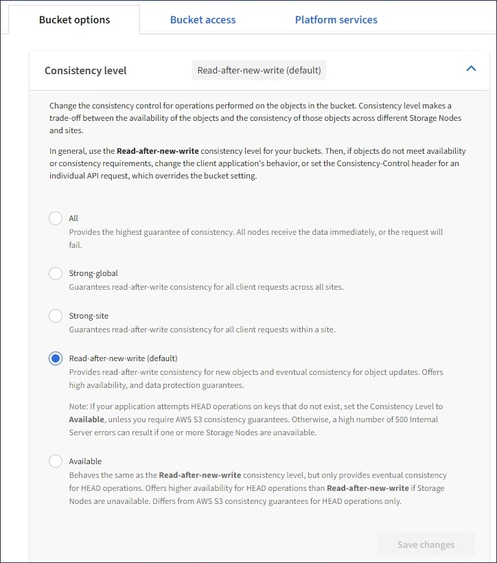

= Modifica del livello di coerenza
:allow-uri-read: 
:icons: font
:imagesdir: ../media/

[role="lead"]
Se si utilizza un tenant S3, è possibile utilizzare il tenant Manager o l'API di gestione tenant per modificare il controllo di coerenza per le operazioni eseguite sugli oggetti nei bucket S3.

.Di cosa hai bisogno
* È necessario accedere a tenant Manager utilizzando un browser supportato.
* È necessario appartenere a un gruppo di utenti che disponga dell'autorizzazione Manage All Bucket (Gestisci tutti i bucket) o Root Access (accesso root). Queste autorizzazioni sovrascrivono le impostazioni delle autorizzazioni nelle policy di gruppo o bucket.

.A proposito di questa attività
Il livello di coerenza crea un compromesso tra la disponibilità degli oggetti e la coerenza di tali oggetti nei diversi nodi e siti di storage. In generale, è necessario utilizzare il livello di coerenza *Read-after-new-write* per i bucket. Se il livello di coerenza *Read-after-new-write* non soddisfa i requisiti dell'applicazione client, è possibile modificare il livello di coerenza impostando il livello di coerenza del bucket o utilizzando `Consistency-Control` intestazione. Il `Consistency-Control` l'intestazione sovrascrive il livello di coerenza del bucket.

NOTE: Quando si modifica il livello di coerenza di un bucket, solo gli oggetti acquisiti dopo la modifica vengono garantiti per soddisfare il livello rivisto.

.Fasi
. Selezionare *STORAGE (S3)* > *Bucket*.
. Selezionare il nome del bucket dall'elenco.
+
Viene visualizzata la pagina dei dettagli del bucket.

. Selezionare *Opzioni bucket* > *livello di coerenza*.
+

. Selezionare un livello di coerenza per le operazioni eseguite sugli oggetti in questo bucket.
+
[cols="1a,3a"]
|===
| Livello di coerenza | Descrizione 

 a| 
Tutto
 a| 
Tutti i nodi ricevono i dati immediatamente, altrimenti la richiesta non riesce.

 a| 
Forte-globale
 a| 
Garantisce la coerenza di lettura dopo scrittura per tutte le richieste dei client in tutti i siti.

 a| 
Sito forte
 a| 
Garantisce la coerenza di lettura dopo scrittura per tutte le richieste dei client all'interno di un sito.

 a| 
Read-after-new-write (valore predefinito)
 a| 
Fornisce coerenza di lettura dopo scrittura per i nuovi oggetti ed eventuale coerenza per gli aggiornamenti degli oggetti. Offre alta disponibilità e garanzie di protezione dei dati. Corrisponde alle garanzie di coerenza di Amazon S3.

*Nota:* se l'applicazione tenta di ESEGUIRE operazioni SU chiavi non esistenti, impostare il livello di coerenza su *disponibile*, a meno che non si richiedano garanzie di coerenza Amazon S3. In caso contrario, se uno o più nodi di storage non sono disponibili, possono verificarsi un numero elevato di errori 500 nel server interno.

 a| 
Disponibile (eventuale coerenza per le operazioni TESTA)
 a| 
Si comporta come il livello di coerenza *Read-after-new-write*, ma fornisce solo una coerenza finale per le operazioni HEAD. Offre una maggiore disponibilità per le operazioni HEAD rispetto a *Read-after-new-write* se i nodi storage non sono disponibili. Differisce dalle garanzie di coerenza di Amazon S3 solo per le operazioni HEAD.

|===
. Selezionare *Save Changes* (Salva modifiche).

.Informazioni correlate
link:tenant-management-permissions.html["Permessi di gestione del tenant"]
