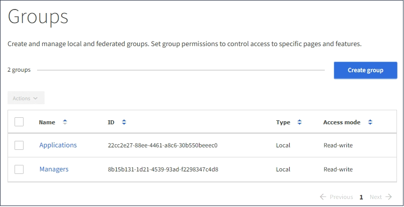

= Eliminazione di un gruppo
:allow-uri-read: 
:icons: font
:imagesdir: ../media/

[role="lead"]
È possibile eliminare un gruppo dal sistema. Gli utenti che appartengono solo a quel gruppo non potranno più accedere al tenant manager o utilizzare l'account tenant.

.Di cosa hai bisogno
* È necessario accedere a tenant Manager utilizzando un browser supportato.
* È necessario appartenere a un gruppo di utenti che dispone dell'autorizzazione di accesso root.

.Fasi
. Selezionare *GESTIONE ACCESSI* > *gruppi*.
+

. Selezionare le caselle di controllo dei gruppi che si desidera eliminare.
. Selezionare *azioni* > *Elimina gruppo*.
+
Viene visualizzato un messaggio di conferma.

. Selezionare *Delete group* (Elimina gruppo) per confermare che si desidera eliminare i gruppi indicati nel messaggio di conferma.
+
Viene visualizzato un messaggio di conferma nell'angolo superiore destro della pagina. Le modifiche potrebbero richiedere fino a 15 minuti per essere effettive a causa del caching.

.Informazioni correlate
link:tenant-management-permissions.html["Permessi di gestione del tenant"]
