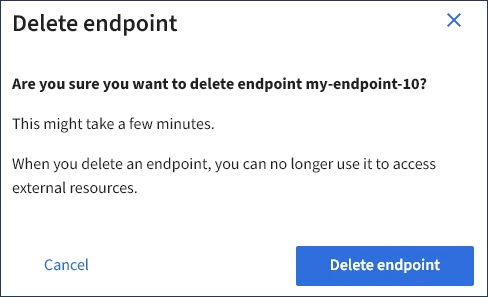

= Eliminazione di un endpoint dei servizi della piattaforma
:allow-uri-read: 
:icons: font
:imagesdir: ../media/

[role="lead"]
È possibile eliminare un endpoint se non si desidera più utilizzare il servizio di piattaforma associato.

.Di cosa hai bisogno
* È necessario accedere a tenant Manager utilizzando un browser supportato.
* È necessario appartenere a un gruppo di utenti con l'autorizzazione *Gestisci endpoint*.

.Fasi
. Selezionare *STORAGE (S3)* > *Platform Services Endpoint*.
+
Viene visualizzata la pagina Platform Services Endpoint (endpoint dei servizi della piattaforma) che mostra l'elenco degli endpoint dei servizi della piattaforma già configurati.

+
image::../media/endpoints_list.png[Elenco di endpoint]

. Selezionare la casella di controllo per ciascun endpoint che si desidera eliminare.
+

IMPORTANT: Se elimini un endpoint di servizi di piattaforma in uso, il servizio di piattaforma associato verrà disattivato per tutti i bucket che utilizzano l'endpoint. Tutte le richieste non ancora completate verranno interrotte. Le nuove richieste continueranno a essere generate fino a quando non si modifica la configurazione del bucket per non fare più riferimento all'URN cancellato. StorageGRID segnalerà queste richieste come errori irrecuperabili.

. Selezionare *azioni* > *Elimina endpoint*.
+
Viene visualizzato un messaggio di conferma.

+

. Selezionare *Delete endpoint* (Elimina endpoint).

