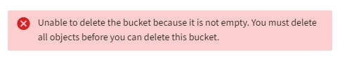

= Eliminazione di un bucket S3
:allow-uri-read: 
:icons: font
:imagesdir: ../media/

[role="lead"]
È possibile utilizzare Tenant Manager per eliminare un bucket S3 vuoto.

.Di cosa hai bisogno
* È necessario accedere a tenant Manager utilizzando un browser supportato.
* È necessario appartenere a un gruppo di utenti che disponga dell'autorizzazione Manage All Bucket (Gestisci tutti i bucket) o Root Access (accesso root). Queste autorizzazioni sovrascrivono le impostazioni delle autorizzazioni nelle policy di gruppo o bucket.

.A proposito di questa attività
Queste istruzioni descrivono come eliminare un bucket S3 utilizzando il Tenant Manager. È inoltre possibile eliminare i bucket S3 utilizzando l'API di gestione tenant o l'API REST S3.

Non è possibile eliminare un bucket S3 se contiene oggetti o versioni di oggetti non correnti. Per informazioni sull'eliminazione degli oggetti con versione S3, vedere le istruzioni per la gestione degli oggetti con gestione del ciclo di vita delle informazioni.

.Fasi
. Selezionare *STORAGE (S3)* > *Bucket*.
+
Viene visualizzata la pagina bucket che mostra tutti i bucket S3 esistenti.

+
image::../media/buckets_table.png[Tabella bucket]

. Selezionare la casella di controllo per il bucket vuoto che si desidera eliminare.
+
Il menu Actions (azioni) è attivato.

. Dal menu Actions (azioni), selezionare *Delete empty bucket* (Elimina bucket vuoto).
+
image::../media/delete_bucket_button.png[Pulsante Delete Bucket (Elimina bucket)]

+
Viene visualizzato un messaggio di conferma.

+
image::../media/delete_bucket_confirmation_dialog.png[Finestra di dialogo Delete Bucket Confirmation (]

. Se si è certi di voler eliminare il bucket, selezionare *Delete bucket* (Elimina bucket).
+
StorageGRID conferma che il bucket è vuoto, quindi lo elimina. Questa operazione potrebbe richiedere alcuni minuti.

+
Se il bucket non è vuoto, viene visualizzato un messaggio di errore. È necessario eliminare tutti gli oggetti prima di poter eliminare il bucket.

+

.Informazioni correlate
link:../ilm/index.html["Gestire gli oggetti con ILM"]
