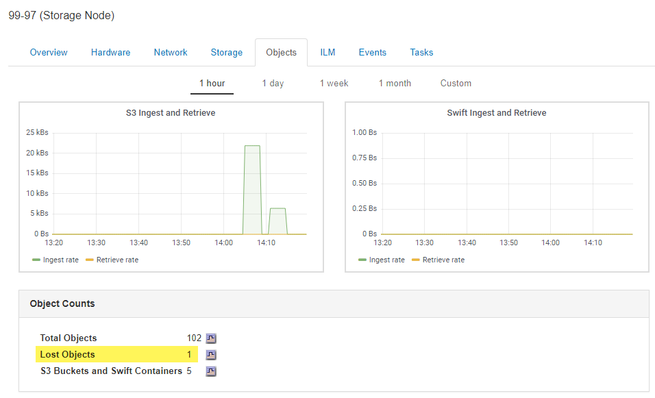

= Analisi degli oggetti smarriti
:allow-uri-read: 
:icons: font
:imagesdir: ../media/

[role="lead"]
Quando vengono attivati l'allarme *oggetti persi* e l'allarme legacy PERSI (oggetti persi), è necessario eseguire immediatamente un'analisi. Raccogliere informazioni sugli oggetti interessati e contattare il supporto tecnico.

.Di cosa hai bisogno
* È necessario accedere a Grid Manager utilizzando un browser supportato.
* È necessario disporre di autorizzazioni di accesso specifiche.
* È necessario disporre di `Passwords.txt` file.

.A proposito di questa attività
L'avviso *oggetti persi* e l'allarme PERSO indicano che StorageGRID ritiene che non vi siano copie di un oggetto nella griglia. I dati potrebbero essere stati persi in modo permanente.

Esaminare immediatamente gli allarmi o gli avvisi di oggetti smarriti. Potrebbe essere necessario intervenire per evitare ulteriori perdite di dati. In alcuni casi, potrebbe essere possibile ripristinare un oggetto perso se si esegue un'azione rapida.

Il numero di oggetti persi può essere visualizzato in Grid Manager.

.Fasi
. Selezionare *nodi*.
. Selezionare *_Storage Node_* *Objects*.
. Esaminare il numero di oggetti persi visualizzato nella tabella Conteggio oggetti.
+
Questo numero indica il numero totale di oggetti che il nodo della griglia rileva come mancanti dall'intero sistema StorageGRID. Il valore è la somma dei contatori Lost Objects del componente Data Store all'interno dei servizi LDR e DDS.

+

. Da un nodo amministratore, accedere al registro di controllo per determinare l'identificatore univoco (UUID) dell'oggetto che ha attivato l'avviso *oggetti persi* e l'allarme PERSO:
+
.. Accedere al nodo Grid:
+
... Immettere il seguente comando: `ssh admin@grid_node_IP`
... Immettere la password elencata in `Passwords.txt` file.
... Immettere il seguente comando per passare a root: `su -`
... Immettere la password elencata in `Passwords.txt` file. Una volta effettuato l'accesso come root, il prompt cambia da `$` a. `#`.

.. Passare alla directory in cui si trovano i registri di controllo. Inserire: `cd /var/local/audit/export/`
.. Utilizzare grep per estrarre i messaggi di audit OLST (Object Lost). Inserire: `grep OLST audit_file_name`
.. Annotare il valore UUID incluso nel messaggio.
+
[listing]
----
>Admin: # grep OLST audit.log
2020-02-12T19:18:54.780426 [AUDT:[CBID(UI64):0x38186FE53E3C49A5][UUID(CSTR):926026C4-00A4-449B-AC72-BCCA72DD1311]
[PATH(CSTR):"source/cats"][NOID(UI32):12288733][VOLI(UI64):3222345986][RSLT(FC32):NONE][AVER(UI32):10]
[ATIM(UI64):1581535134780426][ATYP(FC32):OLST][ANID(UI32):12448208][AMID(FC32):ILMX][ATID(UI64):7729403978647354233]]
----

. Utilizzare `ObjectByUUID` Comando per trovare l'oggetto in base al relativo identificatore (UUID), quindi determinare se i dati sono a rischio.
+
.. Telnet all'host locale 1402 per accedere alla console LDR.
.. Inserire: `/proc/OBRP/ObjectByUUID UUID_value`
+
In questo primo esempio, l'oggetto con `UUID 926026C4-00A4-449B-AC72-BCCA72DD1311` ha due posizioni elencate.

+
[listing]
----
ade 12448208: /proc/OBRP > ObjectByUUID 926026C4-00A4-449B-AC72-BCCA72DD1311

{
    "TYPE(Object Type)": "Data object",
    "CHND(Content handle)": "926026C4-00A4-449B-AC72-BCCA72DD1311",
    "NAME": "cats",
    "CBID": "0x38186FE53E3C49A5",
    "PHND(Parent handle, UUID)": "221CABD0-4D9D-11EA-89C3-ACBB00BB82DD",
    "PPTH(Parent path)": "source",
    "META": {
        "BASE(Protocol metadata)": {
            "PAWS(S3 protocol version)": "2",
            "ACCT(S3 account ID)": "44084621669730638018",
            "*ctp(HTTP content MIME type)": "binary/octet-stream"
        },
        "BYCB(System metadata)": {
            "CSIZ(Plaintext object size)": "5242880",
            "SHSH(Supplementary Plaintext hash)": "MD5D 0xBAC2A2617C1DFF7E959A76731E6EAF5E",
            "BSIZ(Content block size)": "5252084",
            "CVER(Content block version)": "196612",
            "CTME(Object store begin timestamp)": "2020-02-12T19:16:10.983000",
            "MTME(Object store modified timestamp)": "2020-02-12T19:16:10.983000",
            "ITME": "1581534970983000"
        },
        "CMSM": {
            "LATM(Object last access time)": "2020-02-12T19:16:10.983000"
        },
        "AWS3": {
            "LOCC": "us-east-1"
        }
    },
    "CLCO\(Locations\)": \[
        \{
            "Location Type": "CLDI\(Location online\)",
            "NOID\(Node ID\)": "12448208",
            "VOLI\(Volume ID\)": "3222345473",
            "Object File Path": "/var/local/rangedb/1/p/17/11/00rH0%DkRt78Ila\#3udu",
            "LTIM\(Location timestamp\)": "2020-02-12T19:36:17.880569"
        \},
        \{
            "Location Type": "CLDI\(Location online\)",
            "NOID\(Node ID\)": "12288733",
            "VOLI\(Volume ID\)": "3222345984",
            "Object File Path": "/var/local/rangedb/0/p/19/11/00rH0%DkRt78Rrb\#3s;L",
            "LTIM\(Location timestamp\)": "2020-02-12T19:36:17.934425"
        }
    ]
}
----
+
Nel secondo esempio, l'oggetto con `UUID 926026C4-00A4-449B-AC72-BCCA72DD1311` non ha posizioni elencate.

+
[listing]
----
ade 12448208: / > /proc/OBRP/ObjectByUUID 926026C4-00A4-449B-AC72-BCCA72DD1311

{
    "TYPE(Object Type)": "Data object",
    "CHND(Content handle)": "926026C4-00A4-449B-AC72-BCCA72DD1311",
    "NAME": "cats",
    "CBID": "0x38186FE53E3C49A5",
    "PHND(Parent handle, UUID)": "221CABD0-4D9D-11EA-89C3-ACBB00BB82DD",
    "PPTH(Parent path)": "source",
    "META": {
        "BASE(Protocol metadata)": {
            "PAWS(S3 protocol version)": "2",
            "ACCT(S3 account ID)": "44084621669730638018",
            "*ctp(HTTP content MIME type)": "binary/octet-stream"
        },
        "BYCB(System metadata)": {
            "CSIZ(Plaintext object size)": "5242880",
            "SHSH(Supplementary Plaintext hash)": "MD5D 0xBAC2A2617C1DFF7E959A76731E6EAF5E",
            "BSIZ(Content block size)": "5252084",
            "CVER(Content block version)": "196612",
            "CTME(Object store begin timestamp)": "2020-02-12T19:16:10.983000",
            "MTME(Object store modified timestamp)": "2020-02-12T19:16:10.983000",
            "ITME": "1581534970983000"
        },
        "CMSM": {
            "LATM(Object last access time)": "2020-02-12T19:16:10.983000"
        },
        "AWS3": {
            "LOCC": "us-east-1"
        }
    }
}
----
.. Esaminare l'output di /proc/OBRP/ObjectByUUID e intraprendere l'azione appropriata:
+
[cols="2a,4a"]
|===
| Metadati | Conclusione 

 a| 
Nessun oggetto trovato ("ERRORE":"")
 a| 
Se l'oggetto non viene trovato, viene visualizzato il messaggio "ERROR":".

Se l'oggetto non viene trovato, è possibile ignorare l'allarme. La mancanza di un oggetto indica che l'oggetto è stato intenzionalmente cancellato.

 a| 
Posizioni 0
 a| 
Se nell'output sono presenti posizioni, l'allarme oggetti persi potrebbe essere un falso positivo.

Verificare che gli oggetti esistano. Utilizzare l'ID nodo e il percorso del file elencati nell'output per confermare che il file a oggetti si trova nella posizione indicata.

La procedura per trovare oggetti potenzialmente persi spiega come utilizzare l'ID nodo per trovare il nodo di storage corretto.

link:troubleshooting-storagegrid-system.html["Ricerca e ripristino di oggetti potenzialmente persi"]

Se gli oggetti sono presenti, è possibile ripristinare il numero di oggetti persi per annullare l'allarme e l'avviso.

 a| 
Posizioni = 0
 a| 
Se nell'output non sono presenti posizioni, l'oggetto potrebbe essere mancante. È possibile cercare e ripristinare l'oggetto da soli oppure contattare il supporto tecnico.

link:troubleshooting-storagegrid-system.html["Ricerca e ripristino di oggetti potenzialmente persi"]

Il supporto tecnico potrebbe richiedere di determinare se è in corso una procedura di ripristino dello storage. Vale a dire, è stato emesso un comando _repair-data_ su qualsiasi nodo di storage e il ripristino è ancora in corso? Consultare le informazioni relative al ripristino dei dati degli oggetti in un volume di storage nelle istruzioni di ripristino e manutenzione.

|===

.Informazioni correlate
link:../maintain/index.html["Mantieni  Ripristina"]

link:../audit/index.html["Esaminare i registri di audit"]
