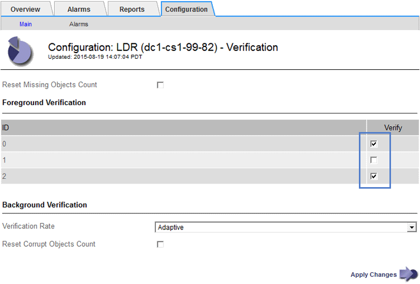

= Verifica dell'integrità degli oggetti
:allow-uri-read: 
:icons: font
:imagesdir: ../media/

[role="lead"]
Il sistema StorageGRID verifica l'integrità dei dati degli oggetti sui nodi di storage, verificando la presenza di oggetti corrotti e mancanti.

Esistono due processi di verifica: Verifica in background e verifica in primo piano. Lavorano insieme per garantire l'integrità dei dati. La verifica in background viene eseguita automaticamente e verifica continuamente la correttezza dei dati dell'oggetto. La verifica in primo piano può essere attivata da un utente per verificare più rapidamente l'esistenza (anche se non la correttezza) di oggetti.

== Che cos'è la verifica in background

Il processo di verifica in background verifica automaticamente e continuamente la presenza di copie corrotte dei dati degli oggetti nei nodi di storage e tenta automaticamente di risolvere eventuali problemi rilevati.

La verifica in background verifica l'integrità degli oggetti replicati e degli oggetti con codifica in cancellazione, come segue:

* *Oggetti replicati*: Se il processo di verifica in background trova un oggetto replicato corrotto, la copia corrotta viene rimossa dalla sua posizione e messa in quarantena in un altro punto del nodo di storage. Quindi, viene generata una nuova copia non corrotta e posizionata per soddisfare il criterio ILM attivo. La nuova copia potrebbe non essere inserita nel nodo di storage utilizzato per la copia originale.

NOTE: I dati degli oggetti corrotti vengono messi in quarantena invece che cancellati dal sistema, in modo che sia ancora possibile accedervi. Per ulteriori informazioni sull'accesso ai dati degli oggetti in quarantena, contattare il supporto tecnico.

* *Oggetti con codifica di cancellazione*: Se il processo di verifica in background rileva che un frammento di un oggetto con codifica di cancellazione è corrotto, StorageGRID tenta automaticamente di ricostruire il frammento mancante sullo stesso nodo di storage, utilizzando i dati rimanenti e i frammenti di parità. Se non è possibile ricostruire il frammento corrotto, l'attributo Corrupt Copies Detected (ECOR) viene incrementato di uno e si tenta di recuperare un'altra copia dell'oggetto. Se il recupero ha esito positivo, viene eseguita una valutazione ILM per creare una copia sostitutiva dell'oggetto con codice di cancellazione.
+
Il processo di verifica in background controlla solo gli oggetti sui nodi di storage. Non controlla gli oggetti nei nodi di archiviazione o in un pool di storage cloud. Gli oggetti devono avere più di quattro giorni di età per poter essere qualificati per la verifica in background.

La verifica in background viene eseguita a una velocità continua che non interferisce con le normali attività del sistema. Impossibile interrompere la verifica in background. Tuttavia, se si sospetta un problema, è possibile aumentare il tasso di verifica in background per verificare più rapidamente il contenuto di un nodo di storage.

=== Avvisi e allarmi (legacy) relativi alla verifica in background

Se il sistema rileva un oggetto corrotto che non è in grado di correggere automaticamente (perché il danneggiamento impedisce l'identificazione dell'oggetto), viene attivato l'avviso *rilevato oggetto corrotto non identificato*.

Se la verifica in background non riesce a sostituire un oggetto corrotto perché non riesce a individuare un'altra copia, vengono attivati l'avviso *oggetti persi* e l'allarme legacy PERSI (oggetti persi).

== Modifica del tasso di verifica in background

È possibile modificare la velocità con cui la verifica in background controlla i dati degli oggetti replicati su un nodo di storage in caso di dubbi sull'integrità dei dati.

.Di cosa hai bisogno
* È necessario accedere a Grid Manager utilizzando un browser supportato.
* È necessario disporre di autorizzazioni di accesso specifiche.

.A proposito di questa attività
È possibile modificare il tasso di verifica per la verifica in background su un nodo di storage:

* Adattivo: Impostazione predefinita. L'attività è progettata per la verifica a un massimo di 4 MB/s o 10 oggetti/s (a seconda di quale valore viene superato per primo).
* Elevato: La verifica dello storage procede rapidamente, a una velocità che può rallentare le normali attività del sistema.

Utilizzare la frequenza di verifica alta solo quando si sospetta che un errore hardware o software possa avere dati oggetto corrotti. Una volta completata la verifica in background con priorità alta, la velocità di verifica viene ripristinata automaticamente su Adaptive.

.Fasi
. Selezionare *supporto* > *Strumenti* > *topologia griglia*.
. Selezionare *_Storage Node_ LDR Verification*.
. Selezionare *Configurazione* *principale*.
. Accedere a *LDR* *verifica* *Configurazione* *principale*.
. In background Verification (verifica in background), selezionare *Verification Rate* *High* (tasso di verifica) o *Verification Rate* *Adaptive* (tasso di verifica).
+
image::../media/background_verification_rate.png[Impostazione della velocità di verifica]

NOTE: Impostando la frequenza di verifica su alta, si attiva l'allarme VPRI (tasso di verifica) legacy a livello di avviso.

. Fare clic su *Applica modifiche*.
. Monitorare i risultati della verifica in background per gli oggetti replicati.
+
.. Andare a *Nodes* *_Storage Node_* *Objects*.
.. Nella sezione verifica, monitorare i valori per *oggetti corrotti* e *oggetti corrotti non identificati*.
+
Se la verifica in background trova dati di oggetti replicati corrotti, la metrica *Corrupt Objects* viene incrementata e StorageGRID tenta di estrarre l'identificatore di oggetti dai dati, come segue:

+
*** Se è possibile estrarre l'identificativo dell'oggetto, StorageGRID crea automaticamente una nuova copia dei dati dell'oggetto. La nuova copia può essere eseguita in qualsiasi punto del sistema StorageGRID che soddisfi la policy ILM attiva.
*** Se l'identificatore dell'oggetto non può essere estratto (perché è stato danneggiato), la metrica *Corrupt Objects Unidentified* viene incrementata e viene attivato l'avviso *Unidentified corrotto Object Detected*.

.. Se vengono rilevati dati di oggetti replicati corrotti, contattare il supporto tecnico per determinare la causa principale del danneggiamento.

. Monitorare i risultati della verifica in background per gli oggetti con codifica erasure.
+
Se la verifica in background trova frammenti corrotti di dati di oggetti con codifica di cancellazione, l'attributo corrotto Fragments Detected (frammenti corrotti rilevati) viene incrementato. StorageGRID esegue il ripristino ricostruendo il frammento corrotto in posizione sullo stesso nodo di storage.

+
.. Selezionare *supporto* > *Strumenti* > *topologia griglia*.
.. Selezionare *_Storage Node_ LDR Erasure Coding*.
.. Nella tabella Verification Results (risultati verifica), monitorare l'attributo corrotto Fragments Detected (ECCD).

. Una volta ripristinati automaticamente gli oggetti corrotti dal sistema StorageGRID, ripristinare il numero di oggetti corrotti.
+
.. Selezionare *supporto* > *Strumenti* > *topologia griglia*.
.. Selezionare *_Storage Node_ LDR Verification Configuration*.
.. Selezionare *Ripristina conteggio oggetti corrotti*.
.. Fare clic su *Applica modifiche*.

. Se si è certi che gli oggetti in quarantena non sono necessari, è possibile eliminarli.

NOTE: Se viene attivato l'allarme *oggetti persi* o l'allarme legacy PERSI (oggetti persi), il supporto tecnico potrebbe voler accedere agli oggetti in quarantena per eseguire il debug del problema sottostante o tentare il ripristino dei dati.

. Selezionare *supporto* > *Strumenti* > *topologia griglia*.
. Selezionare *_Storage Node_* *LDR* *Verification* *Configuration*.
. Selezionare *Delete Quarantined Objects* (Elimina oggetti in quarantena).
. Fare clic su *Applica modifiche*.

== Che cos'è la verifica in primo piano

La verifica in primo piano è un processo avviato dall'utente che verifica l'esistenza di tutti i dati dell'oggetto previsti su un nodo di storage. La verifica in primo piano viene utilizzata per verificare l'integrità di un dispositivo di storage.

La verifica in primo piano è un'alternativa più rapida alla verifica in background che verifica l'esistenza, ma non l'integrità, dei dati dell'oggetto su un nodo di storage. Se la verifica in primo piano rileva la mancanza di molti elementi, potrebbe esserci un problema con tutto o parte di un dispositivo di storage associato al nodo di storage.

La verifica in primo piano verifica sia i dati degli oggetti replicati che quelli con codice di cancellazione, come segue:

* *Replicated Objects*: Se una copia dei dati degli oggetti replicati risulta mancante, StorageGRID tenta automaticamente di sostituire la copia dalle copie memorizzate altrove nel sistema. Il nodo di storage esegue una copia esistente attraverso una valutazione ILM, che determina che il criterio ILM corrente non è più soddisfatto per questo oggetto perché la copia mancante non esiste più nella posizione prevista. Viene generata una nuova copia per soddisfare la policy ILM attiva del sistema. Questa nuova copia potrebbe non essere posizionata nella stessa posizione in cui è stata memorizzata la copia mancante.
* *Oggetti con codifica di cancellazione*: Se un frammento di un oggetto con codifica di cancellazione risulta mancante, StorageGRID tenta automaticamente di ricostruire il frammento mancante sullo stesso nodo di storage utilizzando i frammenti rimanenti. Se il frammento mancante non può essere ricostruito (perché sono stati persi troppi frammenti), l'attributo Corrupt Copies Detected (ECOR) (copie corrotte rilevate) viene incrementato di uno. ILM tenta quindi di trovare un'altra copia dell'oggetto, che può utilizzare per generare una nuova copia con codifica di cancellazione.
+
Se la verifica in primo piano identifica un problema di erasure coding su un volume di storage, l'attività di verifica in primo piano viene interrotta con un messaggio di errore che identifica il volume interessato. È necessario eseguire una procedura di ripristino per tutti i volumi di storage interessati.

Se nella griglia non vengono trovate altre copie di un oggetto replicato mancante o un oggetto corrotto con codifica in cancellazione, vengono attivati l'allarme *oggetti persi* e l'allarme legacy PERSO (oggetti persi).

== Esecuzione della verifica in primo piano

La verifica in primo piano consente di verificare l'esistenza di dati su un nodo di storage. I dati dell'oggetto mancanti potrebbero indicare la presenza di un problema con il dispositivo di storage sottostante.

.Di cosa hai bisogno
* Hai verificato che le seguenti attività della griglia non siano in esecuzione:
+
** Grid Expansion (espansione griglia): Aggiungere un server (GEXP) quando si aggiunge un nodo di storage
** Decommissionamento dei nodi di storage (LDCM) sullo stesso nodo di storage se queste attività della griglia sono in esecuzione, attendere il completamento o il rilascio del blocco.

* Hai garantito che lo storage sia online. (Selezionare *supporto* *Strumenti* *topologia griglia*. Quindi, selezionare *_Storage Node_* *LDR* *Storage* *Overview* *Main*. Assicurarsi che lo stato dello storage - corrente* sia online.
* Si è verificato che le seguenti procedure di ripristino non siano in esecuzione sullo stesso nodo di storage:
+
** Ripristino di un volume di storage guasto
** Ripristino di un nodo di storage con un disco di sistema guasto la verifica di Foreground non fornisce informazioni utili durante l'esecuzione delle procedure di ripristino.

.A proposito di questa attività
La verifica in primo piano verifica la presenza di dati di oggetti replicati mancanti e di dati di oggetti con codifica di cancellazione mancanti:

* Se la verifica in primo piano rileva grandi quantità di dati dell'oggetto mancanti, è probabile che vi sia un problema con lo storage del nodo di storage che deve essere esaminato e risolto.
* Se la verifica in primo piano rileva un grave errore di storage associato a dati con codifica di cancellazione, viene visualizzato un messaggio di notifica. Per risolvere l'errore, è necessario eseguire il ripristino del volume di storage.

È possibile configurare la verifica in primo piano per controllare tutti gli archivi di oggetti di un nodo di storage o solo gli archivi di oggetti specifici.

Se la verifica in primo piano rileva dati dell'oggetto mancanti, il sistema StorageGRID tenta di sostituirli. Se non è possibile eseguire una copia sostitutiva, potrebbe essere attivato l'allarme LOST (Lost Objects) (oggetti PERSI).

La verifica in primo piano genera un'attività della griglia di verifica in primo piano di LDR che, a seconda del numero di oggetti memorizzati in un nodo di storage, può richiedere giorni o settimane per il completamento. È possibile selezionare più nodi di storage contemporaneamente; tuttavia, queste attività della griglia non vengono eseguite contemporaneamente. Vengono invece messi in coda ed eseguiti uno dopo l'altro fino al completamento. Quando è in corso la verifica in primo piano su un nodo di storage, non è possibile avviare un'altra attività di verifica in primo piano sullo stesso nodo di storage, anche se l'opzione per verificare volumi aggiuntivi potrebbe sembrare disponibile per il nodo di storage.

Se un nodo di storage diverso da quello in cui viene eseguita la verifica in primo piano non è in linea, l'attività Grid continua a essere eseguita fino a quando l'attributo *% complete* non raggiunge il 99.99%. L'attributo *% complete* torna al 50% e attende che il nodo di storage torni allo stato online. Quando lo stato del nodo di storage torna in linea, l'attività della griglia di verifica di primo piano di LDR continua fino al completamento.

.Fasi
. Selezionare *_Storage Node_* *LDR* *Verification*.
. Selezionare *Configurazione* *principale*.
. In *Foreground Verification*, selezionare la casella di controllo per ciascun ID del volume di storage che si desidera verificare.
+

. Fare clic su *Applica modifiche*.
+
Attendere che la pagina venga aggiornata automaticamente e ricaricata prima di uscire dalla pagina. Una volta aggiornati, gli archivi di oggetti diventano non disponibili per la selezione su quel nodo di storage.

+
Viene generata un'attività della griglia LDR Foreground Verification che viene eseguita fino al completamento, alla pausa o all'interruzione.

. Monitorare gli oggetti mancanti o i frammenti mancanti:
+
.. Selezionare *_Storage Node_* *LDR* *Verification*.
.. Nella scheda Overview (Panoramica) sotto *Verification Results* (risultati verifica), annotare il valore di *Missing Objects Detected* (oggetti mancanti rilevati).
+
*Nota*: Lo stesso valore viene riportato come *oggetti persi* nella pagina nodi. Accedere a *Nodes* *_Storage Node_* e selezionare la scheda *Objects*.

+
Se il numero di *oggetti mancanti rilevati* è elevato (se ci sono centinaia di oggetti mancanti), è probabile che si sia verificato un problema con lo storage del nodo di storage. Contattare il supporto tecnico.

.. Selezionare *_Storage Node_* *LDR* *Erasure Coding*.
.. Nella scheda Overview (Panoramica) sotto *Verification Results* (risultati verifica), annotare il valore *Missing Fragments Detected* (frammenti mancanti rilevati).
+
Se il numero di *frammenti mancanti rilevati* è elevato (se vi sono centinaia di frammenti mancanti), è probabile che si sia verificato un problema con lo storage del nodo di storage. Contattare il supporto tecnico.

+
Se la verifica in primo piano non rileva un numero significativo di copie di oggetti replicati mancanti o un numero significativo di frammenti mancanti, lo storage funziona normalmente.

. Monitorare il completamento dell'attività della griglia di verifica in primo piano:
+
.. Selezionare *supporto* *Strumenti* *topologia griglia*. Quindi selezionare *Site* *_Admin Node_* *CMN* *Grid Task* *Overview* *Main*.
.. Verificare che l'attività della griglia di verifica in primo piano stia procedendo senza errori.
+
*Nota*: Viene attivato un allarme a livello di avviso sullo stato delle attività della griglia (SCAS) se l'attività della griglia di verifica in primo piano viene interrotta.

.. Se l'attività della griglia viene interrotta con un `critical storage error`, ripristinare il volume interessato ed eseguire la verifica in primo piano sui volumi rimanenti per verificare la presenza di errori aggiuntivi.
+
*Attenzione*: Se l'attività della griglia di verifica in primo piano viene interrotta con il messaggio `Encountered a critical storage error in volume _volID_`, è necessario eseguire la procedura per il ripristino di un volume di storage guasto. Consultare le istruzioni di ripristino e manutenzione.

.Al termine
Se hai ancora dubbi sull'integrità dei dati, vai a *LDR* *verifica* *Configurazione* *principale* e aumenta la percentuale di verifica in background. La verifica in background verifica la correttezza di tutti i dati degli oggetti memorizzati e ripara eventuali problemi rilevati. L'individuazione e la riparazione di potenziali problemi il più rapidamente possibile riduce il rischio di perdita di dati.

.Informazioni correlate
link:../maintain/index.html["Mantieni  Ripristina"]
