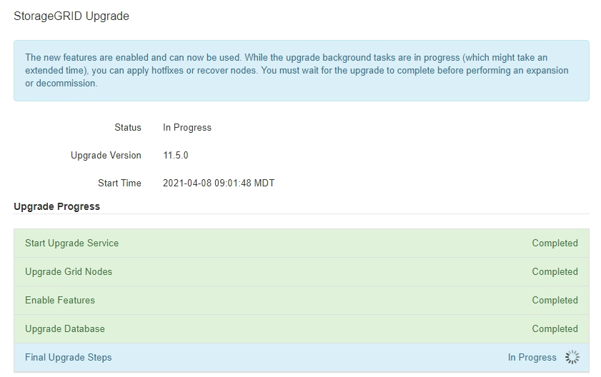

= Aggiornamento dei nodi grid e completamento dell'aggiornamento
:allow-uri-read: 
:icons: font
:imagesdir: ../media/

[role="lead"]
Una volta aggiornato il nodo amministratore primario, è necessario aggiornare tutti gli altri nodi griglia nel sistema StorageGRID. È possibile personalizzare la sequenza di aggiornamento selezionando per aggiornare singoli nodi della griglia, gruppi di nodi della griglia o tutti i nodi della griglia.

.Fasi
. Consultare la sezione Upgrade Progress (avanzamento aggiornamento) nella pagina Software Upgrade (aggiornamento software), che fornisce informazioni su ciascuna delle principali attività di aggiornamento.
+
.. *Start Upgrade Service* è la prima attività di upgrade. Durante questa attività, il file software viene distribuito ai nodi grid e viene avviato il servizio di aggiornamento.
.. Una volta completata l'attività *Avvia servizio di upgrade*, viene avviata l'attività *Aggiorna nodi griglia*.
.. Durante l'attività *Upgrade Grid Nodes* (Aggiorna nodi griglia), viene visualizzata la tabella Grid Node Status (Stato nodo griglia) che mostra la fase di aggiornamento per ciascun nodo della griglia nel sistema.

. Una volta visualizzati i nodi della griglia nella tabella Grid Node Status (Stato nodo griglia), prima di approvare i nodi della griglia, scaricare una nuova copia del pacchetto di ripristino.
+

IMPORTANT: È necessario scaricare una nuova copia del file del pacchetto di ripristino dopo aver aggiornato la versione software sul nodo di amministrazione primario. Il file Recovery Package consente di ripristinare il sistema in caso di errore.

. Esaminare le informazioni nella tabella Grid Node Status (Stato nodo griglia). I nodi della griglia sono disposti in sezioni per tipo: Nodi di amministrazione, nodi gateway API, nodi di storage e nodi di archivio.
+
image::../media/software_upgrade_start_grid_node_status.gif[Schermata di Upgrade Grid Node (Aggiorna nodi griglia) al termine del nodo di amministrazione]

+
Un nodo della griglia può trovarsi in una di queste fasi quando viene visualizzata per la prima volta questa pagina:

+
** Fine (solo nodo amministratore primario)
** Preparazione dell'aggiornamento
** Download del software in coda
** Download in corso
** In attesa di approvazione

. Approvare i nodi della griglia che si desidera aggiungere alla coda di aggiornamento. I nodi approvati dello stesso tipo vengono aggiornati uno alla volta.
+
Se l'ordine in cui i nodi vengono aggiornati è importante, approvare i nodi o i gruppi di nodi uno alla volta e attendere il completamento dell'aggiornamento su ciascun nodo prima di approvare il nodo o il gruppo di nodi successivo.

+

IMPORTANT: Quando l'aggiornamento inizia su un nodo grid, i servizi su quel nodo vengono interrotti. In seguito, il nodo Grid viene riavviato. Queste operazioni potrebbero causare interruzioni del servizio per i client che comunicano con il nodo. Non approvare l'aggiornamento per un nodo a meno che non si sia certi che il nodo sia pronto per essere arrestato e riavviato.

+
** Selezionare uno o più pulsanti *approva* per aggiungere uno o più nodi singoli alla coda di aggiornamento.
** Selezionare il pulsante *approva tutto* all'interno di ciascuna sezione per aggiungere tutti i nodi dello stesso tipo alla coda di aggiornamento.
** Selezionare il pulsante di primo livello *approva tutto* per aggiungere tutti i nodi della griglia alla coda di aggiornamento.

. Per rimuovere un nodo o tutti i nodi dalla coda di aggiornamento, selezionare *Remove* o *Remove All*.
+
Come mostrato nell'esempio, quando Stage raggiunge *arresto dei servizi*, il pulsante *Rimuovi* è nascosto e non è più possibile rimuovere il nodo.

+
image::../media/software_upgrade_two_nodes_queued.gif[La schermata mostra che Stage sta interrompendo i servizi]

. Attendere che ciascun nodo esegua le fasi di aggiornamento, che includono Accodamento, interruzione dei servizi, arresto del container, pulizia delle immagini Docker, aggiornamento dei pacchetti del sistema operativo di base, riavvio e avvio dei servizi.
+

NOTE: Quando un nodo appliance raggiunge la fase di aggiornamento dei pacchetti del sistema operativo di base, il software di installazione dell'appliance StorageGRID viene aggiornato. Questo processo automatizzato garantisce che la versione del programma di installazione dell'appliance StorageGRID rimanga sincronizzata con la versione del software StorageGRID.

+
Una volta aggiornati tutti i nodi della griglia, l'attività *Upgrade Grid Nodes* viene visualizzata come completata. Le restanti attività di aggiornamento vengono eseguite automaticamente e in background.

. Una volta completata l'attività *attiva funzionalità* (che si verifica rapidamente), è possibile iniziare a utilizzare le nuove funzionalità della versione aggiornata di StorageGRID.
+
Ad esempio, se si esegue l'aggiornamento a StorageGRID 11.5, è possibile attivare il blocco oggetti S3, configurare un server di gestione delle chiavi o aumentare l'impostazione spazio riservato metadati.

+
link:increasing-metadata-reserved-space-setting.html["Aumento dell'impostazione Metadata Reserved Space (spazio riservato metadati)"]

. Monitorare periodicamente l'avanzamento dell'attività *Upgrade Database*.
+
Durante questa attività, il database Cassandra viene aggiornato su ciascun nodo di storage.

+

NOTE: Il completamento dell'attività *Upgrade Database* potrebbe richiedere giorni. Durante l'esecuzione di questa attività in background, è possibile applicare hotfix o ripristinare i nodi. Tuttavia, prima di eseguire una procedura di espansione o decommissionamento, è necessario attendere il completamento dell'attività *fasi finali dell'aggiornamento*.

+
È possibile esaminare il grafico per monitorare l'avanzamento di ciascun nodo di storage.

+
image::../media/software_upgrade_upgrade_database.png[Database di aggiornamento del software]

. Una volta completata l'attività *Upgrade Database*, attendere alcuni minuti per il completamento dell'attività *Final Upgrade Steps*.
+

+
Una volta completata l'attività Final Upgrade Steps, l'aggiornamento viene eseguito.

. Verificare che l'aggiornamento sia stato completato correttamente.
+
.. Accedere a Grid Manager utilizzando un browser supportato.
.. Selezionare *Guida* > *informazioni*.
.. Verificare che la versione visualizzata sia quella che ci si aspetta.
.. Selezionare *manutenzione* > *sistema* > *aggiornamento software*. Quindi, selezionare *aggiornamento StorageGRID*.
.. Verificare che il banner verde indichi che l'aggiornamento del software è stato completato alla data e all'ora previste.
+
image::../media/software_upgrade_done.png[Aggiornamento software completato]

. Verificare che le operazioni della griglia siano tornate alla normalità:
+
.. Verificare che i servizi funzionino normalmente e che non siano presenti avvisi imprevisti.
.. Verificare che le connessioni client al sistema StorageGRID funzionino come previsto.

. Consultare la pagina dei download NetApp per StorageGRID per verificare se sono disponibili aggiornamenti rapidi per la versione di StorageGRID appena installata.
+
https://mysupport.netapp.com/site/products/all/details/storagegrid/downloads-tab["Download NetApp: StorageGRID"^]

+
Nel numero di versione di StorageGRID 11.5._x.y_:

+
** La release principale ha un valore _x_ pari a 0 (11.5.0).
** Una release minore, se disponibile, ha un valore _x_ diverso da 0 (ad esempio, 11.5.1).
** Una correzione rapida, se disponibile, ha un valore _y_ (ad esempio, 11.5.0.1).

. Se disponibile, scaricare e applicare la correzione rapida più recente per la versione di StorageGRID in uso.
+
Per informazioni sull'applicazione degli hotfix, consultare le istruzioni di ripristino e manutenzione.

.Informazioni correlate
link:downloading-recovery-package.html["Download del pacchetto di ripristino"]

link:../maintain/index.html["Mantieni  Ripristina"]
